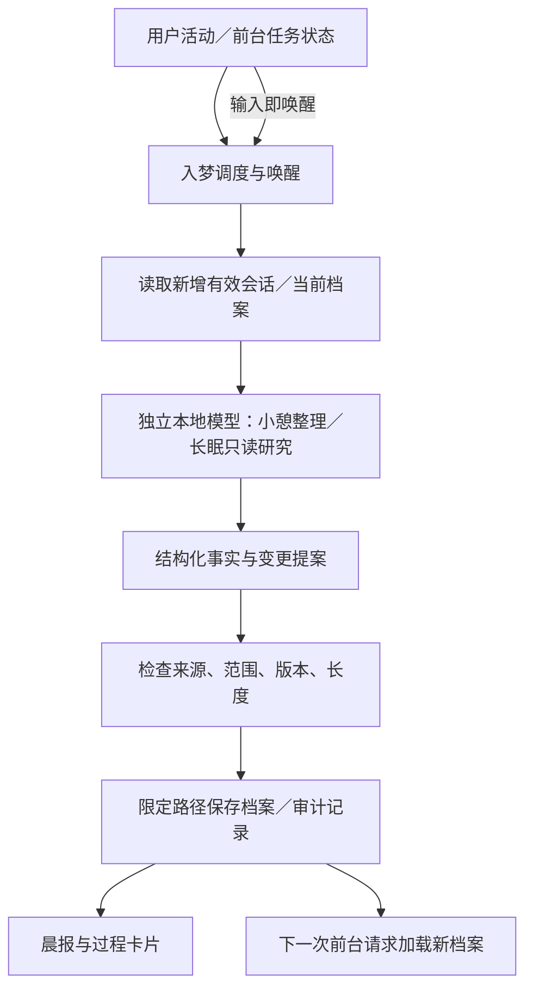

# Anamnesis（入梦）需求与实现设计

> 更新日期：2026-09-30。状态：设计已评审，首版已实现并通过离线验收；真实模型与终端待现场验证。
> 已确认的产品决策与待评审的接口／默认值分别标明。多窗口按最近用户指令提交从新到旧逐个处理，同项目去重，唤醒只影响当前窗口；2026-09-30 用户确认按当前设计在同目录功能分支实现；具体实施差异及实际验证见 §17 和 09 模块文档。

## 1. 目标与交付物

LOGOX 在用户长时间未使用、但 TUI 仍保持运行时，整理用户和项目的有效信息，准备下一次工作的计划；夜间可通过阅读项目代码研究问题和优化方案。用户开始输入即唤醒，前台交互优先。首版不自主修改代码、不执行测试、不建设实验环境。

交付物包括用户级记忆、项目级记忆、晨报和有依据的研究建议。长期记忆维护当前有效状态，以修改替代重复追加；完整过程与证据保存在可追溯记录中，不把全部旧版和工具日志塞进每次请求。研究建议明确区分“阅读发现”“已有验证结果”和“尚待验证”，不能把未执行的测试或预计收益写成实测结果。

用户已确定记忆档案名为 `ANAMNESIS.md`，用户级档案放 `~/.logox/ANAMNESIS.md`，项目级档案放 `<项目工作目录>/ANAMNESIS.md`。项目档案按现有 `LOGOX.md` 的分层思路加载，但自动档案不得替代人工 `AGENTS.md`／`LOGOX.md`／`CLAUDE.md`。具体发现／合并规则、加载预算和冲突处理见 §11—§12。

开发使用 `codex/anamnesis`，已从本地 `main` 的 `11385fe844c414107dff007fba044f2db95fd8c6` 创建并切换。原有未提交修改保留；创建分支没有创建提交或修改 `main` 提交。Git 分支隔离提交历史，不会自动为当前未提交文件建立第二份工作目录；不把已有改动视为本特性新实现。

## 2. 已确认要求

| 项目 | 用户已确认的行为 |
|---|---|
| 生命周期 | 关闭 TUI 不做梦；不另建关闭 TUI 后仍继续入梦的常驻服务。取消和保存进度提案见 §8／§13。 |
| 自动触发 | 按电脑本地时区，00:00—08:00 为长眠时段，其余时间小憩；空闲超过 30 分钟触发。计时起点取最后一次用户活动与前台任务结束的较晚时间；模型、工具或审批仍在进行时禁止入梦。时段可配置。 |
| 重复触发 | 不重复已完成且没有新增信息的整理；有新增资料或未完成研究才继续，小憩后进入夜间仍可启动长眠研究。 |
| 总时长 | 小憩和长眠均不设置一次运行的总时长上限；取消此前 3 分钟／1 小时提案，不因累计运行时长暂停未完成工作。 |
| 手动触发 | 支持 slash 命令手动入梦；命令语法与指定模式提案见 §7。 |
| 前台优先 | 用户开始输入即请求暂停入梦，优先交互；不等用户提交后才暂停。取消模型请求、收尾工具与续做粒度见 §8 的待评审提案，仍须实际验证。 |
| 多窗口 | 同一用户最多一个入梦任务；只选择仍打开、空闲超过 30 分钟、前台结束且有待处理资料的窗口，按最近用户指令提交从新到旧逐个处理，同项目去重。输入只唤醒当前窗口，不跨窗口停止其它任务；当前运行不因其它窗口新对话被抢占。 |
| 模型 | 首阶段以独立配置的本地模型调试上下文级记忆，不转云端；不以云端费用限制研究范围。输入分批与执行结束条件提案见 §7／§13。 |
| 用户记忆 | 从聊天中的明确依据维护当前工作／学习状态、方向、稳定偏好等；推测只作为候选，不自动固化为用户事实。 |
| 项目记忆 | 维护需求、当前进展、任务偏好、有效经验、已知问题、下一步方案；质量判断附实际依据。 |
| 整理范围 | 用户画像可整理全部 LOGOX 会话；项目档案和代码研究针对当前项目，不能将其它项目的需求、进展和限制混入。增量游标和回放处理提案见 §9。 |
| 档案位置 | 统一使用 `ANAMNESIS.md`；用户级存全局 `~/.logox/`，项目级存项目工作目录，沿用 `LOGOX.md` 的分层思路。档案的 Git 归属不因自动生成而自动提交。 |
| 记忆更新 | 有明确依据的内容可自动更新；每次增加、删除、修改均须有来源、理由、前后差异和可撤销记录。保存和人工规则边界提案见 §10—§12。 |
| 只读研究 | 允许读取／搜索代码与对话，并提出问题和方案。首版不给入梦模型源码写入、Shell、测试和远程执行工具；档案和报告仅由限定目标的保存逻辑写入。具体能力清单提案见 §11／§13。 |
| 正式状态 | 未验证的研究建议只能写为待验证；对话中声称完成、已有检查通过、用户验收等状态须有对应依据，不能相互替代。 |
| 可见过程 | 一次入梦对应一张完整卡片，展开查看各阶段正在判断的问题、判断依据、方案取舍、结论和档案差异。具体文件查阅不是主展示内容，操作／来源记录可按需查看；失败、中断和结论修正同样可见。卡片及记录接口提案见 §14。 |
| 模块组织 | 不限制 LOGOX 只能有八个模块；允许独立入梦模块，优先保证项目结构干净、职责明确。具体包与目录提案见 §6。 |
| 类命名 | 按用户指定拼写统一 `Anamesis` 类前缀，协调类为 `AnamesisCoordinator`，不使用 `Dream*`；档案仍为已确认的 `ANAMNESIS.md`。 |

此前讨论的“独立副本内自主实现、测试、优化，保留候选版本供晨报批准”不进入首版。若后续重新开启自主实验，再讨论系统隔离、依赖准备、候选验证与批准流程，不能将此前草案当作当前开发范围。

## 3. 最新确认与设计评审范围

用户已确认下列三项：

| 已确认问题 | 首版方案 | 未采用方案与代价 |
|---|---|---|
| 小憩／长眠范围 | 小憩快速整理新增会话和已有档案；长眠另做按需代码阅读、旧记录核查和次日计划。 | 小憩也读代码会延长白天整理；首版将其集中到长眠。 |
| 档案加载 | 有长度上限的精简正文直接加载，依据和变更历史按需查询。 | 提要＋正文需要额外检索和同步机制，首版暂不引入。 |
| 入梦模型 | 单独配置本地模型；前台切模不影响入梦模型，本地不可用则展示原因并跳过，不转云端。 | 跟随前台会使切换云端模型后无法自动入梦，首版不采用。 |

多窗口队列已确认：只保证本窗口输入唤醒，不能因另一窗口输入而取消当前入梦；档案并发更新须防冲突，同一用户最多运行一个入梦任务。只选仍打开、空闲超过 30 分钟、前台已结束且有待处理资料的窗口，按最近用户指令提交从新到旧逐个整理，同项目去重。当前任务不被后来的其它窗口对话抢占；完成或暂停后交给下一合格项目，唤醒窗口重新等待 30 分钟。§6—§16 是依据已确认要求形成的完整实现提案，接口、恢复细节和默认参数仍待用户评审。

用户进一步确认取消小憩／长眠总时长上限，并确认已经运行的长眠跨过 08:00 继续执行，直到用户打断；08:00 只决定新自动任务采用小憩模式，不能成为既有长眠的运行截止时间。没有待处理资料或研究步骤时仍按已确认的“不重复已完成工作”正常结束，不凭空制造任务维持运行；关闭 TUI 同样结束入梦。

2026-09-30 评审修订：模块数量不是架构约束，入梦可以独立成模块；类前缀使用用户指定的 `Anamesis`，不再使用 `Dream`。卡片以模型明确给出的分析说明为主线：问题、依据、判断原因、结论及变化，不以读文件／工具调用清单代替思考过程。下面的独立包和卡片数据接口是本轮待评审的实现提案。

## 4. 已核对的现状与限制

- [context/memory.py](../src/logox/context/memory.py) 在同一目录只选择一个人工规则文件，优先级为 `LOGOX.md > AGENTS.md > CLAUDE.md`。当前不会加载 `ANAMNESIS.md`，也没有在此加载器中显式加载用户级档案；不能把“已有记忆读取”写成“已实现入梦档案”。
- [permissions/sandbox.py](../src/logox/permissions/sandbox.py) 审计工具参数与路径，不能完整限制获准脚本内部的文件和系统行为。现有权限模块明确不提供操作系统级进程隔离，见 [06 权限模块](modules/06_permissions.md)。
- [store/manager.py](../src/logox/store/manager.py) 按工作目录组织会话；用户级汇总需要跨会话读取，项目级输入必须识别所属工作区，并处理被回滚的记录，见 [07 持久化与回滚](modules/07_store.md)。
- [kernel/loop.py](../src/logox/kernel/loop.py) 有前台回合取消路径；入梦调用链、暂停续做和本地模型服务端释放资源仍须另行验证。入梦记录也不能直接混入前台原始对话。
- 当前已有大量未提交源码与文档成果，新分支已保留这些内容。代码审查应读取实际工作文件，不能假定工作区等于 Git HEAD。
- 此前系统隔离的只读环境调查不构成安装或实现成果；首版已取消自主实验，不要求为只读入梦先配置 Docker、WSL 或 Windows Sandbox。

## 5. 下一步与实现门槛

产品分歧已逐项确认，下一步评审 §6—§16 的接口、默认值与异常边界。经用户确认完整设计后才进入代码阶段；实现后按职责更新现行模块文档，新增独立模块时补充其专属文档和接手入口，不限制为八份。本草案不引用或修改 `legacy` 文档。开发顺序为资料与档案保存、独立只读运行器与调度、上下文加载、TUI 卡片与命令、贯通验收；每步验证通过才推进下一步。

## 6. 总体流程与模块职责（已评审）



入梦有独立运行记录和模型消息，不能插入前台 `kernel.history`，也不能冒充用户消息。已有的压缩流程继续处理当前会话的窗口预算；入梦维护跨会话有效事实，两者不相互替代。

| 模块 | 与入梦的职责边界 |
|---|---|
| 09 入梦 | 空闲／模式调度、多窗口队列、独立只读模型任务、资料与证据选择、记忆提案、档案更新策略、分析记录与报告；不导入 TUI。 |
| 01 kernel | 复用消息／工具结果协议和只读调度能力；提供前台忙闲与取消状态，不接管入梦消息和回合号。 |
| 02 context | 负责前台提示中的独立档案发现、预算和加载；保留人工规则契约，不承载夜间调度或入梦研究策略。 |
| 03 tui | 显示完整入梦卡片、分析阶段和记忆差异；转交输入唤醒及命令，不决定事实是否入档。 |
| 04 providers | 提供模型协议、窗口探测与取消请求；由入梦模块选定独立本地配置，不复用前台当前模型变量。 |
| 05 tools | 提供本地读取／搜索实现；入梦模块只注册允许的能力，不暴露任意 Shell、源码写入、测试或远程工具。 |
| 06 permissions | 审计路径与敏感读取；需要审批的操作在自动入梦中拒绝并记录，不静默升权。 |
| 07 store | 提供既有会话、有效回放和通用文件持久化能力；入梦专属游标、版本、记录及恢复规则集中在入梦模块。 |
| 08 app | 装配入梦服务、配置、前台活动桥接和关闭流程；不在 Runtime 中重复实现调度、事实校验或卡片布局。 |

不再以“不能新增第九个模块”约束设计。简单入口可以采用 `src/logox/anamnesis.py`，但当前功能已包含调度、证据、档案提交与独立模型循环，建议直接使用 `src/logox/anamnesis/` 特性包，避免把全部实现堆进一个大文件或分散到互不相关的模块。包与同名 `.py` 文件不同时创建，以免导入目标混淆；应用级服务放在包内 `service.py`。

| 目录方案 | 收益 | 代价／调整方式 |
|---|---|---|
| 单个 `anamnesis.py` | 初期文件少，入口直观。 | 所有职责挤在同文件后难以独立测试；以后拆包要迁移导入。 |
| 独立 `anamnesis/` 包（建议） | 专属策略集中，调度、模型与持久化可以分开测试；外围只依赖公开接口。 | 多几个职责文件；通过包级导出稳定入口，内部拆分可调整而不影响 TUI／Runtime。 |

已采用的目录方案：

```text
src/logox/anamnesis/
  __init__.py       公开少量入口，避免外围导入内部实现
  service.py        AnamesisService：单窗口生命周期、空闲判断、唤醒和装配接口
  coordinator.py    AnamesisCoordinator：窗口登记、项目队列和跨进程单任务
  runner.py         AnamesisRunner：独立模型消息、只读能力与阶段推进
  sources.py        有效会话、增量游标、项目作用域和证据定位
  archives.py       档案提案校验、版本提交、审计与失败恢复
  models.py         AnamesisStatus、来源、提案、阶段分析及事件数据结构
  reports.py        从阶段分析和实际提交结果生成晨报
src/logox/context/   继续负责前台档案加载，不导入入梦运行器
src/logox/tui/       仅添加入梦卡片呈现与交互接线
tests/anamnesis/     调度、资料、档案、运行器及跨进程验证
```

沿用现有 Python／asyncio、Provider 和校验工具，不为目录拆分引入新的运行时框架。入梦包依赖已有的消息、模型、工具、权限和存储公共接口；不让这些公共模块反向导入入梦服务。UI 通过 Runtime 窄接口调用服务，服务通过中立事件交给 UI 展示，避免业务层反向依赖界面。

命名约定：类前缀按用户指定为 `Anamesis`，例如 `AnamesisCoordinator`／`AnamesisRunner`／`AnamesisService`／`AnamesisStatus`。包、配置段与档案采用已经使用的特性全名 `anamnesis`／`ANAMNESIS.md`；命令入口提案统一为 `/anamnesis`，不再使用 `/dream`。源文件路径与类名是分别约定的标识，不在实现时自行改写用户指定的类名前缀。

## 7. 配置与命令（已评审默认值）

新增 `[anamnesis]` 配置；复用现有 provider 注册机制。下面的数值是可调整的首版默认提案：

| 字段 | 默认提案 | 语义 |
|---|---|---|
| `enabled` | `true` | 允许调度；未配置本地模型时不运行，并显示“未配置”。 |
| `memory_enabled` | `true` | 控制前台加载自动档案；关闭入梦调度不会自动删除或忘记已有档案。 |
| `idle_seconds` | `1800` | 已确认的空闲时长；计时使用单调时钟，启动时从当前用户活动开始。 |
| `sleep_start` / `sleep_end` | `00:00` / `08:00` | 按电脑本地时区判断；参数可配置。 |
| `provider` / `model` | `ollama` / 空字符串 | 必须明确配置模型，不自动挑模型或跟随 `/model`。 |
| `request_timeout_s` | `180` | 单次模型请求上限，失败可重试但不无限等待。 |
| `nap_max_steps` / `sleep_max_steps` | `4` / `64` | 限制一次运行的模型与工具推进步骤，避免同一问题无限循环。 |
| `user_archive_tokens` / `project_archive_tokens` | `800` / `1600` | 用户档案及单份项目档案的精简正文上限；不包含外置完整证据和旧版。 |
| `prompt_memory_max_ratio` | `0.05` | 自动档案注入不超过前台窗口的此比例，且还须给必需规则、工具和当前回合留空间。 |

不提供小憩／长眠总时长截止配置，不以累计耗时结束任务。`request_timeout_s` 是单次请求故障处理的待评审提案，与整次入梦时长不同；步数限制同样仍是待评审提案，不得把它宣传为已经批准的无上限运行策略。

时刻解析非法、空闲阈值非正、长度上限非法均为配置错误，不能启动后悄悄采用另一套规则。首版 provider 只允许已配置的 Ollama／LM Studio 本地回环端点；拒绝外网端点、跳转至外网和任意供应商代替，不依赖 provider 名称单独判断“本地”。模型窗口按独立入梦 provider 探测，不拿前台模型窗口套用。配置缺失、端点不可达、窗口未知或不足都显示具体原因，不拼造模型名称。

命令提案：`/anamnesis` 按当前时段启动；`/anamnesis nap`、`/anamnesis sleep` 指定模式并跳过 30 分钟等待；`/anamnesis stop` 暂停；`/anamnesis status` 查看模式、步骤、原因和模型；`/anamnesis report` 打开最近报告。前台回合／审批未结束时拒绝启动并解释原因，不抢占正在执行的用户任务。没有资料或未完成工作时显示“无可整理内容”，不制造新记忆。手动 sleep 允许白天研究；自动 sleep 仅在夜间启动，已开始的长眠跨 08:00 继续。

## 8. 状态、唤醒与暂停续做（已评审）

状态：`idle → collecting → summarizing/reviewing → validating → committing → completed`；任意未结束状态可进入 `pausing → paused`，不可恢复错误进入 `failed`，未就绪进入 `blocked` 并给原因。`blocked` 是入梦界面状态，不涉及 Codex 的目标状态工具。

- 前台模型生成、工具执行、权限／选择审批未结束时不自动启动。取消或完成前台回合后重新记录结束时间。
- 文本输入、粘贴、退格、编辑和提交触发唤醒；仅滚动／展开入梦卡片或查看报告不打断正在入梦。真实用户操作更新时间戳，终端协议回应不算活动。
- 唤醒回调只设置停止标志／世代编号并请求取消，不在按键处理里扫描日志、写文件、等网络或读取档案。输入显示继续使用既有渲染合并。
- 停止新增模型和工具步骤，关闭正在进行的模型流；已完成步骤保存，半截输出不入档，未完成步骤下次重做。取消之后本地服务是否停止计算须验收，不能只因客户端关闭就宣布 GPU 已释放。
- 写档案前检查活动世代、资料版本和目标版本；唤醒后禁止开始新提交。已开始的单文件替换允许短时完成，不在中途破坏文件；完成后的档案只在下一次前台请求边界刷新，不改变正在发送的提示。
- 暂停任务在再次空闲 30 分钟、模式允许且没有前台任务时续做；启动／关闭 TUI 不继承单调时钟值。关闭 TUI 取消任务并关闭客户端，重开后仍需等待空闲或手动命令。
- 00:00／08:00 只决定新自动任务的模式；小憩／长眠没有总时长截止。已经运行的长眠跨过 08:00 继续执行直到用户打断，不因时段变化暂停、降为小憩或丢弃代码研究步骤。没有剩余有效工作时正常完成，关闭 TUI 时取消；手动 sleep 仍允许白天研究。
- 使用锁保证同一用户只有一个入梦任务；档案提交采用短锁和版本检查。只允许当前窗口输入请求暂停本窗口拥有的入梦任务，不传递全局唤醒指令。另一窗口输入可能仍需等待共享的本地模型，不能将“防并发写入”宣传为“任意窗口输入都释放本地模型”。

### 8.1 多窗口队列（产品规则已确认，协调接口待评审）

不能以运行锁的抢占先后作为项目优先级。窗口需登记少量协调元数据：窗口实例身份、进程身份、规范工作目录、最近用户指令提交顺序、前台忙闲、是否超过空闲阈值、待处理资料版本／未完成工作、存活状态；仅用于选择项目，不混合其模型消息或项目档案。登记与更新放到后台，不在输入回调进行磁盘操作，也不创建独立常驻服务。每个窗口自己用单调时钟判断空闲，不能跨进程比较启动前的计时值。

已确认的选择顺序：

1. 排除已关闭／失效、前台忙、空闲未超过 30 分钟或无待处理工作的窗口。
2. 将剩余窗口按最近一次用户指令**提交**从新到旧排序，不采用回复结束时间；同一规范工作目录去重，由合格窗口中最近提交者承接该项目。
3. 同一用户只运行队首项目，当前运行不因另一个窗口变得更新而被抢占。
4. 完成或暂停且资源收尾后，重新核验下一候选的资格，再逐个处理剩余项目；已完成且没有新资料的项目不重复入队。唤醒当前窗口会使其退出本次候选，重新空闲 30 分钟后才能自动续做。

协调实现提案：以短时协调锁维护登记表、全局提交序号与队列，另外使用一个运行期间持有的跨进程锁确保单任务。提交序号在后台登记时分配，相同时以实例身份稳定排序；序号定义持久化登记顺序，极近的并发提交不能宣称精确还原键盘微秒顺序。用户提交有效任务指令才更新顺序，查看状态／报告、空输入、旧会话加载或窗口启动不伪造新提交。尚无本次运行提交的窗口使用有效历史的最后用户记录时间排序，缺少时间则排在有时间的窗口之后；该回退不改变 30 分钟门禁。

每次认领在短锁内核验资格和项目资料版本，登记 run_id 与所属窗口；只有被选窗口启动自己的模型运行器和过程卡片。认领后、发起模型调用前再次检查本窗口活动世代，避免“刚打字却仍开始入梦”。完成／暂停／失败由所属窗口保存检查点、关闭请求和工具，再释放运行锁并交接。不因累计耗时强制轮转。若采用待评审的步数保护，触及时保留未完资料，先让本轮其它合格项目获得一次机会，再参加下一轮；失败项目记录原因并等待恢复条件，不在调度循环里立即无限重试。这些续做与错误细节属于待评审实现提案。

登记表损坏或协调锁不可用时停止自动入梦并显示原因，不退化为各窗口并发运行。失效窗口清理须结合进程存活与运行锁状态，不能只因心跳延迟就启动第二个任务；进程编号会复用，因此登记还包含窗口随机实例身份。存活但失去响应的占用者显示占用／异常，不擅自杀进程或覆盖档案。异常退出后先按 §11 恢复准备记录，再让合格窗口接手未完成工作。

```text
AnamesisCoordinator.register(window_snapshot) -> Registration
AnamesisCoordinator.update(window_id, activity_generation, state) -> None
AnamesisCoordinator.record_submission(window_id) -> SubmissionOrder
AnamesisCoordinator.claim(window_id, mode) -> RunLease | NotSelected(reason)
AnamesisCoordinator.finish(lease, outcome, checkpoint) -> None
AnamesisCoordinator.unregister(window_id) -> None
```

上述持久化协调方法均在后台执行；`note_activity` 的同步输入入口只修改本窗口内存状态和取消标志。`RunLease` 绑定 window_id、project_id、run_id、资料版本及活动世代，不能转用于另一项目或另一窗口的唤醒。

窗口关闭后移出候选；其旧会话仍可作为用户画像来源，但不自动继续该已关闭窗口的项目代码研究。档案版本与资料处理进度独立于窗口生命周期，接手同项目时不能从头重复添加事实。手动触发遇到另一个窗口已在入梦时，显示当前占用原因，不因手动请求偷偷取消其它窗口。

例如 A、B、C 最近提交顺序为 C、B、A，C 仍在跑前台工具，A 与 B 已空闲且有资料，则先 B 后 A。B 入梦时在 A 打字只让 A 退出候选，B 继续；在 B 打字才暂停 B。用户画像的全局进度另外去重：B 已整理的跨项目用户事实不因轮到 A 又重复添加，A 的项目研究仍只读取 A 的资料。

## 9. 资料输入、证据与增量读取（已评审）

输入来自配置生效的 LOGOX 会话目录、当前档案与长眠按需读取的当前项目文件，不扫描任意磁盘或其它应用的会话。

`SourceRef` 的最小字段：`source_id`、`kind`（user_message／assistant_statement／tool_result／code／manual_archive）、`session_id`、规范工作目录身份、物理行号或文件行范围、内容摘要值、采集时间、轮次状态。定位必须能重新找到并核对原文；单独的模型总结不能当作用户原话。

会话游标记录文件身份、已完成读取的完整行／字节位置、上次有效视图指纹和作用域处理状态。初次扫描也按有限批次推进；之后只处理新增或变化部分。JSONL 未写完尾行暂不处理，损坏中间记录报告缺口，不将全部日志直接塞进一个请求。

回滚记录改变有效历史，即使出现在旧游标之后，也须失效对应事实的证据并重建相关有效视图。复用 `filter_rewound_records` 的语义；失败／中断回合中已明确的用户指令仍可作为用户事实，模型关于完成的声称不能转成成功进展。

用户资料可从所有项目会话提取明确个人事实；当前项目资料只从规范化当前工作目录身份及适用的项目档案获得。同名目录不能认为是同一项目，大小写与符号链接按平台规范去重。沿用会话按 cwd 区分的身份，不擅自把同一 Git 仓库的所有子工作区历史合成一个项目。

代码和旧会话的细节按问题检索，先摘要／索引，再取得必要原文。工具大日志使用已有归档指针，避免重复读完整工具全文。档案／报告／审计日志从普通代码研究清单排除，防止把自己的上轮结论当成新证据。明确禁止读取过时 `docs/modules/legacy`／`LEGACY` 文档，并沿用敏感与越界读取限制。

目录枚举、读取与哈希放到可取消的后台工作中；扫描使用有界批次并让出执行时间。首次资料较多时晨报显示已覆盖／尚未覆盖范围，不能谎称已研究整个工程。

## 10. 事实提案与校验接口（已评审）

本地模型提出结构化变更，不直接给任意写文件命令：

```text
MemoryProposal
  run_id, scope(user|project), base_revision, project_id
  changes[]
    entry_id, action(add|replace|delete), category
    old_value, new_value, source_ids[], rationale, analysis_record_id
    considered_options[], status(explicit|observed|candidate)
  review_findings[]
    finding, source_ids[], suggestion, validation_state
  next_plan[]
    objective, basis, alternatives, proposed_check
```

条目身份尽量稳定，同一事实更新旧条目而非再加一条近义句。用户明确纠正优先于旧说法；删除需要纠正、已失效或重复的依据，“本轮没再提到”不是删除理由。出现多个相互冲突但未澄清的说法时保留候选并在报告中说明。

确定性检查：结构与字段合法、source_id 可解析且摘要值匹配、来源作用域正确、旧值与基础版本匹配、路径在允许清单、正文预算满足、没有重复或自相矛盾的更新、没有伪造验证状态；每条变更的 analysis_record_id 指向本次有效、完整的阶段分析且具体理由非空。模型对证据是否支持结论的二次核对与这些机械检查分开，不能用一句“置信度很高”代替来源核验。

自动入档只接受明确用户表述或可核对的事实。模型自身提议、引用／假设场景、一次项目需求推成长期审美、读代码推测的性能收益均作为候选。检查“来源存在”不等于保证语义完全正确；晨报须保留纠正／撤销入口，模型评估专门测误记。

纯代码阅读发现可写为“发现／待验证”，不能生成首版未执行的测试结论。历史测试结果附时间与当时版本；无法关联当前工作文件时，只说“历史记录显示”，不称当前已通过。

结构或证据校验失败可要求本地模型修正一次；仍失败则保留提案和失败理由，不更新对应档案，也不推进该作用域处理游标。没有实质变更时不重写 MD、不制造空变更，但可提交已检查资料的进度。

## 11. 档案、版本与限定写入（已评审）

自动档案采用可读 Markdown，正文分为稳定事实、当前状态、有效项目经验／限制、待验证问题与下一步；用户档案与项目档案使用不同模板。短来源 ID 可出现在条目旁，原文、完整理由和旧版放外置记录。

建议 `~/.logox/anamnesis/` 保存来源索引、游标、运行日志、档案版本和晨报；按项目身份／run_id 隔离。项目主档案仍写入用户选择的 `<cwd>/ANAMNESIS.md`，不自动移动到此辅助目录。档案与报告不自动加入 Git 或提交。

写入仅允许两个已解析档案目标以及工具自管辅助目录，由宿主保存逻辑执行。模型不提供目标路径，不获得 write/edit/Shell/MCP 权限。符号链接导致目标越界、档案目标与源码／规则冲突、目录权限不足时停止保存并显示原因。

每份档案提交：读取并记录旧内容与摘要值 → 保存变更准备记录和旧版 → 验证候选正文 → 同目录临时文件写入并 flush／同步 → 再核对旧摘要值 → 单文件替换 → 写入完成记录 → 推进该作用域游标。输入已唤醒、文件被手工修改或基础版本变化时保留候选，不覆盖未知内容。

用户级和项目级文件分别提交，不宣称多文件整体原子；其中一份失败时，晨报如实显示另一份是否已经成功。准备／完成记录用于恢复“文件已替换而完成记录未写”的情况，恢复先核对新旧摘要值，不强行把外部编辑还原。只在档案与记录完成匹配后推进游标，重复处理通过 entry_id／变更摘要值防止重复添加。

外部编辑器不一定遵守 LOGOX 的锁，摘要值检查与替换之间仍存在极短竞争窗口；首版不宣称能对任意编辑器提供文件级比较交换保证。保留版本、缩短提交窗口并检测外部变更；不能为了避免冲突改写人工规则文件或源码。

`ArchiveStore` 接口提案：

```text
load(scope, project_id) -> ArchiveSnapshot(revision, digest, text, entries)
prepare(proposal, expected_digest) -> PreparedChange
commit(prepared, activity_generation) -> CommitResult
recover_pending() -> RecoveryReport
revert(change_id, expected_digest) -> CommitResult
```

撤销创建一条有依据的反向变更与审计记录；不是悄悄删除旧记录，且不得覆盖撤销时的外部新编辑。保留期和历史清理由后续独立配置决定，首版不自动清除用户证据。

## 12. 前台加载与预算（已评审）

保留原 `find_project_memory` 对人工文件的优先级。新增独立档案发现：用户档案唯一一份；项目从 cwd 向 Git 根／文件系统根查找 `ANAMNESIS.md`，参照现有分层行为，同层优先直接文件，兼容 `.logox/ANAMNESIS.md`；按根到 cwd 排列并去重。自动保存默认目标仍是 cwd 的直接文件，不擅自重写祖先档案。

自动记忆标为“可纠正的背景事实”，不能授予新工具权限，也不能覆盖当前用户明确指令或人工规则。原 `project_memory_enabled` 关闭时不加载自动项目档案，用户档案读取由新增入梦记忆加载开关控制，明确区分“允许入梦”与“允许前台读取档案”。

加载精简正文的完整文档，证据与旧版不常驻。实际注入上限取配置额度、窗口比例和必需提示／当前回合剩余空间的最小值；人工规则和当前用户输入优先。超限时按整份档案选择当前工作目录、用户档案、较远祖先档案，未加载来源可见；不截断事实、不因模型窗口小而删除磁盘档案，也不把无限档案压力推给会话压缩。

请求边界检查档案版本，版本未变复用读取和 token 估算缓存；无逐字输入读取磁盘。入梦成功保存后标记待刷新，下一次前台构建才换入新内容。端点窗口变更或 `/reload` 使缓存失效，既有 token 账本继续按系统前缀摘要值自校验。

## 13. 只读模型运行器与公共接口（已评审）

`AnamesisRunner` 是独立模型任务，不改前台 KernelLoop 的回合语义：独立 system、messages、窗口预算、工具清单和取消标志。复用 Provider.stream、消息模型与可审计只读调度能力；不复用前台对话、hook_runner、插件自动装配或 MCP 注册表。

小憩输入仅有新增会话片段和现有档案；长眠另开放当前项目 read/glob/grep 以及以 source_id 查询已登记证据的受控读取。用户级历史从资料收集器供给，不让模型获得任意用户目录读取工具。需要 ASK 的敏感读取在无人值守时返回拒绝，并在卡片解释；不给入梦任务静默批准窗口。

上下文分批保证 system＋资料＋工具＋输出预留不超独立模型实测窗口；超限减少批次，仍容不下则停止并说明，不截坏结构后继续调用。新生成内容和工具结果有上限，证据全文留在既有来源，不将其再次大规模复制进档案。

服务接口提案：

```text
AnamesisService.note_activity(kind, monotonic_time) -> None
AnamesisService.note_foreground_state(busy) -> None
AnamesisService.start(mode=auto|nap|sleep, manual=False) -> StartResult
AnamesisService.request_wake(reason) -> None
AnamesisService.status() -> AnamesisStatus
AnamesisService.latest_report(project_id) -> ReportRef | None
AnamesisService.aclose() -> None
```

`StartResult` 区分启动／忙／未就绪／无工作；`AnamesisStatus` 包含 run_id、模式、阶段、当前分析问题、最新结论状态、进度、已读范围、暂停原因、独立模型和待刷新档案版本。同步 UI 接口不得等待文件或网络；async_close 负责可靠收尾，不能只创建未等待的清理任务。

## 14. 完整入梦卡片、阶段分析与晨报（已评审）

### 14.1 一次入梦，一张卡片

同一个 run_id 对应一张 `AnamesisCard`，开始、阶段推进、档案更新、暂停、失败和完成都更新这张卡片；读取和搜索不单独制造一串工具卡片。暂停后续做同一运行仍沿用该卡片和已有阶段记录，真正开始新一轮整理才创建新 run_id。

折叠时显示“入梦／小憩或长眠／当前分析主题／状态／耗时／已生效变更数”；展开时能查看本次入梦的全部阶段和结论修订。展示顺序为当前阶段及按发生顺序组织的阶段记录，用户滚动查看旧阶段时保留位置，不强迫跟随最新阶段。

阶段按用户关心的问题组织，而不是按工具名称组织：回顾当前工作、筛选用户／项目记忆、核查矛盾与旧结论、研究项目问题（仅长眠）、形成下一步建议、校验与保存、整理晨报。阶段可以反复出现或发现无需变更；卡片如实显示实际执行范围，不把尚未运行的阶段涂成完成。

### 14.2 每个阶段展示“问题 → 依据与判断 → 结论 → 影响”

卡片主体必须让用户读懂：

- **在判断什么**：当前问题或假设，为什么值得研究。
- **为什么这样判断**：用自然语言概括实际依据，解释支持和反对的证据、考虑的方案与取舍；结论修正时给出新依据和改变原因。
- **得到什么结论**：结果、适用的用户／项目范围、尚存不确定性、需要后续验证的部分。
- **因此做了什么**：记忆的新增／替换／删除／不写入，或下一步建议；明确提案、已核验、已保存、失败与撤回状态。

来源标识和文件路径仍完整保存供核对，但主体不逐行列“读了文件 A、又搜了文件 B”。用户按需展开“依据详情／操作记录”再看原文位置、工具参数和结果。每项 MD 增删改仍必须有独立前后差异、原因和来源，不能以阶段总体总结代替某条变更的解释。

分析说明由模型在对应阶段明确输出并逐步展示，不在结束后由 UI 根据工具名称编造一段思考过程；模型没有给出说明时显示“分析说明缺失”，不冒充已经理解或得出结论。未完成输出标为草稿，取消时保留可读阶段记录但不拿半截说明提交档案。展示完整的可核对说明，不依赖供应商是否暴露原始推理流，通用模型同样能够产出该契约。

示意（展示格式，非实际入梦结果）：

```text
入梦 · 长眠 · 项目记忆核查 · 进行中
  阶段：这条界面偏好应该记在哪里？
  依据：用户要求主屏保留终端历史，屏外旧卡片保留当时状态。
  判断：这是 LOGOX 的交互取舍；当前证据不能证明是用户在所有项目的通用偏好。
  结论：只保存到 LOGOX 项目档案，不写成用户级通用事实。
  影响：替换项目档案中的旧表述；状态：提议，尚未保存。
  [查看前后差异] [依据详情／操作记录]
```

### 14.3 分析记录与事件接口

```text
AnamesisAnalysisRecord
  run_id, record_id, stage_id, question, rationale, evidence_summary
  source_ids[], alternatives[], conclusion, scope, uncertainties[]
  decision(ignore|candidate|propose|revise), change_ids[], revises_record_id
  status(draft|complete|validated|rejected|interrupted), created_at
```

`rationale` 是模型明确给出的判断说明，`source_ids` 指向 §9 的依据。`MemoryProposal.changes[].rationale` 与对应分析记录关联，保存每条变更的具体理由。只有文件操作而没有问题、理由和结论的记录不能被 UI 当作完成分析；缺少必要依据或变更理由时不自动提交对应档案。模型的分析结论与宿主的来源／版本／保存核验分别记录，机械校验通过不代表结论语义一定正确。

专用 `AnamesisEvent` 包含开始、阶段目标、分析说明增量、阶段结论、结论修订、变更提议／提交、暂停、失败、完成；字段含 run_id、stage_id、record_id、change_id、结果与耗时。文件／工具事件留在同次运行的操作明细，不是阶段主标题。与前台 ModelDelta／TurnFinished 分开，不影响前台 token／工具统计。

持久记录保留已完整输出的分析、阶段修订、全部记忆差异、操作与失败，不用事后总结覆盖原有不同结论。正文档案保持精简，完整阶段记录外置；“完整卡片”指全部阶段可访问，而非把整夜记录在每帧全部重算。旧阶段按需载入、缓存已排版内容，分析增量合并渲染，耗时只更新头部。不得因展示分析重新引入打字卡顿。

主屏与全屏都保留阅读位置。主屏已经滚出物理屏的原输出遵循此前确认的终端历史取舍：保留当时快照，当前可见内容更新同一逻辑卡片状态；完整运行记录仍可从卡片入口查看，不承诺原地重写终端的全部历史。

### 14.4 晨报与中断

晨报从本次实际阶段分析、事实来源和提交结果生成：整理范围／未覆盖资料、已生效变更、项目状态、研究结论和不确定性、次日建议及替代方案、中断／失败／冲突。报告可以简短，但不能成为唯一解释入口，展开卡片仍能逐阶段查看得出结论的理由。

任务计划是建议，不在用户回来前自主实施；首版不出现“候选代码已测试待合并”等越界状态。暂停时卡片保留已完成分析，并说明停在哪个问题、哪些变更没有提交；唤醒不抢焦点、不强制展开报告。`/anamnesis report` 查看完整报告，每份报告引用档案版本与阶段记录，避免把旧晨报当最新状态。

## 15. 异常与验证计划（已评审）

| 场景 | 必须满足的行为 |
|---|---|
| 模型未配／本地不可用／远端端点 | 有原因，不调用云端，不更改档案。 |
| 输入时正在读资料／流式生成／准备写入 | 立即请求停止，输入继续；半截提案不提交，未完步骤留待重做。 |
| 任务结束／取消／审批／时钟变更 | 按已确认起点计时；真实前台未结束不入梦，系统钟改变不缩短空闲阈值。 |
| 长时间整理 | 超过 3 分钟的小憩、超过 1 小时的长眠不能因累计耗时被暂停；有有效工作时继续，仍响应输入和关闭。 |
| 既有长眠跨过 08:00 | 保持长眠研究模式并继续运行，输入可以唤醒；同一时刻新自动任务采用小憩。 |
| 多窗口竞争／队列交接／重复项目 | 先筛资格再按最近提交倒序逐个处理；同用户单任务，同项目同批资料只处理一次。 |
| 非所属窗口输入／所属窗口关闭 | 不跨窗口唤醒；所属窗口关闭先取消并收尾，不继续该关闭窗口的项目研究。 |
| 登记损坏／活跃锁／异常退出 | 协调失败停止自动入梦；心跳延迟不抢占活跃任务，退出后恢复记录再接手。 |
| 同一资料重复运行 | 不重复增加条目；没有变化不重写正文，不持续空转。 |
| 回滚／损坏尾行／文件变化 | 剔除或重新核对受影响证据；缺口可见，不把无依据内容固化。 |
| 错误证据／跨项目来源／用户纠正 | 拒绝或留候选；旧结论不覆盖更新的明确纠正。 |
| 磁盘满／备份失败／部分提交／异常退出 | 不假报成功、不越级推进游标；可核对恢复，每份档案结果分别可见。 |
| 档案被手工修改／版本冲突／越界链接 | 保留候选并提示，不强制覆盖未知版本或越界保存。 |
| 小模型窗口／档案超限 | 保留磁盘事实，缩减批次或不加载超额整份档案，显示原因。 |
| 恶意工具请求／插件 hook／源码写入 | 能力清单拒绝；入梦不能触发前台 Shell hooks 或远程执行。 |
| 代码检查结果 | 首版源码内容保持不变；报告不声称运行了测试或证明性能提升。 |
| 阶段说明缺失／结论修订 | 不凭工具日志编造解释；缺依据／变更理由不提交，修订原因与旧结论均可查看。 |
| 卡片暂停／续做／大量文件操作 | 同 run_id 仍为一张卡片；展开全部阶段，文件操作留在详情，不能挤掉问题、理由和结论。 |

单元测试以假时钟、伪 Provider 和临时资料目录验证状态与失败路径，不接云端、不碰真实用户档案。核心用例：30 分钟边界／跨午夜／新任务的 08:00 模式选择，超过旧 3 分钟／1 小时仍运行的计时推进，既有长眠跨 08:00 保持模式继续且仍可输入唤醒，输入／粘贴唤醒，前台忙与审批门禁，停止与重开，重复与回滚记录，项目隔离，来源真实性与纠正，限长与整份加载，原子替换失败／恢复／外部冲突，禁止工具与未批准能力，档案刷新不改变正在生成的请求。不沿用旧的 08:00 到点收尾断言。

队列用例需覆盖：提交先后与回复结束先后相反时仍按提交排序；最新窗口忙／未到阈值／已关闭时跳过；同项目两个窗口只处理一次；完成交接与已确认停止条件下的下一项目机会；其它窗口新提交不抢占当前任务；输入只暂停所属窗口；认领后马上输入不能发起模型请求；全局用户资料不因项目轮转重复入档。另用两个真实子进程验证运行锁互斥和异常退出释放，不仅检查某个加锁方法被调用；临时登记／准备记录损坏应停下或恢复，不能启动双任务。

UI 贯通验收覆盖主屏和全屏：入梦中输入仍及时呈现、查看卡片不唤醒、模型流与大历史不阻塞输入、活动卡片不跳顶、完整变更可追溯、晨报入口不抢焦点。日志扫描和卡片渲染的延迟与已有 TUI 修复基准比较，出现回退才扩大排查，不能只凭功能通过就称流畅。

卡片专门验收：多阶段／多工具仍只有一个运行卡片；每个完整分析包含问题、依据、原因、结论及影响；文件清单只在详情出现；每条增删改有独立理由和前后差异；新证据推翻结论时旧结论及修订原因保留；模型未给说明不显示伪造内容；取消／续做保留同 run_id 的阶段记录；展开可访问所有阶段，长记录不在输入回调或每帧全量解析。包边界验证外围只导入公开接口、入梦业务不导入 TUI，并分别测试协调器、资料、档案与模型运行器。

本地模型效果评估用含多项目、明确偏好、一次性要求、后来纠正、取消与回滚的固定会话集。比较无入梦档案、仅逐轮摘要、有入梦档案三种条件，记录事实误记／遗漏、跨项目混入、纠正生效、次日计划可执行性、档案 token 是否稳定、实际本地耗时。来源存在但语义错误要计入误记；样例得分和测试结果只能在实际运行后报告。

交付验收门槛：源码未被入梦修改，工具越权被拒绝，本地不可用不转云端，输入唤醒和两种 TUI 过程可见性通过，档案与证据／恢复路径通过，当前方案规定的单元及贯通测试通过。多窗口验收必须证明同用户单任务、当前窗口才唤醒、项目去重、不处理关闭窗口，以及按最近用户指令提交从新到旧逐个处理；未实现范围明确列为限制。

## 16. 这一轮值得记住的概念

- **证据溯源（provenance）**：模型的一句总结可能记错人物或项目，所以每个事实都要能回到原始用户消息／文件，并核对内容是否变化。现有 `context/storage.py` 的物理行号是来源定位基础；本方案的 SourceRef 将位置、作用域和内容校验值连起来。有位置仍可能解释错，效果评估还必须检查语义。
- **协作式取消（cooperative cancellation）**：输入时只设置“停止”状态还不够，生成、读取和写入步骤都要在可停止位置响应。否则看似叫醒，后台仍在占用模型或写档案。本方案在 §8 规定取消与恢复边界；当前前台取消入口在 `kernel/loop.py` 的 `cancel()`，不能把它当成已实现入梦取消。
- **原子替换（atomic replace）**：直接把新正文写进旧档案，中途失败会留下半份文件；先写临时文件再替换，使读者看到完整旧版或完整新版。**这是面试常考的**：面试官会追问单文件替换为什么不能保证用户／项目两份档案和游标一起成功；§11 用分别提交和恢复记录明确这一限制，不夸大成整体事务。

## 17. 实施记录

2026-09-30：用户确认在同一工作目录的 `codex/anamnesis` 开始实现，保留此前未提交修改。接口及默认提案进入实现基线；后文标注“待评审”的小节表示其原始设计阶段，实施状态以本节和 ARCHITECTURE §11 为准。不新增总时长上限、不修改 LEGACY、不自动选择入梦模型。首先完成数据／证据、限定档案保存与队列，验证后推进运行器与界面。


2026-09-30 实施差异与当前事实：已按独立包落地，新增 `local.py` / `io.py`，不新增运行时依赖。`ArchiveStore.commit(snapshot, changes, verify, awake)` 将纯校验与单文件提交收在同一方法；没有单独公开 prepare。处理游标按用户与项目分别推进，代码依据持久化后跨运行可核查。字节级增量 JSONL 扫描尚未实现：未变日志缓存，改变日志重新扫描；损坏／过大条目明确留覆盖缺口。分析采用完整结构化记录后展示，首版未提供半截分析 JSON 的逐字展示；卡片有界预览，完整说明和长差异在报告，原操作事件保留于外置日志。自动长眠跨 08:00 的连续批次仍沿用 sleep，用户唤醒后下一次自动启动重新按当前时段判断。撤销 API 已实现，slash 撤销与手工档案接管界面未实现。实际签名、配置、失败边界与验收入口以 [09 入梦](modules/09_anamnesis.md) 为准。

最终离线验收：1931 passed / 3212 subtests passed，入梦新增 37 项；相关源码／测试 Ruff 检查通过，wheel 全部 119 个 Python 源文件齐全。全量后补充档案预算输入再通过 65 项相关验证；实际模型质量与终端边界见 [验收记录](ANAMNESIS-VALIDATION.md)。

## 18. 2026-09-30 会话恢复与实时过程修订（用户已确认两个 A）

问题：已有 events.jsonl 不参与会话回放；运行器忽略模型 reasoning 增量，只读操作不进入界面。用户澄清此前约 180 秒的结束是主动终止，不能据此诊断超时。本轮不改变 request_timeout_s。

### 接口与保存边界

- 启动时捕获当前会话身份，run_id 的归属固定；同运行续做保留最初归属。服务暴露 current_session 回调，装配根以当前实际会话文件名提供身份，不依赖热切换后不变的总线 ID。
- 会话 JSONL 只保存 anamnesis_ref（run_id），没有 user/assistant/tool 角色；完整分析、模型实际返回的思考、只读操作保存在原独立 events.jsonl，不回灌前台模型。回放只恢复卡片位置，再异步读取有界 preview.json；回滚不删除外置研究记录。
- 每个运行的 preview.json 保存归属、递增序号、最后状态、最近 64 条分析／50 条变更／32 条操作、末尾 12000 字思考及发现／下一步建议。完整事件先追加，预览随后原子替换。预览故障不能伪称完整日志丢失；损坏预览提示异常，保留原始记录供追查。
- AnamesisEvent 增加 session_id、sequence、timestamp、delta、operation、findings、plan。实时思考按短时间片合并，生成限额以 §20 的最新裁定为准；取消时保留已收到的片段，片段不等于已核验的档案事实。核查模型请求也提供相同过程通道。
- 只读操作先发开始、随后结果或错误，以 call_id 配对。卡片展开显示实际读／搜索参数与结果节选，分析与结论为主体；普通 JSON 提案仍等待完整校验，不展示为已完成结论。没有 reasoning 输出时明确说明，不编造内心过程。
- /anamnesis history 列出当前项目全部运行（包括尚无会话归属的旧记录）；/anamnesis report [run_id] 按身份读取固定项目下报告；/anamnesis trace [run_id] 查看原始过程。新参数只接受合法运行身份，不接受任意路径。

### 恢复与错误防御

TUI 启动及热切换异步加载当前会话所属预览；读取结束再核对当前会话，已切走则丢弃该次展示结果，磁盘数据保留。按 run_id 合并，按 sequence 忽略已经展示的旧事件，避免恢复任务覆盖刚到达的实时增量。关闭后的未完成旧卡片标记中断，不能继续计时成仍运行。旧日志没有归属时不猜测绑定，只出现在项目历史。异常至少保存类型及非空说明；用户唤醒记录真实原因。历史入口及恢复均不触发模型请求、不改源码和记忆档案。

### 验证计划

离线覆盖两种 TUI：持久化后新服务恢复同一张卡片、原会话位置、热切换归属隔离、重复加载不重复卡片、实时思考在 Stop 前可见、核查阶段可见、取消保留片段且不提交、读操作开始／完成／失败、发现与下一步计划、长输出预览有界与正文缓存、损坏记录提示、非法 run_id／链接拒绝、旧记录仍可访问。兼容静态模型窗口配置的现有传输测试，核对本地请求不经过代理或重定向。

## 19. 多窗口规则修订（2026-09-30，部分已确认）

用户将入梦范围限定为当前仍打开的会话项目：一个项目回顾该项目；同项目多个窗口只安排一个入梦任务；多个项目依次处理。关闭项目不参加本轮资料整理。

已确认两项：

1. 自动入梦资格按项目计算。同项目所有仍打开的窗口都空闲超过 30 分钟，且模型、工具、审批结束，项目才合格。不能先过滤出合格窗口再按项目去重，否则会漏掉同项目另一个正在工作的窗口。
2. 项目排序按最后提交用户指令的时间，从最近到最早；滚动、展开、查看只影响空闲资格，不提高队列优先级。最近会话是当前仍打开窗口中最后提交用户指令的会话。

待确认：运行中另一会话收到新指令时，本次过程卡片固定启动归属，还是迁移到新的最近会话。该项影响 §18 保存与恢复接口，确认前不实现迁移／新的窗口选择行为。已有“输入只唤醒当前窗口”保持原约束，不能因项目资格改动擅自变成跨窗口取消。

现状检查：coordinator.claim 当前先筛 eligible 窗口，再按项目去重，所以忙窗口不会阻挡其同项目闲窗口；需要改为先收集存活窗口，按项目汇总全部窗口资格，然后挑选项目最近提交窗口。服务还需登记暂未合格的窗口，不能仅登记有模型／待处理资料的窗口，否则“所有窗口”检查不完整。后续测试包含同项目一个忙／一个闲、多项目排序、关闭及过期窗口、无新增资料项目和提交时间相同的稳定排序。

§19 归属补充已确认：启动时选择项目最近对话会话并固定归属，本次卡片不迁移，下次重新选择。暂停任务的后续批次属于同 run_id，仍保留最初会话；若原承载窗口／会话已关闭或切换，不由新会话接续旧 run_id，另起逻辑运行，旧完成分析保留于原卡片／报告，默认不跨会话回灌新运行。手动 slash 沿用跳过空闲时长的既有规则，但不能绕过任何同项目窗口的前台忙状态；显式手动入梦指令计作当前会话的新提交，使其成为本次最近会话。同项目输入只唤醒当前窗口，不跨窗口取消已运行任务，全部窗口空闲条件用于新任务启动。

资料范围：每个任务仅扫描自己项目的会话桶和源码，不再扫描关闭或其它项目的会话。其它已打开项目由各自队列任务整理；旧用户档案保留，不能把范围收窄当成删除旧事实的依据。其它项目的旧证据不回读原日志、不加入本次模型可用来源；现有用户档案保留，新结论只引用本次项目可验证来源。

提交时间可靠性补充：新 user_prompt 记录保存原事件 ts；重开／切换时从当前会话读取最后明确的用户提交时间，禁止用被后台报告更新过的文件 mtime 冒充提交时间。没有时间字段的旧会话保留未知值 0，并使用既有稳定次序处理并列，不捏造精确活跃时间。服务启动先登记窗口为未空闲，再读取会话；输入路径仍只更新内存，磁盘登记由后台轮询完成。

实时排版补充：思考片段与已完成分析使用独立缓存。新增思考只更新思考区域，不重新换行全部旧阶段；阶段／变更／读取完成才使静态详情失效。恢复期间暂存最近 512 个已落盘增量，在旧预览后按序号应用，避免旧分析与新思考相互覆盖。

准备阶段边界：窗口登记后先检查项目全员资格与队列位置，再扫描会话／枚举代码；取得运行锁时再次使用同一候选选择逻辑核对，避免同项目另一个窗口仍忙时反复做大日志准备。窗口状态以后台心跳登记为准（2 秒轮询、20 秒失联淘汰），跨进程新活动不是零延迟可见；后续若需消除这段传播窗口，需要另行评审进程间即时通知机制。

事件序号恢复：序号不能仅取 preview.json，因为完整事件追加成功、预览替换失败时预览会落后。运行内缓存最后已追加序号；重开首次追加时检查日志末尾的最后有效序号。遇到半截尾行先补换行保留原损坏片段，再追加新完整记录；不能把两条记录粘成一条或复用有效序号。预览替换失败仍向上报告保存异常，完整已追加过程可通过 trace 查看。

多实例续做序号补充：运行实例的序号缓存同时记录日志长度；另一个窗口续做追加后，即使其预览写入失败，旧实例发现日志长度变化也必须重新读有效尾部，不能凭旧缓存复用序号。追加仍受同用户运行锁约束。

2026-09-30 §18—§19 实施验收：全量 **1983 passed / 3202 subtests passed（57.36s）**，入梦相关 57 项，新增 20 项；相关 Ruff 检查通过。首次全量发现 T41 界面依赖越界，将校验移回服务线程后通过，未放宽检查。追加跨实例预览失败用例后再次全量通过。未调用真实本地模型、修改用户档案、提交改动或操作 LEGACY。完整输出 .test-tmp/anamnesis-history-release-tests.txt，当前行为／边界见模块 09。

## 20. 2026-09-30 思考兼容与取消固定输出限额（用户已授权继续）

现场运行 f3761219843d4d0e844eec02f7941093 仅有开始、阶段、失败三个事件，reason 为输出截断；没有阶段分析或记忆提交。代码固定整理 max_tokens≤4096、语义核验≤2048，另有 reasoning 与正文合计 120000 字符保护。适配器仅接受 reasoning_content，而 Ollama 兼容协议还使用 reasoning；离线实际解析器已复现该字段被丢弃。未保留现场原始分片，因此不能假称已还原历史思考或精确用量。

已确认取舍：用户要求不设置输出限额或放大限额，并授权继续。本轮选择不向本地整理、修复及语义核验请求传 max_tokens；不另设替代字符生成限额。服务自身、模型窗口和终止符仍可能结束生成，不能承诺无限输出。输入预算检查仍按静态窗口预留四分之一（至少 512 token）的生成空间，显式 max_tokens 请求沿用其预留值；这是拒绝过大的输入，不是生成上限。资料批次、档案长度、提案条目及工具数量边界保持独立，取消生成限额不扩大入梦写入权限。单次 request_timeout_s 仍按已有配置执行，本轮不改变此前未授权的超时策略。

接口：OpenAICompatProvider.translate 将非空字符串 reasoning_content 优先、reasoning 作为后备，归一化为 DeltaEvent(kind=reasoning)；相同分片双字段只取一份，空或非字符串旧字段不遮挡合法后备。入梦运行器实时转发这些事件，既有归属、磁盘事件及预览恢复无需新数据字段。完整原始 JSON/思考片段不得作为已核验阶段或事实。

诊断：每次请求收尾在既有 on_progress 中发 model_response，result 为 JSON（归一化 stop_reason、服务实际报告的 usage 或 null、请求 max_tokens/null、收到的思考/正文字符数、完成工具数）。用量缺失必须保留未知，不伪造 0；取消、出错也先保存已收到片段，日志不保存请求密钥或额外上传资料。服务仍拒绝截断或缺少结束信号的提案，错误说明服务截断、已有用量及未提交，原档案保持不变。卡片尾部 12000 字预览继续有界，完整过程在 trace 中。

验证：双思考字段/空值/错误类型/双字段去重/正文分离；真实本地传输的 MockTransport 验证整理和语义核验均无 max_tokens，reasoning 能显示和保存；超过旧 4096 token 与 120000 字符的返回不被 LOGOX 截断；服务 length 结束保留思考、用量、失败原因且不提交档案；长思考暂停后新服务恢复、两种 TUI 渲染与已完成阶段缓存通过。相关测试及全量回归完成后更新 ARCHITECTURE §11、模块 09、决策、验收与复盘。仅修改当前 codex/anamnesis，保持 LEGACY 禁读禁改，不提交。

§20 实施完成：全量 1991 passed / 3212 subtests passed（69.00s），8 项新增；相关 Ruff 通过。完整输出 .test-tmp/anamnesis-output-full-tests.txt。模拟长思考和服务截断、真实传输构造及两种界面恢复已验证；未以离线结果代替实际 Qwen 质量验收。

## 21. 2026-09-30 入梦超时现场证据与状态动画（本轮）

现场运行 14ac2238d1b74999926a4a9ac66abf39 保存 237 个事件，含 233 段思考、12387 字符，无最终正文／阶段分析／工具调用。最后思考距失败不到一秒，model_response 的 stop_reason 和 usage 为 null。运行器 asyncio.timeout(180) 包裹整个请求，因此持续正常生成也会被总计时器取消；本轮不能归因为模型无响应或用户手动终止。

用户已要求状态动画与结束可知。本部分直接实现：单卡片头部保留展开三角，活动阶段显示既有 SPINNER_FRAMES 字符动画，10Hz 更新；成功／失败／暂停／原窗口中断显示静态符号，终态停止动画和计时。计时和动画只使头部失效，既有思考与阶段正文缓存保持。主屏和全屏共用卡片／已有 ticker，不新开动画任务。正在入梦期间即使无模型分片也更新动画；动画表示任务存活，不伪称模型正在返回内容。当前会话收到实时终态时增加一条普通结束通知（完成／失败／暂停及原因），不抢焦点、不弹模态框、不把历史恢复当新结束。重复事件不重复通知；同 run_id 续做后再次结束可以再次通知。仍遵循屏外旧卡片保留终端快照的裁定，结束通知让用户知道最新状态。

超时路线已向用户询问：A 保留 180 秒连续无数据保护，持续输出不受总时长限制；B 取消全部请求超时，直到输入／关闭取消。未收到选择前只进行状态动画工作，不修改请求超时语义。最终选择需追加本节并覆盖旧单请求总超时描述。异常不能继续保存空白 TimeoutError：应标明哪种超时、期限、已收到片段且档案未提交。

测试计划：同一秒内动画变化、没有分片仍刷新、计时／动画不重排旧阶段、完成／失败／暂停后停止、两种 TUI 即时终态通知、重复事件／历史恢复不刷通知、旧恢复卡片不动画。超时选择后增加持续输出超总时长、真正无数据超时、取消时保留片段及关闭连接的运行器／真实 MockTransport 覆盖，最终全量验证后先更新 ARCHITECTURE §11，再同步模块与复盘。

§21 超时策略 A 已确认：request_timeout_s 改为连续无模型数据期限（默认 180 秒），取代请求总超时。AnamesisRunner 为每个请求持有一个可重设 deadline；note_response_activity() 在统一事件到达时延期，本地传输在每条有效 SSE 分片（含未装配完的工具参数）到达时也延期，防止将持续原始工具片段误判为空闲。传输通过运行器回调连接，不向前台协议添加心跳事件或厂商字段。HTTP 连接／读取／写入／连接池分别沿用 httpx 的超时，读取失败给出无响应期限及已保留过程／未提交的明确提示。取消不会转换成超时，最后先保存收到的片段，再关闭生成器／HTTP 流；model_response 附 failure_reason 解释无结束事件的原因。不得通过伪造模型片段延长计时，存储和卡片 tick 也不延期。

验证额外覆盖：流总时长超过空闲期限但每段间隔小于期限，仍完成；初始无输出和中途沉默触发 TimeoutError；原始工具参数连续到达而尚无统一 ToolCallEvent 时不误报；httpx 的 ReadTimeout 同样提供明确原因；主动取消保持 CancelledError，deadline 清理后续请求不串状态。

§21 实施完成：空闲 deadline 与原始 SSE 回调、具体异常原因、头部动画及实时结束通知已落地。新增 9 项，相关 157 passed / 148 subtests passed；全量 2000 passed / 3213 subtests passed（69.53s），相关 Ruff 通过。证据 .test-tmp/anamnesis-idle-full-tests.txt，实际本地模型与终端验收待重启。

## 22. 2026-09-30 入梦与普通思考统一 Ctrl+T（用户最终裁定）

根因：两种模式收到 Ctrl+T 后更新 expand_reasoning，但入梦渲染读取 expand_tools，因此已收到的思考无法通过用户期待的快捷键显示。修复后 Ctrl+T 同时控制普通思考和整张入梦卡片，Ctrl+O 只控制普通工具与 diff。点击仍可覆盖单张卡片的展开状态；Ctrl+T 按既有普通思考规则清理这两类点击覆盖，Ctrl+O 不清理入梦覆盖。新卡片跟随会话 expand_reasoning；重开默认折叠，原预览内容保留。

接口：沿用 TimelineBuffer.expand_reasoning 和已有缓存键，不增加独立入梦开关、参数或持久化字段。render_blocks 的入梦分支使用 expand_reasoning；TimelineComponent 点击反转当前 reasoning 状态。reasoning toggle/setter 包含入梦覆盖，tools toggle/setter 不包含。保持全屏阅读位置保护与主屏屏外旧卡片终端快照规则；展开操作不取消模型，不改变入梦写入权限。

验证：真实两种 App._dispatch Ctrl+T 展开已有和后来收到的思考，再按折叠；Ctrl+O 不改变入梦；普通工具维度独立；新卡片跟随状态；点击覆盖和 setter；恢复原会话后 Ctrl+T 显示原思考；缓存读取随 reasoning 状态失效。已有旧实现红检记录保留，按最新要求重写验收。

## 23. 2026-09-30 仅提交消息或明确停止暂停入梦（用户已确认）

用户撤销“开始输入就唤醒”的旧规则：编辑、粘贴、删除、查看历史、展开卡片及只读 slash 不暂停正在运行的入梦。普通消息真正提交，以及 /anamnesis stop 才暂停当前窗口的入梦。关闭 TUI 仍终止后台任务；前台模型／工具／审批启动的互斥保护继续生效。其它窗口的活动不能取消当前窗口任务。

接口：Anamesis.note_activity 默认 input 只记录活动时刻，供未来新任务空闲资格使用；view 同样只更新活动。明确 submit 才递增资料世代、清理失败抑制并 request_wake，原因记录“用户发送消息”。note_submission 保持队列排序与会话登记，不隐式取消，因为手动入梦也会调用它。App._on_submit 先分流 slash，普通消息走 submit 活动后再启动前台；/anamnesis stop 调用明确 request_wake。移除 Esc/Ctrl+C 专门暂停入梦的分支，保留既有前台取消、退出行为。

未发送草稿不是新证据，不能使已完成提案因世代变化被丢弃；它可以推迟下一次自动入梦。只读命令不会因按 Enter 而暂停；manual nap/sleep 的既有资格检查不变。测试使用离线等待模型，覆盖两种界面编辑不停、Ctrl+T 不停、提交即停、stop 即停、只读命令不停、关闭清理、同窗口续做以及其它窗口隔离；更新此前将 input 当取消的测试为 submit，不削弱提交／落盘竞态保护。

§22—§23 实施完成：Ctrl+T 独占入梦／普通思考展开，删除试作的独立 expand_anamnesis 状态及参数；Ctrl+O 保持工具／diff。输入活动仅更新空闲时间，普通消息提交明确 submit，stop 明确停止；移除专门以 Esc／Ctrl+C 暂停入梦的分支，保留关闭和前台互斥。新增 10 项，相关 874 passed / 2075 subtests passed（25.34s），全量 2010 passed / 3213 subtests passed（83.97s），相关 Ruff 通过。证据 .test-tmp/anamnesis-controls-full.txt，当前行为见模块 03／09。没有真实模型或原生终端现场验收，未改真实档案、未提交、未操作 LEGACY。

## 24. 2026-09-30 逐条采纳、候选保留与历史时效（用户选择 A）

现场 e681c928a28949bc9b43e854977865d4 已产生思考、阶段分析及 5 条提案；known_gaps 仅引用 assistant 总结却标 observed，触发硬检查。其它 3 条通过语义核验，另 1 条为 candidate；服务把任一非候选拒绝当异常，所以 0 条提交，整批停在旧会话。通用提示“模型声称完成不是成功依据”不能解释缺口清单。资料来自旧会话，历史文档／工具快照不等于今天的状态。

### 行为与接口

用户确认 A：完整提案按条处理。通过宿主检查及独立语义核验的条目维持保存逻辑；证据不足、旧状态及模型显式 candidate 不入 ANAMNESIS.md，保留于本运行事件、预览和完整报告，说明具体原因，并继续后续批次。拒绝条目用于展示的 MemoryChange.status 归一为 candidate，报告同时保留 proposed_status；不修改模型原始提案或既有审计记录。条目拒绝不是运行失败：有效批次全部候选也正常完成／续做，终态原因显示保存与候选数量；有保存且有候选称“部分采纳”，全候选称“无可采纳记忆”。不新增终态枚举，保留现有 completed／paused 与续做恢复。

每个已完成批次仅在逐条结果已经落盘、合格条目保存后推进来源游标，表示资料已审阅，不等于每条提案已入档。同一批候选不会反复阻挡队列；候选保存在该运行的 report／trace，后续有新证据可重新分析，不声称实现无限重试或独立候选任务系统。批次途中取消、模型生成不完整、核验协议错误、档案外部编辑、预算／磁盘／版本冲突仍保留既有失败／暂停保护；来源失效条目不得提交，提交时再次核对摘要值，不能因为 A 而放行不安全写入。提交结果只更新本批记录，不能把旧批同 entry_id 的历史结果改写成这次版本。

### 当前状态的证据时效

不靠“完成／缺口”等关键词判断。仅有 assistant 来源的 observed 条目提示“仅引用模型叙述，缺少用户原话、工具结果或当前文件依据”。对项目档案的变更，宿主从当前已收集、有效项目会话计算最新可确认的资料时间，记录 project_latest_timestamp，并在整理及独立核验输入中明确它。仅凭旧会话快照／未知时间资料不直接更新当前项目状态：至少有同项目时间不早于该界线的非 assistant 证据，或本次可验证摘要值的当前文件证据；否则保留候选，历史事实仍在完整分析中。助手新文字不能替旧工具证据证明时效，不能由模型伪造“今天”。user 档案的明确用户偏好不按项目时间衰减，旧偏好是否纠正仍由现有依据／语义核验处理。

时效采用保守策略：存在较新资料时，即使是无关对话，也可能让旧项目结论进入候选；这是宁可暂不入档的界限，不承诺精准判断每个事实过期时间。没有可确认时间的旧日志不从文件 mtime 或名字猜时间；长眠读取当前源码／文档后可以形成可核验依据。源码 hash 不变仅证明文件未变，不证明历史测试现在仍通过；语义核验明确禁止用当前文件给无关的历史测试／git 快照背书。

### 验证计划

离线模型＋隔离档案：混合合格／仅 assistant／显式候选提案只提交合格项；独立语义拒绝同样保留候选；全部候选不失败且进度推进，无新资料不再模型请求；小窗口分批候选后继续下批，同 run_id 报告与记录保留；旧工具结果＋最新 assistant 不冒充新证据，旧／未知时间项目提案不得覆盖当前档案，当前文件和最新真实来源可通过，用户旧偏好不误拒绝；半截核验、外部编辑、提交失败／取消仍保护；两种卡片、恢复及晨报明确显示部分采纳和未入档原因。先红检再落地，完成后先更新 ARCHITECTURE §11，再同步模块 09／03、验收、决策与复盘。只在 codex/anamnesis，LEGACY 禁读禁改，不整理真实用户档案。

§24 实施完成：逐条采纳／候选报告、来源时间界线及当前文件验证、明确拒绝原因、原提案状态、仅更新本批提交结果已落地。核验协议检查包含 JSON 对象、字段类型、接受身份必须属于送审集合，空白理由提供明确后备。新增 12 项，相关 179 passed / 148 subtests passed（24.58s），全量 2022 passed / 3213 subtests passed（78.04s），相关 Ruff 通过；证据 .test-tmp/anamnesis-partial-full.txt。当前时效采用非 assistant 的同项目有效来源时间，未知不猜；候选只存报告／日志，不加载前台、不承诺跨运行自动重试。旧运行不改写，未调用真实模型或更改真实档案，未提交、LEGACY 禁读禁改。


## 25. 2026-10-01 无进展停止、提案引用与批次交接（用户选择 A）

现场 ed3585e4ae4b4e1088d7c7bf171af715：19 个批次、18 次暂停、6 次保存事件，最终剩余 2551 个来源片段，没有整体 completed。首个失败中 propose_memory 重新措辞了已记录分析的 conclusion／rationale，沿用 record_id，被正确拒绝；后续不完整批次未推进来源游标却自动启动，形成重复。最终旧运行使用整批核验拒绝逻辑；当前 §24 已改为逐条候选，不能把旧日志当作新版已生效证明。

### 已确认行为及职责

A：没有形成完整提案的批次（complete=false，包括步骤保护返回）保存分析／读过的代码身份／报告，但不推进来源游标，不自动重试相同资料。新真实来源、可见代码内容变化或显式手动 nap／sleep 才可再次尝试。不将新增分析条数作为完成依据：模型换 ID 重述结论不是资料审阅进度。不增加总时长、模型输出或新的工具次数上限，已有每批步骤保护与连续无数据超时保持。完整批次经逐条核验和落盘后继续推进，全部候选也算已审阅，沿用 §24。

Service 在 project checkpoint 保存 automatic_block={sources_signature, code_fingerprint, reason}；sources_signature 为当前全部待审 source_id 排序后的摘要，不依赖昼夜模式或承载窗口；代码摘要在阻断时记录。自动启动先比较待审来源集合；相同时复核当前代码摘要，完全相同则返回暂停原因，不创建 runner、不追加 started／paused、不取得运行租约。重开或同项目另一个窗口同样尊重阻断；手动启动绕过它，成功推进或开始新有效批次后替换／清理旧阻断。自动禁止跳过该批，不删除原始资料，不将它记为 processed。仅输入未发送不解除阻断；输入提交必须实际形成新来源，不能靠界面世代计数冒充新证据。报告明确说明无完整提案、未推进与手动继续方法。持久化失败继续走既有失败防护。

Runner 保持分析身份不可覆盖。SYSTEM／propose_memory schema 明确已 record_analysis 的记录不必复制，analyses=[] 并以 changes.analysis_record_id 引用；analyses 只承载新增或显式修订记录。ID 冲突反馈包含冲突 ID、不同字段及合法引用方式，未知来源反馈包含实际非法 ID，并要求使用完整 source_id；不根据前缀猜来源、不自动接受改写。无工具 JSON 修复携带具体错误，不只给泛化契约提示。续做请求携带每次独立 analysis_id_prefix，建议新记录使用前缀避免与旧记录冲突，旧记录仍仅摘要回灌。

正常完整批次尚有剩余资料时，事件 kind=checkpoint、phase=continuing，reason 显示剩余片段数／逐条结果；仍属同 run_id／固定启动会话，保存 checkpoint、报告和 preview，但不打印结束通知。Card 显示“批次已保存／等待续做”和静态续做符号，交接期间停止动画；下一次 started 恢复正常呼吸，不假称等待时模型在输出。非活动的历史 continuing 卡片恢复为 paused，表示可续做而非已经完成。真实用户暂停、无完整提案停止、失败、整体完成保持单次明确结束通知。

### 接口与验证

沿用既有 AnamesisEvent 的开放 kind／phase，不新增必填字段；旧 checkpoint 没有 automatic_block 时兼容。checkpoint 自动续做字段对 continuing 有效，对无完整提案 paused 为 false。不改变归属／多项目排序／前台互斥／关闭终止／越过 08:00 的正常长眠续做。

离线测试：重复改写严格拒绝并可按反馈引用已有分析成功；未知来源说明准确；无工具修复错误具体；不完整批次多次自动启动不再请求，跨模式／新窗口／重开仍抑制且资料不跳过；新来源／代码变化／手动允许继续，输入草稿不解锁；完整分批静默交接、同卡片、剩余数量、暂停恢复与最终通知两种模式一致；正常长眠已完成批次跨 08:00 继续。隔离临时档案，红检后实现，相关检查通过后全量一次，收尾先更新 ARCHITECTURE §11 再同步模块／决策／复盘／验收。LEGACY 禁读禁改，不调用真实模型、不改真实 ANAMNESIS.md、不提交。

§25 多窗口边界补充：未完成／没有新资料的窗口是“无可自动运行的工作”，不等于“用户仍活跃”。登记 eligible=false 时仍显式保存真实 idle、会话及提交时间，避免一个暂停窗口被误标不空闲，长期阻挡同项目另一窗口的新资料处理。新增用例同时验证原窗口仍开启时其它最近会话窗口遵守相同持久化阻断。

§25 实施完成：持久化 automatic_block、完整批次 checkpoint／continuing、静态交接／恢复、具体提案修复反馈和多窗口 idle／eligible 分离已落地。代码变化判定沿用路径／mtime／size 指纹，并非内容 hash，同尺寸且保留时间的改动需手动继续。新增 12 项，针对性 51 passed（15.37s），全量 2034 passed / 3213 subtests passed（85.90s），相关 Ruff 与 git diff --check 通过。证据 .test-tmp/anamnesis-continuation-red.txt（旧代码 7 failed／4 passed）、anamnesis-continuation-focused-final.txt 和 anamnesis-continuation-full.txt。正常跨 08:00 验证改用已完成批次交接，不能再用不完整提案作为正常自动续做夹具。实际 Qwen／Windows Terminal 待重启验收，未改真实档案、未提交、LEGACY 禁读禁改。
