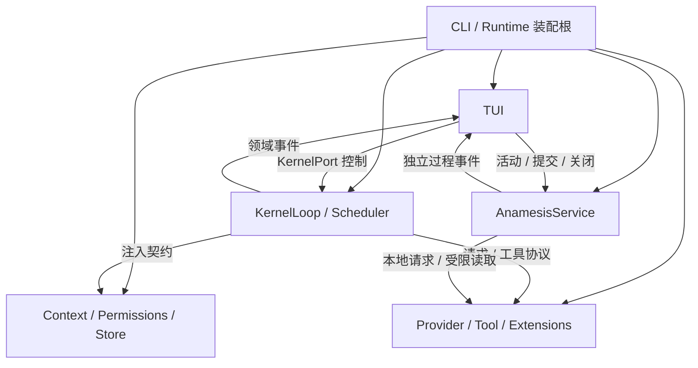

# LOGOX 当前架构

核对日期：2026-10-09。描述当前工作树；临时任务和验收状态单独维护在 [STATUS](development/STATUS.md)。

## 技术栈与边界

| 技术 | 用途 |
|---|---|
| Python 3.11–3.13、asyncio | 输入、流式模型、工具和后台生命周期 |
| Pydantic 2 | 配置、事件、消息和参数校验 |
| Rich、自研终端渲染 | 样式、Markdown、组件和行差分 |
| httpx、OpenAI SDK、Anthropic SDK | 模型传输和协议适配 |
| 外部 ripgrep | 搜索，复杂匹配在独立进程运行 |
| MCP SDK | stdio 工具服务 |
| uv.lock、hatchling、pytest | 依赖锁定、打包和开发验证 |

完整依赖由 [pyproject.toml](../pyproject.toml) 声明。TUI 没有 Textual 运行时依赖，仍依赖 Rich；发布包不包含本机 rg。产品概念见 [PRD](PRD.md)。

## 层次与依赖方向

装配根（composition root）选择实现并连接依赖；内核不导入具体 UI、配置或文件工具实现。事件总线（event bus）使界面、存储和度量分别订阅，内核不逐个调用它们。KernelPort 仅暴露 start、cancel、current_turn，避免界面依赖内核私有状态。

跨模块共享中立消息、工具 Schema、事件和错误；适配器转换厂商字段，业务规则由所属模块维护。分层检查见 [导入约束](../tests/unit/test_imports.py) 和 [KernelPort](../tests/unit/test_kernel_port.py)。

## 模块与源码目录

| 模块 | 源码 | 责任与主要边界 |
|---|---|---|
| [内核](modules/01_kernel.md) | kernel | 回合、调度、响应分类；不绘制界面 |
| [上下文](modules/02_context.md) | context | 提示、计量、有效视图、归档与压缩 |
| [界面](modules/03_tui.md) | tui | 输入、卡片、布局、终端；不执行工具 |
| [模型适配](modules/04_providers.md) | providers | 请求和事件转译、注册及发现 |
| [工具](modules/05_tools.md) | tools | 六个内置工具；不决定批次顺序 |
| [权限](modules/06_permissions.md) | permissions | 风险、规则、审批数据；无 OS 隔离 |
| [存储](modules/07_store.md) | store | 日志、回放、CAS 和文件回滚 |
| [装配与扩展](modules/08_app_and_collaboration.md) | app、config、mcp、skills、commands、hooks、plugins | 配置、接线和资源生命周期 |
| [入梦](modules/09_anamnesis.md) | anamnesis | 队列、只读研究、证据、活档案和报告 |

cli.py 提供入口，paths.py 维护目录发现，errors.py/difftext.py 提供公共数据，telemetry.py 保存诊断事件。模块数量按职责演进；不以目录数量限制新能力。

## 三条关键数据流

**前台任务：** 真实提交 → Turn → 构建有效上下文 → Provider 流 → 完整工具批次 → 权限/校验/快照/执行 → 结果 → 下一请求或终态。截断恢复不增加用户轮号，每次继续仍检查预算。busy 以整轮终态解除。

**保存与恢复：** 请求/工具完成事件 → 会话 JSONL 和工具原文 → 有效分支回放 → 压缩状态校验 → 模型视图与完整时间线分别恢复。write/edit 检查点采用内容哈希；回滚预检和冲突处理成功后才提交对话回滚。

**后台记忆：** TUI 生命周期 → 项目全员空闲及最近会话 → 单用户锁 → 冻结本项目资料/代码快照 → 有限事项与只读研究 → 提案 → 宿主和独立语义核验 → 用户/项目分别提交 → 报告和背景加载。前台对话与后台模型消息不共享。

## 生命周期与一致性约束

- 默认主屏和全屏共用内容归约；滚动分别受终端和应用管理。
- 配置按 Schema、用户、祖先项目、state、环境、CLI 覆盖；运行数据不修改人工配置正文。
- 用户偏好可跨项目继承，权限和项目档案隔离；项目身份按规范 cwd，而非安装目录。
- 普通工具审批不覆盖插件/Hook 运行代码的信任问题；MCP 仅 stdio，配置接受不等于传输实现。
- 回合失败、取消和关闭均需终态及资源清理；取消不承诺撤销副作用。
- 原始消息可追溯，缓存和摘要不能套用到不匹配的历史；后台提案提交再核对版本、来源与唤醒状态。
- JSONL、工具日志、文件快照和入梦事件各有责任，不能把诊断队列当可靠审计。

## 持续边界与开发入口

权限检查和实际使用之间仍有 TOCTOU 风险；文件级原子替换没有跨文件事务。计量为估算，静态窗口可能与本地服务不一致；动态工具 Schema 尚未独立加入计量指纹。日志保留工具全文，请求结束前增量在内存；时间线尚非完整视口虚拟化。

这些限制在所属模块说明，不把它们反复追加为架构历史。开发按 [WORKFLOW](development/WORKFLOW.md)，验证按 [TESTING](development/TESTING.md)，当前未完成与未验证事项按 [STATUS](development/STATUS.md)。源码细节优先查稳定路径和符号，历史记录解释当时取舍，不替代当前契约。
