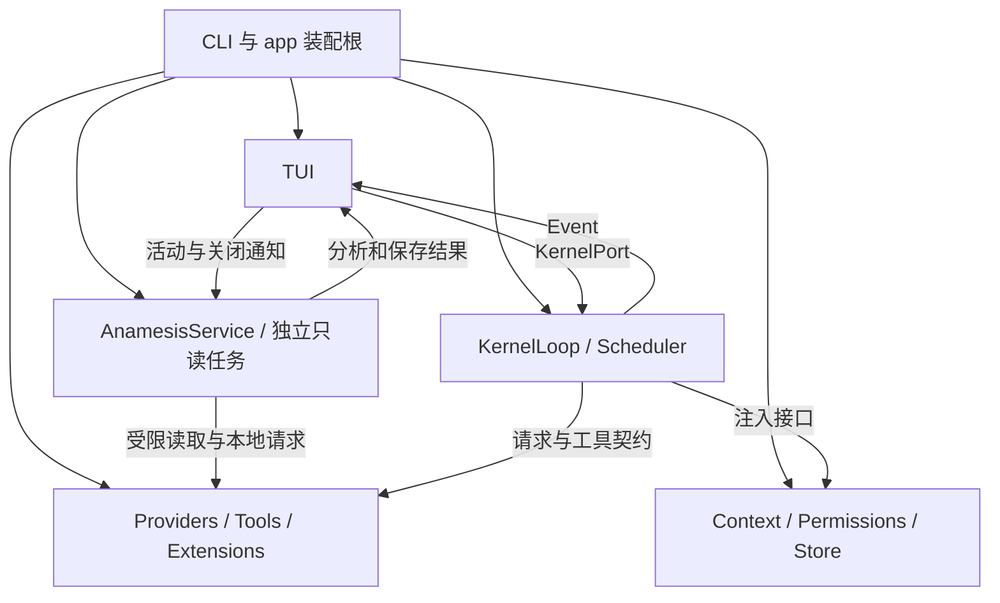

# LOGOX 当前架构与接手入口

核对日期：2026-10-02。描述当前实现；[模块文档](modules/README.md) 是详细接口与边界来源。本文未重选产品形态或技术路线。

## 1. 产品边界

Python 终端编程助手，参考 Pi Agent 与 Claude Code。内核驱动模型和工具，界面通过事件显示；默认主屏和备用全屏均保留。

## 2. 当前技术栈

| 已有依赖 | 作用 |
|---|---|
| Python >=3.11,<3.14 / asyncio | 模型流、输入与子进程 |
| Pydantic 2 | 配置、事件与工具参数校验 |
| Rich | 文本样式与 Markdown |
| ripgrep / rg（外部可执行文件） | grep 搜索，默认 Rust 正则与 auto 编码；缺失时明确失败 |
| httpx / OpenAI SDK / Anthropic SDK | 探测与模型请求 |
| MCP SDK / platformdirs | 当前 stdio 工具服务 / 用户路径 |
| pytest（开发可选） | unittest 收集与参数化回归 |
| hatchling / uv.lock | 包构建与依赖锁定；本轮未更换依赖 |

## 3. 层次与依赖方向



装配根（composition root）创建具体实现并连接对象；内核依赖窄接口，避免自己挑选配置、厂商和界面。导入边界由 test_imports.py 验证。

## 4. 当前模块责任

现有九份文档按职责组织，不限制未来模块数量。Anamnesis 独立承担后台整理的生命周期、只读模型任务、证据与档案保存；既有模块只负责接线和展示，见 [入梦模块](modules/09_anamnesis.md)。

| 模块 | 负责 | 边界 |
|---|---|---|
| 01 | 回合、事件、调度、取消与摘要 | 不实现终端或厂商 SDK |
| 02 | 提示、有效历史、计量与压缩 | 不实现权限和模型发现 |
| 03 | 输入、时间线、布局与终端 | 不执行工具或决定业务策略 |
| 04 | 厂商协议、凭据、发现与窗口 | 不驱动 Agent 循环 |
| 05 | 六个内置工具、输入输出 | 不决定授权和批次顺序 |
| 06 | 风险审计、规则与审批数据 | 不隔离操作系统进程 |
| 07 | 会话、回放、快照与回滚 | 不撤销任意外部副作用 |
| 08 | 配置、Runtime、技能、插件、命令和 MCP | 不重复实现其他模块算法 |
| 09 | 入梦调度、只读研究、证据、活档案与晨报 | 不执行实验、不修改源码、不共享前台模型对话 |

## 5. 目录与职责

```text
src/logox/
  cli.py, app.py, paths.py       启动、装配、路径
  kernel/                       01 回合与调度
  context/                      02 提示、计量、压缩、写出器
  tui/                          03 内容、组件、终端、主题
  providers/                    04 厂商与发现
  tools/                        05 文件与命令工具
  permissions/                  06 审计与规则
  store/                        07 会话、回放、快照、回滚
  config/, mcp/, plugins.py      08 配置与外部工具扩展
  hooks.py, commands/, skills/   08 钩子、命令、技能
  anamnesis/                    09 后台整理、协调、核验与归档
  errors.py, difftext.py         公共错误与中立数据
 tests/                         单元、契约、模拟终端、流程
 docs/modules/                  当前模块说明
 docs/audits/                    本轮复验证据
```

## 6. 一轮执行

start → Turn → 构建上下文 → Provider 统一流 → 工具授权/校验/执行 → 结果回灌 → 必要时继续请求 → 摘要与完成。取消保留已输出内容、补齐工具结果并进入终态，不代表已发生副作用被撤销。

## 7. 配置与扩展

默认模型字段、用户配置、祖先项目配置、状态、环境、CLI 逐层覆盖。插件和钩子运行本机代码；技能与命令按文件发现；默认 MCP 通过元工具暴露简要目录。接受配置字段不代表对应传输已实现，细节见 08。

## 8. 数据与恢复

原始历史留痕，有效视图参与预算。JSONL、工具输出和内容寻址快照用途不同。resume 重建会话；rewind 撤销指定轮次及之后的已记录修改。单文件替换原子，多文件加日志和内存没有整体事务保证。

## 9. 验证

输出、取消、失败与数据保留分别验证。局部耗时不作为脆弱单测门槛；模拟终端与离线流不替代真实终端和在线厂商验收。源码、文档和测试入口同步维护。

## 10. 已知边界

权限是应用策略而非操作系统隔离；检查后到实际读写之间仍可能发生文件替换。上下文以估算值控制预算，动态工具 Schema 尚未加入计量失效条件。极小窗口允许历史有损摘要，原始会话与工具归档提供恢复线索。单文件替换不等于多文件、日志和内存的整体事务。JSONL 仍保留工具全文，模型请求结束前的增量仍在内存。MCP 仅实现 stdio，http 配置返回明确错误。界面尚未按视口只渲染可见块。详见各模块第 5 节。

## 11. 接手顺序与当前进度

2026-10-02 发布准备：用户明确授权 push codex/anamnesis 和 main。远程 origin 为 MARKIR123/logox；fetch 后本地 main 与 origin/main 同为 11385fe，没有合并入梦到 main 的操作。新分支提交当前已验证源码／测试、允许发布的模块／架构／入梦设计与验收文档、主题生成器及固定色板。本次功能源码／测试逻辑沿用 2026-10-01 全量验收，2034 passed / 3213 subtests passed（85.90s）；首次暂存检查发现 7 个测试文件的尾空行／空白，已只清理排版，相关 155 passed / 148 subtests passed（5.64s）。发布前重新检查完整暂存内容。自动生成 ANAMNESIS.md、本机缓存、临时产物、私人决策／复盘／原始证据及 LEGACY 不纳入提交。通过选定文件清单暂存，建立本地提交后执行普通 push，保持 main 自身历史；远程提交身份由 git ls-remote 最终核对。

2026-10-01 入梦无进展保护（用户选择 A）已实现：未形成完整提案不推进来源游标，保留分析／报告及 automatic_block；相同待审资料和代码指纹不再自动请求模型，跨模式／同项目窗口／重开均遵守，真实新资料或代码变化可解锁，手动 nap／sleep 可续做。完整已审阅批次使用 checkpoint／continuing 静默交接，同 run_id 卡片显示剩余数量；真实暂停／失败／整体完成仍通知。提案明确引用已记录分析，ID 冲突／未知来源／JSON 修复反馈具体；分析不可覆盖与逐条候选保护保持。eligible=false 登记仍保存真实 idle，避免暂停窗口错误阻挡同项目窗口。新增 12 项；针对性 51 passed（15.37s），相关 Ruff 通过；全量 **2034 passed / 3213 subtests passed（85.90s）**。设计 §25，模块 03／09，证据 .test-tmp/anamnesis-continuation-focused-final.txt 与 anamnesis-continuation-full.txt。仍在 codex/anamnesis，未提交、未改真实档案、未调用真实模型、LEGACY 禁读禁改。此前“每批暂停就通知／步骤耗尽自动续做”为已被取代的历史行为。

2026-09-30 入梦逐条采纳修订（用户选择 A）已实现：完整提案不因一条记忆被拒绝而整批失败，合格项按原保护保存，拒绝项归一为候选留在原会话卡片／事件／报告，原提案状态另存；全部候选也表示本批资料已审阅，推进游标并续做后续资料，不重复阻塞旧批。终态显示部分采纳／无可采纳记忆及保存／候选数量，不新增终态枚举；同 entry_id 只更新本批提交记录，旧批结果保留。项目变更需最新可确认的非 assistant 证据或可核验的当前文件，旧／未知时间状态留候选；用户明确偏好不按项目时间衰减。核验错误响应、未送审身份、外部编辑、预算／写入冲突／取消保护继续有效。新增 12 项，相关 179 passed / 148 subtests passed（24.58s）；全量 **2022 passed / 3213 subtests passed（78.04s）**，相关 Ruff 通过。设计 §24，模块 09；证据 .test-tmp/anamnesis-partial-related.txt 与 anamnesis-partial-full.txt。仍在 codex/anamnesis，未提交，未操作真实模型／档案或 LEGACY。

2026-09-30 入梦展开与暂停规则已按用户最新裁定实现：Ctrl+T 同时控制普通思考和整张入梦卡片，Ctrl+O 仅控制工具／diff，点击仍可覆盖单卡片；沿用 expand_reasoning 和既有缓存，不增加独立状态。未发送的输入、粘贴、删除、展开、查看和只读 slash 只刷新活动时间，不取消当前任务、不递增资料世代、不丢弃提案。普通消息提交或 /anamnesis stop 暂停当前窗口；前台互斥、TUI 关闭清理和其它窗口隔离保留。新增 10 项覆盖两种真实 App 按键／编辑器 Enter、slash、预览恢复、点击与缓存及草稿期间完成提交；相关 874 passed / 2075 subtests passed（25.34s）；全量 **2010 passed / 3213 subtests passed（83.97s）**，相关 Ruff 通过。证据 .test-tmp/anamnesis-controls-full.txt。设计 §22—§23，模块 03／09；源码仍在 codex/anamnesis，未提交，未修改真实档案或操作 LEGACY。以下旧进度中的“输入唤醒／Ctrl+O 展开入梦”为历史规则，已被本轮取代。

2026-09-30 入梦连续无响应超时与生命周期动画修复完成：用户选择 A，request_timeout_s 现为连续无模型数据期限（默认 180 秒），取代请求总时长限制。现场运行保存 233 段／12387 字思考，最后片段距失败不到一秒，证明旧总计时器误取消正常生成；不是本地模型卡住或用户主动终止。运行器持有可重设 deadline，统一事件及本地原始 SSE（含工具参数片段）到达后延期；HTTP 连接／传输期限保留，沉默／传输超时保存明确原因、片段和 model_response.failure_reason，取消保持独立。卡片复用既有 10Hz 字符动画，成功／失败／暂停／中断改静态符号并停止计时；当前会话实时结束新增普通通知，重复事件／恢复不刷通知，不抢焦点，不重排旧阶段正文。相关 157 passed / 148 subtests passed；全量 **2000 passed / 3213 subtests passed（69.53s）**，新增 9 项；相关 Ruff 检查通过。证据 .test-tmp/anamnesis-idle-full-tests.txt，设计 §21，模块 03／09。源码仍在 codex/anamnesis，未提交，未操作 LEGACY 或真实档案；需重启后实际 Qwen／Windows Terminal 验收。

2026-09-30 入梦固定输出限额与思考字段兼容修复完成：仍在同目录 `codex/anamnesis`，未提交。用户授权取消或放大输出限额，本轮选择整理／契约修复／语义核验请求均不传 max_tokens，移除 120000 字符总输出保护；输入检查预留生成空间，不限制返回长度。OpenAI 兼容适配器接收 reasoning_content 或 Ollama reasoning，双字段不重复显示，非法／空旧字段不遮挡后备。已有实时事件、完整 trace、有界预览及会话恢复接通这些片段；每请求保存 model_response（结束原因、实际用量或未知、字符统计及是否指定上限），服务截断仍拒绝提交并明确原因。本次全量 **1991 passed / 3212 subtests passed（69.00s）**，新增 8 项测试；相关 Ruff 检查通过。证据 .test-tmp/anamnesis-output-full-tests.txt，设计 §20、模块 04／09。需重启后现场验证实际 Qwen／Windows Terminal；本轮未调用真实模型、改真实档案或操作 LEGACY。服务自身生成默认值、窗口容量和既有 request_timeout_s 仍生效，不能承诺无限生成；卡片显示最近 12000 字，trace 保存完整已收到思考。

2026-09-30 Anamnesis 会话恢复、实时过程与项目级多窗口规则完成：同目录 `codex/anamnesis`，未提交。任务只扫描自己项目的会话桶／源码，关闭项目不参与本轮整理，旧用户档案保留。同项目全部窗口空闲超过阈值、前台结束才自动入梦；项目按真实用户提交从新到旧，最近提交会话承载，单次归属固定。手动指令跳过空闲时长，不绕过同项目前台忙；输入仍只唤醒当前承载窗口。全部窗口登记，准备及认领前核对队列；新会话只存 anamnesis_ref，外置事件与有界预览用于启动／热切换／回滚后恢复，结束读取再次检查会话并合并新事件。实际 reasoning、读取开始／完成／错误、阶段结论、发现及计划可展开查看；history、report [run_id]、trace [run_id] 已接通。旧无归属记录只在项目历史可见。思考与静态阶段排版分开缓存，异常记录类型／非空原因，预览写失败及半截事件尾行不复用有效序号。约 180 秒结束由用户主动终止，撤回超时归因，本轮未改 request_timeout_s。最终全量 **1983 passed / 3202 subtests passed（57.36s）**，入梦相关 57 项，新增 20 项，相关 Ruff 检查通过；三项旧窗口探测测试改验静态窗口和真实 POST 代理／重定向保护，未恢复探针。输出 .test-tmp/anamnesis-history-release-tests.txt；设计 §18—§19，模块 09。全部窗口需重启后现场验收；未调用真实模型、修改用户档案或操作 LEGACY。跨进程状态有 2 秒登记间隔，20 秒失联淘汰；不宣称即时观察、真实语义质量或原生终端体验已获证明。

2026-09-30 默认主屏历史渲染兼容回归修复：卡片展开／折叠和窗口缩放时 ED(2) 会在 Windows Terminal 中把旧画面（含输入框／状态栏）放入历史；D199 移除 ED(3) 后暴露。当前屏重绘和 Terminal.clear 统一使用 Home + ED(0)，保留历史与行差分，启动显式清空与全屏入口语义保持。新增 11 项历史／物理屏／光标验证；旧清屏序列在隔离测试进程触发 10 项失败，修复后相关 125 项通过。全量 1960 passed / 3201 subtests passed，另有 3 项既有入梦静态窗口测试失败；以旧渲染序列复测 LocalTransportTests 仍是同样 3 failed / 1 passed，不宣称全量通过。验收输出在 .test-tmp/scrollback-full-tests.txt 与 scrollback-unrelated-baseline.txt；当前屏与历史模拟仍不覆盖原生 ConPTY 或完整缩放重排，用户现场验收待重启并 resume，已污染的历史不做选择性删除。源码仍在同目录 codex/anamnesis，未提交；修复设计和边界见 03 §5.6。

2026-09-30 静态模型上下文窗口与运行时探针剔除完成（D194）：彻底物理移除脆弱的 `ollama_probe.py` 运行时探针；在 `config.toml` 中支持 Provider 通用 `context_window` 兜底与针对具体模型 ID 的 `model_windows` 精细映射字典。模型窗口解析改为精确匹配优先、`:latest` 规范化 Tag 容错、未命中回退 Provider 默认值的 $O(1)$ 纯内存同步查表，零网络往返与端口假死阻塞。全量 912 项单元测试与 184 项契约测试通过。

2026-09-30 压缩后 resume 回涨修复完成：有效前缀／全局 memo／工具归档替换写入同会话 `context_state`；启动恢复、热切换与回滚均校验有效分支再恢复，状态栏估算实际视图，新会话与切换清空旧厂商用量。工具仅修剪后下次 build 反弹已修复，工具批次与日志单行按来源单元对齐。新增 18 项，相关 187 项通过；全量 1949 passed / 3212 subtests passed（53.21s），相关源码和新增测试 Ruff 检查通过。全量仅在测试进程移除继承的 HTTP／HTTPS／ALL_PROXY，避免 SOCKS 依赖缺失干扰回环端点，未更改用户配置或依赖。旧日志未保存的模型 memo 无法凭计数还原，应重新压缩一次；恢复失败保留原始历史，写状态失败 warning 并在后续 build 重试。详情见 02 §5.3 和 07 §5.4，验收输出在 `.test-tmp/context-resume-full-tests.txt`。同目录 `codex/anamnesis`，改动未提交，Anamnesis 与此前用户改动保留。

2026-09-30 Anamnesis 首版实现完成并通过离线验收：同目录 `codex/anamnesis`，改动未提交。独立只读运行器、TUI 生命周期、最近指令项目队列、受限活档案、证据与版本日志、暂停续做、单运行卡片及完整报告均已接通；前台独立加载有预算的背景记忆。最终全量 1931 passed / 3212 subtests passed，新增入梦 37 项；相关源码与测试 Ruff 检查通过，wheel 包含全部 119 个 Python 源文件。全量后补充档案预算输入字段再通过相关 65 项 / 11 子用例。100×30 假终端、800 对历史、20 条展开阶段、入梦请求等待时，输入与渲染中位约 11.55/11.72ms，首次输入唤醒约 11.52/9.19ms（主屏/全屏）；不包含真实终端写出与本地服务计算。本地实际模型与现场体验尚待用户验收，默认模型空值，需要配置 `[anamnesis].model` 后重启。实现、使用和失败边界见 [09 入梦](modules/09_anamnesis.md)，验证方法与限制见 [验收记录](ANAMNESIS-VALIDATION.md)。此前“尚未实现”段落为保留的历史记录。

2026-09-29 Anamnesis（入梦）首版收敛为只读研究（D202）：已从本地 `main` 创建并切换到 `codex/anamnesis`，起点 `11385fe844c414107dff007fba044f2db95fd8c6`，原有未提交改动保留，没有创建提交。仅在 TUI 存续期间运行；按电脑本地时区，00:00—08:00 长眠，其余时间小憩，支持 slash 手动触发。空闲超过 30 分钟，从最后用户活动与前台任务结束的较晚时间计时；前台模型／工具／审批未结束时不入梦；输入即唤醒，交互优先。无新资料或未完成工作不重复整理，小憩后进入夜间仍可启动长眠研究。首版取消自主修改、测试与实验环境建设，仅允许模型读取／搜索并提出方案；指定档案和报告由受约束的保存逻辑更新。档案统一为 `ANAMNESIS.md`，用户级放 `~/.logox/`，项目级放项目工作目录；用户画像可整理全部 LOGOX 会话，项目资料隔离。只自动写入有明确依据的记忆，过程卡片与变更记录可追溯。用户已确认小憩只整理新增会话／档案，长眠再读代码；精简正文限长直接加载；独立配置本地入梦模型，不转云端。多窗口队列已确认：只选择仍打开、空闲超过 30 分钟、前台结束且有待处理工作的窗口，按最近用户指令提交从新到旧逐个处理，同项目去重；当前任务不被其它窗口的新对话抢占，输入仅唤醒当前窗口。同用户最多一个入梦任务，完成或暂停后交给下一合格项目。小憩／长眠均不设总时长上限；已运行长眠跨过 08:00 继续执行直到用户打断，08:00 仅决定新自动任务的模式；没有待处理工作仍正常结束，不重复空转。实现设计草案的接口、流程、写入恢复、卡片和验证计划已补齐，见 [Anamnesis 设计](ANAMNESIS-DESIGN.md) §6—§16；2026-09-30 评审修订：不限制模块数量，设计建议独立 `anamnesis/` 特性包；内部类前缀统一 `Anamesis`，协调类为 `AnamesisCoordinator`。一次入梦在一张完整卡片内分阶段展示分析问题、依据、取舍、结论与档案变化，具体文件操作移至按需详情。2026-09-30 用户确认继续使用当前目录并开始实现，完整设计通过本轮评审。当前进入资料／档案／协调器阶段，随后接入独立只读运行器、上下文与卡片；功能验收尚未完成。

2026-09-29：第一轮兼容优化完成后，用户确认后续 A 方案。统一工具风险审计、回滚预检与重试、存储行号与会话隔离、只读线程、Shell 有限输出收集、固定消息宽度、Ollama 窗口刷新及 MCP 取消清理已落地。极小窗口按最新裁定采用“历史逐轮摘要 → 必要时本地全量汇总 → 仍超预算暂停”，无云端或机械截断兜底。最终离线验收完成：原工作区与仅含 Git 可纳入文件的候选目录分别 1813 passed / 3169 subtests passed，无失败或跳过项；本轮涉及源码与测试静态检查通过，八模块结构/链接/示例/测试入口验证通过。安装包包含全部 107 个 Python 源文件，六工具实际执行成功。验收和未完成边界见本机 `docs/AUDIT-A-2026-09-29.md`，证据位于 `docs/audits/2026-09-29-A/`。

接手先读 08 装配和 01 循环；上下文进入 02，工具/权限进入 05/06，恢复进入 07，界面进入 03，厂商进入 04。当前原用户改动保留，未提交或远端发布。通用文档和测试具备 Git 可纳入性；个人决策、复盘和审计证据仍留本机。


2026-09-29 后续 TUI 诊断：用户在 Windows Terminal、两种模式及空白会话均报告卡顿。实际离线渲染链路复现长尾 Markdown 每帧重排、工具起始前缀全量重建，以及 Python 正则工作线程占用 GIL 使心跳暂停；现有平滑器突发按字符数放出大块，默认 30 FPS 不是实际达到值。空白会话纯排版约 0.25ms，真实终端写入/尺寸查询和输入排队仍待用户终端时序，不能把这一部分认定为历史问题。当前业务源码未改；诊断证据与只记录时长/长度的启动脚本见本机 `docs/TUI-LATENCY-2026-09-29.md`。此前 1813 项验收证明功能正确性，尚不足以证明交互流畅。

后续用户补充：发送延迟主要发生在已有历史时，模型工作期间打字更慢；两种模式的新工具有时使阅读位置跳到整个会话第一条。真实 Editor → KernelLoop → 事件 → Screen 的离线复现已证明长历史新增用户块会使首帧耗时超过一秒。主屏还捕获到“旧工具状态变化未被前缀缓存发现 → 新工具到来重建前缀 → 修改行已在视口外 → 清屏且发出清空回滚历史的 `ESC[3J`”链路；全屏确认新增行导致阅读内容漂移，但尚未复现直接跳到第一条，不能认定两者完全同因。接手优先处理缓存失效和增量追加，再对齐主屏历史更新与全屏阅读锚点的兼容边界；此次未实施渲染/滚动策略修复，用户实际终端时序仍需验证。复测时另修复状态栏调用未定义 `RUNNING_DEFAULT` 的启动异常，改用已有 `tool_glyph` 属性；160 项界面测试 / 18 个子用例通过，当前复测首帧主屏约 1.41 秒、全屏约 1.12 秒，性能问题仍在。

2026-09-29 新增 `/reload`（D197，决策见 `../00-decision-log.md` §94，边界与七条验收见 `modules/08_app_and_collaboration.md` §5.2）：重扫项目记忆 / 技能包 / 模板命令、重读当前主题并重绘视口、校验 `config.toml` 但**不替换运行中的配置**；正在生成时拒绝执行。**不重载 Python 代码**（改 `.py` 仍要重启，`/status` 的「代码」行继续承担过期告警），也不重连 MCP 或重建插件注册表。全量 1,828 passed / 3,170 subtests；两次红检验证新用例有效。下一版候选：原地重启（`os.execv` + 自动 resume）与工具侧重载（需先给 `PluginManager` 补卸载路径）。

2026-09-29 状态字形接通（D200，决策见 `../00-decision-log.md` §96，边界与验收见 `modules/03_tui.md` §5.2）：`running` 字形由 `⏺` 改为 `✻`（用户裁定），并把主题 `[glyphs]` 链一次接通三处断点 —— `CardContext` 未传 glyphs、`StatusContext` 未传 `tool_glyph`、`glyph_set()` 零调用者（`ui.icon_set` 的 ASCII/Nerd 降级因此从未可用）。启动 / `/theme` / `/reload` 三条路径共用 `InlineApp._glyphs_for()`。三次红检确认断言有效（第一次的断言只查字段、抓不到缺陷，已改为断言渲染输出）。本会话相关测试 143 passed。

⚠️ **此前 D199 演进期间全量有 7 条失败（下文续修已收敛），与本会话改动无关**，已用隔离副本证明（把 `src/` 复制一份并用 HEAD 覆盖本会话改过的全部文件，同样失败）：`test_timeline_cache.py` 3 条、`test_render_screen.py` 1 条、`test_fullscreen_app.py` 2 条、`test_render_inline_app.py` 1 条。根因是并行会话 D199 的新缓存契约（按块内容键复用、不再"最后一块必重渲染"）与旧断言冲突，**本会话未擅改对方正在进行的代码**；该 7 条**已由并行会话自行修复**（见下文续修记录，全量 1,894 passed / 0 failed）。

⚠️ **并行会话互扰的实证（值得记住）**：上一段提到的"状态栏 `RUNNING_DEFAULT` 未定义"异常，其实是本会话做红检时**故意**写入的临时引用；并行会话在共享工作区里看到它，当成真缺陷修掉了（改回已有的 `tool_glyph` 属性）。结论是好的，但暴露了共享工作区的代价：**临时性的破坏性编辑会被另一个会话观测成生产缺陷**。今后红检要么改成不引入未定义名（例如只改一个已有值），要么在改动前说明。


2026-09-29 接手续修完成（D199 / D201）：按用户主屏 A 裁定，正常更新保留回滚历史，屏外旧卡片留当时状态，仅更新当前画面；全屏各帧捕获正在阅读的块与行，工具/正文/旧卡片/浮层/尺寸/输入框高度变化后恢复。时间线按完整显示内容键缓存全部未变块，包括最后块；Markdown 结构和代码行复用，UI 直接使用分块行，避免重复合并切分完整历史。已接受用户消息兑现一帧后才继续上下文准备；ticker 按截止时间调度，正文与推理每帧各步进一次，普通帧每通道最多 16 字，终态排空。用户明确选 grep B，改为异步 ripgrep 子进程，参数列表传递并保留结果格式/全局上限/敏感范围，启动中取消、执行取消、上限与协议异常均回收进程。原旧成本断言与首次全屏滚动几何问题已修复，上一段历史“7 条失败”不再代表当前状态。全项目 1893 passed / 3170 subtests passed；相关新增边界测试 51 项通过。离线同场景长历史 Enter 首帧约主屏 20ms / 全屏 10ms（原约 1413/1124ms），3.24 万字流式帧约 5ms（原约 94/65ms）。详情和实测边界见 [TUI 修复验收](TUI-LATENCY-2026-09-29.md#8-续修结果与验收边界)。真实 Windows Terminal 的空白输入、滚动实际落点和写出延迟仍需现场验收；不声称所有卡顿已消失。
