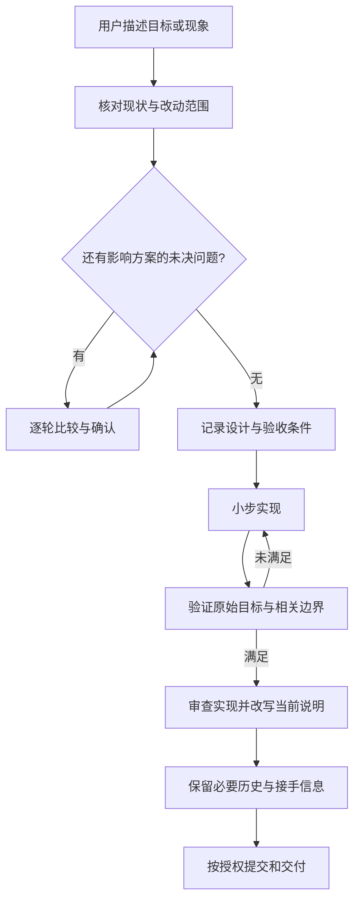

# LOGOX Vibe Coding Workflow

维护日期：2026-10-09。适用范围：LOGOX 的需求讨论、功能开发、缺陷修复、性能优化和文档维护。

本指南将已经确认的协作规则整理为日常流程。文档已按用户操作、当前实现与开发历史整理；目录归属不是功能验收结果，运行验证仍按 TESTING 执行。

## 1. 一次开发的闭环



用户决定目标、产品体验和有意义的技术取舍；Agent 查事实、提出可比较的方案、实施并提供验证证据。已经确认并授权的工作持续推进，不反复索要同一批准。

## 2. 先决定需要多深的记录

| 改动 | 修改前需要什么 | 完成后保留什么 |
|---|---|---|
| 文案、排版、链接等低影响维护 | 明确修改范围，核对实际内容 | 改写受影响说明；Git 保存普通变更 |
| 恢复已确认行为的普通缺陷修复 | 简短记录现象、依据、修改思路和验收条件 | 修复与验证进入提交或任务记录；典型排查才写复盘 |
| 新功能、产品行为变化、跨模块重构 | 逐轮讨论后形成设计，确认接口、失败边界与验收条件 | 当前说明更新；设计标记结果与状态；重要取舍按需单独记录 |

记录深度取决于行为影响，不取决于代码行数。一个快捷键即使只改一行，若改变唤醒规则，也需要先确认用户体验。

一次变更默认使用一份设计，包含需求、方案、实施检查清单与验收。篇幅或独立读取场景确实需要时才拆文件。普通修复的简短说明可留在现有任务或相关设计中。

## 3. 各阶段怎样完成

### 3.1 核对现状

读取 [模块入口](../modules/README.md)，找到负责该行为的模块，再核对源码、配置和相关测试。产品范围核对当前 [PRD](../PRD.md) 与已确认需求。跨模块关系参考 [架构](../ARCHITECTURE.md)。

确认当前分支及未提交修改，保留既有工作；文档与源码不一致时指出差异。已有 LEGACY/legacy 及明确标为 legacy 的材料不读取、不修改、不作为依据。用户明确要求归档时，只将旧资料迁入新建日期目录，不重写或使用旧档案推导当前事实。

对故障记录触发步骤、实际结果、预期结果和可重复的证据。性能问题注明历史规模、输入、终端模式、模型或工具状态与测量环境。

完成条件：能说明现在发生了什么、已有约束是什么、准备修改哪里；事实不足的部分明确列出。

### 3.2 逐轮确认需求

先解决范围、用户体验和技术路线的主要分歧，再讨论依赖这些答案的细节。每轮给出具体选项、优缺点、代价、建议及以后改变的成本。

新功能从整体边界到模块接口逐步收敛。已确认需求不重新打开；源码和环境能查到的事实由 Agent 查证。

完成条件：目标、范围与验收结果已对齐；影响实施的未决问题得到回答。

### 3.3 写设计与验收条件

设计放在 `docs/development/designs/`，使用有意义的名称和日期；同一变更优先修订现有设计。

按需要包含：

- 问题、目标与范围。
- 当前行为和预期行为。
- 方案比较、确认方案、影响的模块与接口。
- 数据变化、取消、异常、恢复及兼容边界。
- 可逐步完成的实施清单，每项注明怎样验证。
- 完成条件及明确未覆盖的范围。

验收描述用户或调用方能观察的结果，避免“足够完美”“模型说完成”这类无法核对的标准。

完成条件：能够根据设计实施，也能够根据它判断结果是否满足要求；需要用户评审的行为与架构选择已确认。

### 3.4 小步实现

每一步围绕一个可验证的行为推进，将代码、必要测试与受影响说明一起处理。失败时先定位原因，再调整该步骤。

保持模块职责清楚；跨模块变更明确谁负责业务规则，谁仅负责接线或展示。工具和框架按已确认需求使用，不为未来假设提前增加层次或文件。

若实现发现方案不成立，先修订对应设计；影响已确认产品体验或技术路线时回到讨论。普通实现细节在授权范围内解决。

完成条件：该步骤已经接入实际流程，其验证证据可查，尚未完成的步骤保持未完成状态。

### 3.5 验证与审查

验证原始目标、相关失败边界与受影响的既有行为。测试检查外部可观察结果；可逆的低影响文档改动使用内容与链接检查即可。

项目开发依赖与测试配置以 [pyproject.toml](../../pyproject.toml) 为准。准备开发环境可使用：

```powershell
uv sync --extra dev
```

定向验证时，用真实的相关测试路径替换下面的占位符：

```text
uv run python -m pytest <相关测试路径>
```

影响范围需要全量回归时：

```powershell
uv run python -m pytest tests
```

定向检查通过后，只在新修改、失败或尚未解决的影响范围需要时扩大或重复验证。公共协议、取消与调度、持久化、压缩等跨模块变更，按其实际影响覆盖回归。

TUI 性能和滚动体验需要真实终端检查；本地模型、MCP 与外部服务需要对应环境的验证。离线通过不能替代这些结论。

审查同时核对两件事：实现是否符合确认的需求；实现是否符合当前模块边界与开发规范。能使用独立审查时保留这一视角，不能使用时也按两项分别检查。

完成条件：每项验收有结果；未验证、失败或已有基线问题单独说明，不把“已编写测试”写成“测试已通过”。

### 3.6 文档收尾与交付

改写当前说明，将失效规则替换或移除；按影响更新产品、架构、模块和用户操作。详细排查、旧实现、当时的测试计数留在有日期的记录中。

设计注明完成、部分完成、放弃或被取代；关联实际提交或当前未提交状态。完成任务移出当前待办，未完成任务保留明确下一步。

提交说明记录问题、变化和验证；按用户授权处理提交、推送、合并或发布。检查改动范围，避免带入已有的无关修改或私人原始材料。

完成条件：代码、验收和当前说明一致；读者能找到有效入口，下一会话能找到剩余工作，交付明确说明完成内容及实际限制。

## 4. 每类信息只维护在所属位置

| 信息 | 归属与维护方式 |
|---|---|
| 产品定位、范围和产品概念 | PRD；按当前需求改写 |
| 整体协作与依赖、架构概念 | ARCHITECTURE；按当前架构改写 |
| 当前模块机制、接口与边界 | 所属模块文档；按当前实现改写 |
| 使用步骤、配置与故障处理 | 用户指南；现有说明能承载时优先原地更新 |
| 当前未完成工作 | [STATUS](STATUS.md)；完成事项移出，历史由 Git 或必要复盘保存 |
| 本次修改方案和实施清单 | 现有任务或 `development/designs/` 的对应设计 |
| 重要取舍 | 按需存入 `development/decisions/`，普通选择留在对应设计 |
| 典型排查与历史验证 | 按需存入 `development/reviews/`，注明时间、环境、方法和代码状态 |
| 外部调研 | `development/research/`，注明来源、调查日期与适用边界 |
| Agent 必须持续遵守的约束和沟通偏好 | 根目录 AGENTS；详细流程由本指南维护 |
| 私人学习材料与迁移前原文 | 本地忽略目录，正式文档不依赖私人原文才能读懂 |

目录中的路径以 `docs/` 为起点，另有说明的除外。验证读取 [TESTING](TESTING.md)，接手与收尾读取 [STATUS](STATUS.md)。私人原文及过时材料归入忽略的 legacy 日期目录；已经归档的材料不作为当前依据。

产品概念融入 PRD；实现概念在架构或所属模块就近解释。新增文档要有独立职责或读取场景，不另建词汇表，不为每次变更机械创建规格、计划与任务三份文件。

旧记录保持时间语境。后续修订标明取代关系；来源不明的编号、日期和效果明确为未知，不能通过猜测补全。

## 5. LOGOX 的具体例子：输入卡顿修复

这是一份使用流程的示例，不表示本轮已经实施或验证新的 TUI 修复。

1. 记录 Windows Terminal、主屏/全屏、历史规模，以及前台空闲/模型输出/工具执行时的输入表现。
2. 分开测量按键到输入显示、发送到用户消息显示、工具动画和流式输出，避免把所有卡顿先认定为一个原因。
3. 根据证据选择修改范围；会改变终端历史、滚动位置或卡片更新规则的方案先比较并确认。
4. 每次修复一个有证据的瓶颈，验证输入、工具计时、流式更新和阅读位置。
5. 模拟终端与实际 Windows Terminal 的结论分别记录；报告注明规模和方法，不将局部耗时推广为整体提速。
6. 当前 TUI 文档说明最终机制和边界，典型诊断另留复盘，用户指南说明可见的交互规则。

## 6. 交付前核对

- [ ] 原始目标及所需失败边界有实际结果。
- [ ] 本轮测试、人工检查、未验证项和基线问题分别说明。
- [ ] 受影响的当前说明已改写，命令、配置和链接有效。
- [ ] 旧设计与当前实现有明确的日期和状态边界。
- [ ] 剩余事项有下一步；没有新建内容重复的文档。
- [ ] 既有未提交工作和私人资料被保留，LEGACY 未参与。
- [ ] 提交或外部发布在已有授权范围内处理。

交付先说明结果与验证，再讲重要原因和代价；必要时补充值得记住的概念和排查过程。

## 7. 借鉴来源与适配

本流程是 LOGOX 对公开方法的适配，不代表作者指定了上述目录或已测得开发效率提升。

- Harper Reed 的 [工作流](https://harper.blog/2025/02/16/my-llm-codegen-workflow-atm/)：逐轮澄清、分步实施、清单保留执行状态。
- Addy Osmani 的 [工作流](https://addyosmani.com/blog/ai-coding-workflow/)：计划先行、小步实现、规则文件与人工验证。
- Simon Willison 的 [质量原则](https://simonwillison.net/guides/agentic-engineering-patterns/code-is-cheap/)：文档随当前行为更新。
- [OpenSpec](https://github.com/Fission-AI/OpenSpec/blob/main/docs/concepts.md)：区分当前规范、本次变更及历史生命周期。
- [Spec Kit](https://github.github.io/spec-kit/reference/agentic-sdd.html)：区分需求、技术方案、执行步骤，并对照结果检查一致性。
- [Diátaxis](https://diataxis.fr/how-to-use-diataxis/)：以实际阅读需求逐步改善内容结构。
- [Docs-as-Code](https://www.writethedocs.org/guide/docs-as-code/)：文档与代码使用相同的维护、审查和版本管理流程。

PRD、用户指南、当前模块和精选开发记录允许由 Git 管理。AGENTS 的本机隐私策略保留；归档原文、原始审计、ANAMNESIS.md、会话和状态继续忽略。本指南不依赖私人材料才能读懂。
