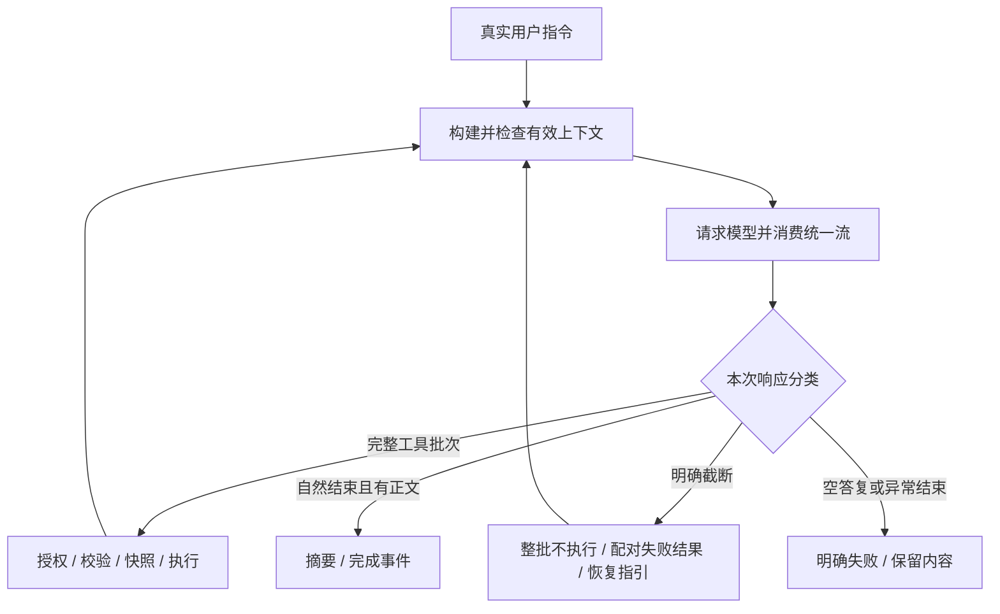

# Agent 内核与工具调度

核对日期：2026-10-09。描述当前工作树中的执行契约；控制入口为 `KernelPort`。

## 职责与边界

一次用户指令往往包含多次模型请求和工具调用。内核（kernel）管理整轮状态、请求循环、工具批次、重试和取消，使工具完成后能继续请求，失败后能进入明确终态。单次模型请求结束不等于整轮结束。

内核不绘制终端、不实现文件工具、不选择配置和厂商 SDK。上下文由 [上下文模块](02_context.md) 注入，厂商流由 [模型适配模块](04_providers.md) 转译，具体工具由 [工具模块](05_tools.md) 提供；对象由 [应用模块](08_app_and_collaboration.md) 创建。

## 执行流程

`start(text)` 创建后台 Turn 并返回；`submit(text)` 等待结果。忙时再次启动会抛出 `TurnInProgressError`，内核不提供待发送队列，当前界面也没有可靠的自动排队。

截断指 `max_tokens`、`context_limit` 或适配器明确标记的参数截断。即使同一响应含完整调用，也拒绝整批执行，返回对应失败结果；半截 JSON 不进入工具。下一请求要求重新生成完整调用或续写已有正文，恢复提示只进入请求视图，不伪造用户消息。

自然 `end_turn / stop_sequence`、有正文且没有工具时成功收尾。`tool_use` 却没有完整工具、仅思考、空正文、未知结束原因、拒绝、过滤和服务端暂停均明确失败；目前不实现 `pause_turn` 恢复。该判断确认协议收尾，不证明用户全部需求已实现。

工具循环、截断续写和参数恢复共用 `kernel.max_iterations`。达到额度后使用已有人工续期接口；未获批准则失败。继续请求仍重新构建和检查上下文。

## 调度、事件与恢复

- `plan_batch()` 对全只读批次采用受限并发；包含写工具或未知工具时整批按模型顺序串行。完成事件按实际完成时间发布，返回结果按调用顺序排列。
- 正常装配中全部注册工具经过权限决策；`readonly` 只决定调度和普通只读基线，不构成免审入口。权限规则见 [权限模块](06_permissions.md)。
- 支持的写工具执行前保存快照；备份失败返回错误，避免无恢复依据的写入。快照和回滚边界见 [存储模块](07_store.md)。
- 产生正文或推理增量后不整体重试同一响应，避免重复拼接；无可见内容的可重试错误采用指数退避和抖动，受次数及等待上限约束。
- 取消传播到等待点，保留已输出内容、按所属 assistant 批次补齐缺失工具结果并发布终态。结果只并入紧随该批调用的工具消息，或在下一条非工具消息前新增工具消息；不会塞进旧批次。取消不代表已发生的文件或外部副作用撤销。
- 成功回复优先提取末尾随轮摘要；契约缺失时可补请求当前模型，最后使用本地确定性摘要。摘要来源与原因保留，失败回合不生成成功声明。

事件总线（event bus）让内核发布事件，界面、存储和度量各自订阅。阻塞订阅者按优先级执行；异常被隔离，连续失败达到阈值后告警。取消异常继续传递。非阻塞订阅者使用有界队列，队满可丢最旧事件；不能承担每条必达的审计保证。

## 接口与源码

| 入口 | 契约 |
|---|---|
| [port.py](../../src/logox/kernel/port.py) · `KernelPort` | `start / cancel / current_turn`，供界面控制 |
| [loop.py](../../src/logox/kernel/loop.py) · `KernelLoop` | 单轮驱动、上下文注入、响应分类和收尾 |
| [turn.py](../../src/logox/kernel/turn.py) · `Turn / TurnStatus` | 回合任务、状态与计时 |
| [scheduler.py](../../src/logox/kernel/scheduler.py) · `Scheduler` | 批次计划、授权、校验、执行及截断拒绝 |
| [bus.py](../../src/logox/kernel/bus.py) · `EventBus` | 订阅、优先级、队列与隔离 |
| [messages.py](../../src/logox/kernel/messages.py) | `Message(role, blocks, meta)` 和中立内容块 |
| [events.py](../../src/logox/kernel/events.py) | 版本化事件、用量和统一/原始停止原因 |
| [registry.py](../../src/logox/kernel/registry.py)、[summary.py](../../src/logox/kernel/summary.py) | 工具注册和摘要契约 |

工具调用块使用 `id / name / input`，结果块使用 `id / ok / content / archived`。总线文本增量为 `ModelDelta.delta`；厂商适配事件为 `DeltaEvent.text`。接口完整签名以源码为准。

## 限制与验证入口

同步工作或终端写出仍可能延迟事件循环；协作式取消不能强制中断所有系统调用。写批次串行保障顺序，尚无按文件依赖图并发调度。

重点验证完整调用与结果配对、取消后的下一轮、截断整批不执行、恢复提示不改变轮次、迭代额度和订阅异常。入口：[内核循环](../../tests/unit/test_kernel_loop.py)、[中断后配对恢复](../../tests/unit/test_tool_pairing_recovery.py)、[调度](../../tests/unit/test_kernel_scheduler.py)、[事件](../../tests/unit/test_kernel_events.py)、[响应结束](../../tests/unit/test_response_termination.py)、[依赖边界](../../tests/unit/test_imports.py)。执行方式见 [测试指南](../development/TESTING.md)。
