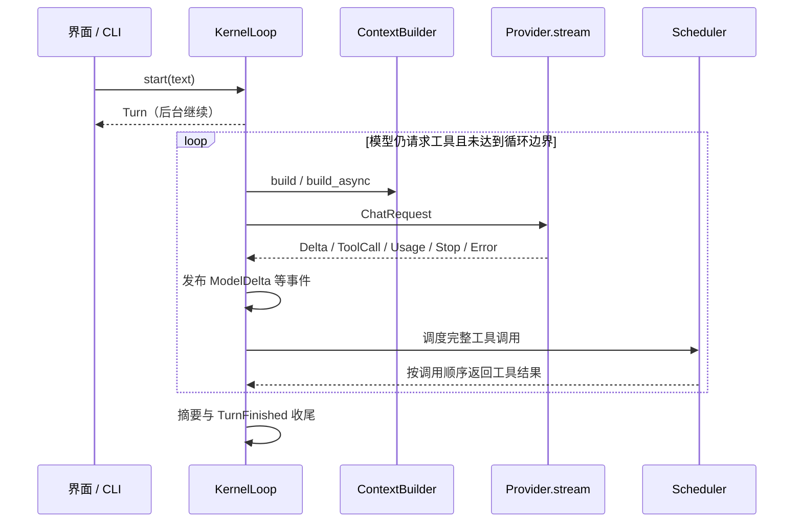

# 01 · Agent 内核与工具调度

> 核对日期：2026-09-29。范围：当前工作区源码（包含已有未提交改动）。接口以源码为准；性能数值只引用本轮验收报告中的实测。本文不以历史设计代替已实现能力。

## 1. 定位与边界

用户提出任务后，模型可能先查文件，再调用工具，最后回答。内核（kernel）负责让这几个步骤持续推进，并在失败或取消后让会话能够继续。没有统一的回合管理，常见现象是工具卡片一直显示运行中，或下一次请求携带缺失的工具结果而被服务端拒绝。

本模块负责回合状态、模型事件转译、工具批次调度、取消收尾与回合摘要；不负责具体文件工具、权限规则、终端绘制或厂商 SDK。厂商协议经 [04](04_providers.md) 转换，提示词与压缩由 [02](02_context.md) 注入，实例由 [08](08_app_and_collaboration.md) 装配。

## 2. 源码地图与依赖

| 文件 | 实际符号 | 职责 |
|---|---|---|
| [loop.py](../../src/logox/kernel/loop.py) | `KernelLoop`, `ContextBuilder`, `ContextBundle`, `CompactionPlan`, `CompactionReport` | 回合驱动与上下文注入契约 |
| [turn.py](../../src/logox/kernel/turn.py) | `Turn`, `TurnStatus` | 回合状态、任务与计时 |
| [scheduler.py](../../src/logox/kernel/scheduler.py) | `Scheduler`, `plan_batch`, `PermissionDecider` | 授权、参数校验与批次执行 |
| [registry.py](../../src/logox/kernel/registry.py) | `ToolRegistry` | 注册、查找、稳定顺序的工具 Schema |
| [bus.py](../../src/logox/kernel/bus.py) | `EventBus`, `Subscription`, `DispatchReport` | 优先级事件分发、队列与异常隔离 |
| [events.py](../../src/logox/kernel/events.py) | `Event`, `ModelDelta`, `ToolCallStarted`, `ToolCallFinished`, `Usage` 等 | 版本化事件与跨模块数据 |
| [messages.py](../../src/logox/kernel/messages.py) | `Message`, `MessageMeta`, 四类内容块 | 模型与历史共享的中立消息 |
| [port.py](../../src/logox/kernel/port.py) | `KernelPort` | 界面控制入口 |
| [summary.py](../../src/logox/kernel/summary.py) | `extract_trailing_summary`, `render_turn_transcript`, `deterministic_summary` 等 | 摘要识别、补写输入与本地兜底 |
| [errors.py](../../src/logox/kernel/errors.py) | 错误重导出 | 兼容入口；分类定义位于 `logox/errors.py` |

事件总线（event bus）解决的是内核需要同时通知界面、度量与存储的问题：内核发布事件，订阅者（subscriber）各自处理；发布者不逐个调用具体模块。`EventBus` 并非所有事件的唯一发布者，装配根及 MCP 生命周期也会发布事件。

## 3. 执行流程与状态约束



- `start()` 创建后台任务后返回；`submit()` 等待回合完成，主要用于 CLI 和测试。`await` 等待不会自行阻塞整个事件循环；界面的输入任务必须仍能独立运行。
- `plan_batch()` 判断全批次是否只读：全只读时使用受限并发（默认上限 4）；包含写操作或未知工具时整批按模型顺序串行。并发完成事件按实际时间发布，结果列表仍按调用顺序组织。
- 重试以已经产生正文或推理内容增量为边界。产生内容后不重新拼接一份响应；未产生内容的可重试失败按退避策略处理。
- 取消请求通过任务取消传递。协作式取消（cooperative cancellation）要求协程在等待点响应取消并清理资源；不是所有同步文件操作都能立即中断。已开始的工具必须有对应完成事件，未返回的工具结果由内核补齐，文案不宣称副作用已经撤销。
- 随轮摘要优先使用模型最终回复末尾的摘要，兼容旧标签，并提供模型补写与本地生成退路。阶段 2 复用已有摘要不会额外请求模型，摘要补写本身可能增加一次模型调用。

`EventBus` 阻塞订阅者按优先级执行；普通异常被捕获，连续失败达到阈值后隔离并告警。`CancelledError` 必须继续传递。非阻塞订阅者共用一条有界队列，队满丢最旧项并计数；因此这个通道不能承担“每条必达”的审计保证。当前分发还会按事件筛选并排序订阅列表。

## 4. 接口、失败处理与验证

实际控制协议如下（源码摘录）：

```python
# KernelPort.start
async def start(self, text: str) -> Any: ...

# KernelPort.cancel
def cancel(self) -> bool: ...

# KernelPort.current_turn
@property
def current_turn(self) -> Any | None: ...
```

`Message` 的字段是 `role / blocks / meta`，角色包含 `system / user / assistant / tool`，不是 `content`。`ToolUseBlock` 的字段是 `id / name / input`，`ToolResultBlock` 为 `id / ok / content / archived`。事件流式文本为 `ModelDelta.delta`；厂商侧 `DeltaEvent` 使用 `text`，二者通过内核转译。

| 场景 | 当前处理 | 验证入口 |
|---|---|---|
| 忙时再次提交 | 抛 `TurnInProgressError`；排队由界面负责 | `test_kernel_loop.py` |
| 未知工具、错误参数、拒绝授权 | 返回失败工具结果，模型可根据错误纠正 | `test_kernel_scheduler.py` |
| 模型断流、取消 | 保留已输出内容并补齐结果；回合进入终态 | `test_kernel_loop.py`, `test_resume_fidelity.py` |
| 订阅者抛错或递归发布 | 隔离、递归深度保护与报告；取消例外继续上抛 | `test_kernel_events.py` |
| 分层越界导入 | 静态架构检查阻止 | `test_imports.py`, `test_kernel_port.py` |

在仓库根执行：

```powershell
$env:PYTHONPATH = 'src'
.venv\Scripts\python.exe -m pytest -q tests/unit/test_kernel_loop.py tests/unit/test_kernel_scheduler.py tests/unit/test_kernel_events.py tests/unit/test_kernel_port.py
```

## 5. 权衡、性能与已知限制

全批次含写串行牺牲部分速度，换来可解释的读写顺序；细分读写依赖图可以更快，但需要证明每个工具的副作用与路径依赖，本轮不更改该策略。订阅目标缓存也可能加速事件分发，但 `Subscription` 的优先级可变，未经失效设计直接缓存会改变通知顺序。

**这是面试常考的：竞态条件（race condition）与取消收尾。** 两个任务读写同一文件时，结果可能随完成顺序变化；面试官会追问“为什么写操作整批串行”“取消后下一轮为什么还能请求模型”。本项目的证据在调度顺序与消息补齐测试，不能用单纯“不抛异常”代表恢复成功。

本轮自动阶段 3 回调接线修复见 [08](08_app_and_collaboration.md)。权限入口是否覆盖所有工具需要结合 [06](06_permissions.md)，不可仅凭 `PermissionEngine` 存在就宣称所有读写都受保护。

当前通用验收见 [A 方案回归](../../tests/unit/test_audit_a_choices.py) 与对应模块测试；当前接手状态见 [架构入口](../ARCHITECTURE.md)。

### 5.1 已确认 A：统一授权入口与预算暂停（已实现）

所有已注册工具均调用权限决策器，readonly 只决定批次调度，不再以 requires_permission 跳过审计。引擎先检查风险和显式拒绝；普通只读工具默认允许，敏感和越界仍询问。无界面保持已有拒绝/等待语义，由注入决策器负责。正常阅读无额外弹窗。

构建后有效上下文仍达到高水位时，在发模型请求前暂停本回合并给可解释错误，保留当前轮次与历史恢复线索；历史原文是否转摘要遵循 02 的极小窗口策略；低水位仅是压缩目标，低于高水位但高于低水位仍可请求。原始历史与既有压缩报告保留。切换模型时旧实测量不当作新 tokenizer 精确值，重新估算当前有效视图。

写前快照失败与文件原本不存在必须区分：备份失败时阻止写工具执行，返回失败结果；成功备份或确认新文件才允许写。测试覆盖普通只读、敏感读取/搜索、拒绝规则、无界面、预算过高不发请求、快照故障不修改文件。
