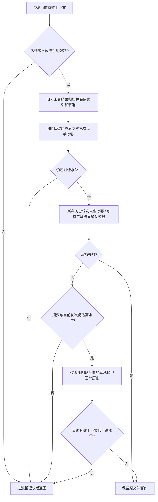

# 02 · 上下文、计量与分层压缩

> 核对日期：2026-09-30。范围：当前工作区源码（包含已有未提交改动）。接口以源码为准；性能数值只引用本轮验收报告中的实测。本文不以历史设计代替已实现能力。

## 1. 定位与边界

模型每次请求只能接收有限文本。文件输出与历史问题持续累积时，下一次请求可能被拒绝；直接删除历史又会丢掉任务约束。本模块负责组装实际发送的上下文、过滤推理块、预测输入规模、复用旧轮摘要并按需生成历史备忘录。

上下文窗口（context window）是单次请求可容纳的输入和输出空间。高水位是触发压缩的线，低水位是期望压缩到的目标；两条线分开，避免每次新增几句话就再压缩一次。它们是估算与调度机制，不是服务端接受请求的数学保证。

模型窗口网络探测属于 [04](04_providers.md)，模型切换与摘要路由属于 [08](08_app_and_collaboration.md)，日志格式属于 [07](07_store.md)。

## 2. 源码地图与数据来源

| 文件 | 实际符号 | 职责 |
|---|---|---|
| [builder.py](../../src/logox/context/builder.py) | `HierarchicalContextBuilder`, `_FoldCache` | 系统提示、有效历史视图、计量与压缩协调 |
| [compaction.py](../../src/logox/context/compaction.py) | `Compactor`, `CompactionResult`, `FoldedEpoch` | 三阶段压缩、归档索引、工作集再读取 |
| [tokens.py](../../src/logox/context/tokens.py) | `TokenEstimator`, `TokenLedger`, `Anchor`, `Prediction` | 字符估算、分桶校准与真实用量锚点 |
| [memory.py](../../src/logox/context/memory.py) | `find_project_memory`, `ProjectMemory`, `MemorySource` | 从 cwd 向上查找规范；每层 `LOGOX.md > AGENTS.md > CLAUDE.md` |
| [storage.py](../../src/logox/context/storage.py) | `SessionTranscriptWriter` | JSONL 追加、工具 Blob 与真实日志行号 |

原始 `kernel.history` 是源记录；模型收到的是“持久化折叠前缀 + 已归档工具替换后的未覆盖历史”的有效视图。不要拿全量原始工具输出反算压缩后占用。运行中以对象引用检查历史替换；resume／rewind 从匹配的 `context_state` 恢复，新会话清空。模型生成的历史备忘录不能当作随时可丢的加速缓存。

## 3. 机制与执行流程

### 3.1 提示词与计量

系统提示由基础人设、项目规范、技能索引与回合摘要约束拼接。历史中的 `ReasoningBlock` 在压缩入口过滤；这减少重复回灌，也意味着当前路径未保留 Anthropic 签名推理块，跨请求兼容性应单独验证。

本地估算按 CJK 字符约 1、其他字符约 0.28 的权重计量，消息外壳另计；不是精确 tokenizer。校准系数 κ 按 `provider/model` 分桶。账本（token ledger）将厂商实测的已发送前缀作为锚点，只估算后续增量；历史重写、系统提示变化和模型切换会让锚点失效。工具 Schema 没有单独纳入指纹，动态工具集变化是现有限制。

窗口 `W`、申请预留 `R_req`、低水位比例 `r` 的当前公式为：

```text
R = min(R_req, W // 4)
H = W - R
L = int(W * r)
可选 max_budget_tokens 进一步降低 H；target_budget_tokens 进一步降低 L。
当前 tokens >= H 时触发；压缩目标是 tokens <= L。
```

### 3.2 标准压缩与极小窗口降级



1. **标准工具归档与逐轮折叠**：旧大结果落盘后换成节选与路径，最近结果暂保留；旧轮保留用户原文和助手已有摘要，最近 `keep_recent_turns` 轮暂保留完整内容。这两步不请求模型。`archived=True` 避免反复改写已归档文本。幂等（idempotent）解决“同样历史重复构建却越来越长”的问题；缓存命中与重建都必须保留相同事实。
2. **极小窗口的逐轮摘要视图**：标准处理仍高于低水位时，取消历史首轮与近期历史原文保护，每个历史轮次只留摘要；当前轮次继续保留。所有未归档工具结果，包括当前轮次的短结果，确认落盘后换成路径指针。摘要缺失时使用既有确定性摘要；这是有损降级，原始 `kernel.history` 不被重写。已有摘要与备忘录直接复用正文，不反复加标签。归档失败则保留原始结果并报告暂停。
3. **本地全量历史汇总**：逐轮摘要加当前轮次仍达到高水位时，异步路径最多发起一次本地汇总。输入是有效视图中的历史摘要、旧备忘录正文和归档线索；不重新上传或读取整份原始日志及大工具输出。输出为一个历史备忘录加当前轮次，不再保留历史首问原文。同步入口不自行请求模型。空摘要、错误或无可用本地模型时保留逐轮摘要；最终超预算由内核暂停，不使用机械截断。

本地选择：当前明确使用本机 Ollama 或 LM Studio 时复用当前模型；否则只使用 `providers.ollama.models` 中已配置的首个模型，端点必须为 localhost / 127.0.0.1 / ::1。没有明确本地模型时不猜预设模型名。每次摘要目标为 `max(1, H - T_system_and_current - 128)`，Runtime 再按本地模型输入剩余空间缩减，`max_tokens=min(target_tokens, 3000)` 且至少为 1。摘要输入已超过本地窗口时不请求该模型。估算仍有误差，不能宣称永远不会收到厂商窗口错误。

两类摘要请求应分清：单轮契约缺摘要的补写只读取当前轮次、调用当前提供商；全局历史汇总只在上述预算条件成立时使用本地模型。前者当前提供商若是云端，仍会发起云端补写请求。

### 3.3 模型切换与缓存覆盖

`Runtime.apply_model()` 更新内核、窗口、计量桶和状态栏，并作废旧模型的计量锚点。计量锚点（token anchor）记录过去一次请求实测占用，帮助只估算新增内容；它与本轮取消的历史原文锚点是两个概念。`eager_compact_if_needed()` 用新模型重新预测“压缩缓存前缀 + 未覆盖历史”，不拿旧 tokenizer 的实测数直接放行，也不重新展开全部原始历史。删除纯推理消息后，折叠边界转换回原始历史下标，避免缓存游标错位；计量锚点的消息条数也按过滤后的可发送视图对齐，避免把已发送的正文再次当增量计费。Ollama 窗口与缓存细节见 [04](04_providers.md)。

## 4. 接口、异常与验证

以下为源码公开入口（参数名称和关键字约束应保持）：

```python
# HierarchicalContextBuilder.set_model
def set_model(self, *, model_key: str, window_capacity: int | None=None) -> None: ...

# HierarchicalContextBuilder.build
def build(self, history: list[Message], *, last_usage: Usage | None=None) -> ContextBundle: ...

# HierarchicalContextBuilder.build_async
async def build_async(self, history: list[Message], *, last_usage: Usage | None=None, summarizer: Any | None=None) -> ContextBundle: ...

# HierarchicalContextBuilder.force_compact_async
async def force_compact_async(self, history: list[Message], *, last_usage: Usage | None=None, summarizer: Any | None=None) -> ContextBundle: ...

# 恢复前应先 filter_rewound_records；无有效状态返回 False
def restore_state(self, history: list[Message], records: list[dict[str, Any]]) -> bool: ...

def estimate_context(self, history: list[Message]) -> int: ...

def reset(self) -> None: ...

# HierarchicalContextBuilder.plan
def plan(self, history: list[Message], *, last_usage: Usage | None=None, force: bool=False): ...
```

构造器必须显式传 `transcript_writer`，不隐式选择日志目录。`ContextBundle` 返回 `system / messages / token_estimate / memory_sources / pruned_count / compaction`；报告有 `strategy / degraded / folded_turns / tokens_before / tokens_after`。`CompactionResult.folded_from_index` 用于前推缓存覆盖游标。

| 场景 | 应保持的行为 | 测试 |
|---|---|---|
| 缺少真实 Usage | 降级本地估算；不把估算伪装成实测锚点 | `test_token_ledger.py` |
| 同一 Usage 重复传入 | 不重复校准或重建锚点 | `test_token_ledger.py` |
| 再次压缩 / 切换历史 | 不重复索引，不复用其他历史缓存 | `test_context_cache.py`, `test_compaction_index.py` |
| 压缩后退出／resume／热切换／回滚 | 恢复实际模型有效视图，原始历史完整；工具卸载不反弹 | `test_context_state_resume.py` |
| writer 归档返回 None | 阶段 1 保留该块；writer 负责写盘诊断 | `test_audit_regressions.py` |
| 历史行号缺失或冲突 | 标记未知，不编造索引 | `test_transcript_paths.py`, `test_compaction_index.py` |
| 第三阶段失败 / 取消 | 失败按路径降级；取消继续传递 | `test_compaction_stage3.py` |
| 切小窗口 | 及早规划、压缩报告与窗口同步 | `test_eager_compaction.py`, `test_model_switch_and_compaction_hook.py` |

```powershell
$env:PYTHONPATH = 'src'
.venv\Scripts\python.exe -m pytest -q tests/unit/test_context.py tests/unit/test_context_cache.py tests/unit/test_token_ledger.py tests/unit/test_compaction_stage3.py tests/unit/test_eager_compaction.py
```

`LOGOX_DUMP_COMPACTION=1` 可启用压缩转储用于排查，转储可能含完整项目文本，应按会话隐私数据管理。使用 `strategy`、前后 token 和降级标记核查结果，不能只看“压缩完成”提示。

## 5. 权衡与本轮优化设计

本轮在已有契约内：① 有有效 `current_tokens` 时直接使用，不再全量估算后丢弃；② 过滤推理块时复制已校验消息外壳和块列表，避免重复 Pydantic 校验，仍保持源历史独立；③ 纯 ASCII 文本跳过 CJK 正则扫描。第一轮保留估算公式与压缩水位；后续已按用户裁定更新极小窗口摘要策略。验证以等价输出与调用次数为主，耗时只记录、不作为脆弱的单测门槛。

**这是面试常考的：缓存失效（cache invalidation）。** 缓存节省重复工作，但错误复用会让模型看到过时历史；面试官会追问“模型切换、历史回滚和项目规则变化后为何要作废锚点”。本项目以代际、模型键和系统提示指纹控制，但动态工具 Schema 与可变嵌套字段仍需后续治理。

已完成超预算暂停与本地摘要路由。Anthropic 签名推理兼容、动态工具 Schema 计量及更严格的无损摘要质量评估仍需后续验证。

当前通用验收见 [A 方案回归](../../tests/unit/test_audit_a_choices.py) 与对应模块测试；当前接手状态见 [架构入口](../ARCHITECTURE.md)。

### 5.1 已实现：极小窗口逐轮摘要与本地汇总

当标准工具归档、历史折叠仍无法达到低水位时，先取消历史首轮原文与近期历史原文保护：每个已结束历史轮次只保留该轮摘要，工具原文必须确认落盘再移除。当前正在进行轮次仍保留，使模型能完成当前请求；系统规则不可删除。这里取消的是历史内容锚点，不是计量账本的估算与校准。

摘要叠加仍达到高水位（预留输出空间的可发送预算）才调用本地模型做一次全量历史汇总，输入为这些摘要和归档线索，不重新读取所有大工具结果或原始日志。复用当前本机 Ollama / LM Studio 模型；当前不是本地提供商时使用已配置的 Ollama 模型，没有明确本地模型时停止这一降级，不猜测模型名。禁止云端自动兜底，也不使用丢弃用户内容的机械硬截断。完成这一步仍超预算，或工具落盘失败导致无法安全移除时，保留可恢复信息并由内核报告暂停。

对应验证已加入 `test_compaction_stage3.py` 与 `test_audit_a_choices.py`：第一轮可折叠、每轮摘要仍在、所有大/小工具结果都能回读、重复汇总包含旧备忘录正文、本地请求次数与输入、无云端请求、本地失败和单轮不可压缩输入暂停。

归档索引中的工具目录必须取当前写出器的 `blob_dir`，以会话日志命名空间给出实际绝对路径；不再提示旧的 `tools/<call_id>.log`。回归验证索引目录能找到当前写出器已归档的工具原文。

### 5.2 Anamnesis 背景记忆接入

`context/anamnesis.py` 独立发现并缓存自动档案，人工规则保持原有优先级。请求边界在工作线程检查版本；当前回合与必需系统提示优先，自动档案按整份文档选择，默认总量最多占窗口 5%。用户、cwd、祖先来源分开，项目开关不影响用户档案；放不下的原因在 `/anamnesis status` 显示。写档案、入梦调度和语义核查由 [09 入梦](09_anamnesis.md) 负责。

### 5.3 压缩状态跨进程恢复修复（2026-09-30）

现象：手动／模型压缩后状态栏显示 3k，退出并 resume 后恢复为完整原始历史的 1.2M。定位：`_FoldCache`、全局备忘录和工具归档视图仅存在进程内；`compaction` 事件只写计数，启动恢复与热切换直接估算原始 `history`。下次请求还会重新压缩，已有模型备忘录不能恢复。

修复沿用原始历史与模型有效视图分离的契约，不删除用户历史、不在恢复时调用模型。每次有效压缩在同一 JSONL 追加版本化 `context_state`：保存折叠前缀、原始消息覆盖游标、工具归档替换、折叠账本和工作集。用原始消息内容指纹与来源单元数量绑定历史，摘要来源／回放行号等元数据不参与指纹。一个工具结果计一个来源单元，兼容内存里工具批次合成一条消息、日志里逐工具一行；状态覆盖游标不能切断批次。只持久化已改变的工具块，正常原文仍由原始日志提供。

恢复：先过滤 rewind、重建完整原始历史，再从最新到最旧寻找匹配状态；验证版本、游标、指纹与消息结构后绑定新对象引用，追加到快照之后的新对话照常保留。损坏、不支持的版本、内容不匹配或工具归档缺失会记录 warning 并尝试更早的匹配状态。老会话没有状态则保留原始历史；不能伪装成 3k。启动 resume 与运行中 `/resume` 共用恢复接口。状态栏从恢复后的有效视图和当前 system／model 重新估算，旧厂商用量清空，避免将上次会话用量误当精确值。新会话／回滚重置前缀与归档替换。

额外发现：仅修剪工具结果没有折叠时，下一次 build 又会使用原始全文。以按原始消息位置绑定的工具块替换修复；保留原始 meta，使本轮稍后补出的摘要不丢失。有效状态改变后写状态，普通 build 不重复新增记录；已折叠索引不会因为新增审计行而改写。写盘失败记录警告并继续当前会话，后续 build 重试未提交状态，不破坏原始记录。

验证：压缩→新构建器读取磁盘→实际请求消息逐字对比；普通折叠、summary-only、本地 memo、工具修剪、追加新轮、二次压缩、行号／摘要变化、热切换、启动恢复、回滚、损坏／不支持版本／历史不匹配／写盘失败。原始 timeline 仍显示全部历史。旧记录从未保存的模型 memo 无法凭计数复原，需重新压缩一次才能得到新格式状态。

状态：已实现。`tests/unit/test_context_state_resume.py` 新增 18 项；相关上下文／持久化／模型切换／界面命令 187 项通过，全量 1949 项／3212 子用例通过（53.21s）。全量测试仅在子进程移除继承的代理变量，未改变用户代理或依赖。

权衡：同日志追加实际状态比恢复时重新压缩增加少量磁盘占用，但避免重复模型调用，并能保留不可确定性重建的 memo。未保存的旧 memo 不猜测还原；新模型／新 system 重新估算占用，数值可能略有变化。当前使用 flush，没有断电 fsync 保证；人工插入但未写入 JSONL 的历史消息会使内容绑定失败并回退原始历史，不能静默套用错位摘要。
