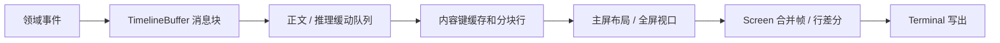

# 终端界面与流式渲染

核对日期：2026-10-09。两种 TUI 共用内容和事件处理，终端能力与滚动边界不同。

## 职责与模式

TUI（terminal user interface）将模型和工具事件变成消息、卡片、输入框及状态栏，将输入转成控制请求。它不执行工具、不解析厂商流、不决定权限策略。

| 模式 | 渲染与浏览 | 固有边界 |
|---|---|---|
| 默认 `InlineApp` | 终端主屏，历史选择和滚动由终端提供 | 已滚出物理屏的旧卡片保留当时快照 |
| `--fullscreen` · `FullscreenApp` | 备用屏，固定输入区，应用管理视口、滚动和选择 | 终端鼠标/复制能力与应用映射相关 |

两种模式保留统一的卡片、思考与 Anamnesis 展开语义。布局和视觉契约见 [UI-SPEC](../UI-SPEC.md)，操作步骤见 [命令与快捷键](../user/interaction.md)。

## 内容与帧管线

`TimelineBuffer` 管理 user、assistant、reasoning、tool、diff、notice 和 anamnesis 等块。缓存按实际显示字段、前序类型、宽度、主题字形和相关开关判定；旧工具原地完成或正文变化使对应块失效。普通正文不因思考/工具展开开关整体失效。

排版复用未变块、分块行、偏移和点击范围；Markdown 仍解析结构并复用未变结果。界面按块读取行，只有兼容访问完整文本时才拼接。当前仍遍历历史和计算视口，不提供只渲染可见块的完整虚拟化，也不保证整帧恒定成本。

正文和推理各有 `StreamSmoother` 队列。ticker 按截止时间推进，默认 30 FPS，配置限制在 5–60；小积压逐字释放，大积压每通道每帧最多 16 字。终态和中断排空，避免尾文串入下一轮。FPS 是调度目标，实际节奏取决于模型分片、积压、CPU 和终端写出。

`Screen.request_render()` 合并密集请求，行差分减少重复输出；已接受的用户消息在上下文准备前兑现一帧。同步排版和写出仍可能延迟输入。终端消费速度不足时会产生背压（backpressure），表现为停顿后成段出现，不能仅凭动画不卡证明整条链路流畅。

## 阅读位置、输入与卡片

全屏用消息块和块内行记录阅读位置，只有停靠底部才跟随新内容。增量、工具状态、展开、浮层和尺寸变化共用锚点恢复；消息宽度预留一列滚动条，点击与选择使用同一宽度。

主屏启动时清理进入 LOGOX 前的终端回滚历史；运行期间正常更新保留 LOGOX 历史，不清空旧内容。已经提交到屏外的卡片不能原地改写；当前画面和报告反映最新状态。结构变化时采用追加和重绘边界，尺寸变化仍受终端重排影响，需真实终端验收。

- `Ctrl+O` 控制工具和 diff；失败工具初次展开，后续可折叠。
- `Ctrl+T` 控制普通思考和入梦卡片；点击覆盖单卡片状态，全局切换清理相应覆盖。
- `Ctrl+B` 显示/隐藏消息轨道，方便复制。
- 输入在忙时仍可编辑；当前没有可靠的待发送队列，再次提交可能被内核拒绝。busy 持续至整轮结束，单次请求结束不解除模型/会话/资源守卫。
- 浮层优先处理取消、筛选和选择。审批取消必须结束等待；退出恢复终端模式和光标。

Anamnesis 卡片每个 run_id 一张，显示实际思考、结构化阶段、依据、变更与终态。保存、归属及预览限制见 [入梦模块](09_anamnesis.md)。

## 源码与接口

| 源码 | 职责 |
|---|---|
| [render/app.py](../../src/logox/tui/render/app.py) | `InlineApp / TimelineComponent / AppLayout`，输入、事件、busy 与宿主接线 |
| [render/fullscreen.py](../../src/logox/tui/render/fullscreen.py) | 全屏视口、锚点、鼠标和选择 |
| [render/screen.py](../../src/logox/tui/render/screen.py) | 帧合并、差分、浮层与硬件光标 |
| [render/terminal.py](../../src/logox/tui/render/terminal.py)、[keys.py](../../src/logox/tui/render/keys.py) | 平台读写、模式、转义序列和粘贴 |
| [render/component.py](../../src/logox/tui/render/component.py)、[components](../../src/logox/tui/render/components/) | `render(width) / handle_input(key) / invalidate()`、编辑器及浮层 |
| [content/timeline.py](../../src/logox/tui/content/timeline.py)、[smoother.py](../../src/logox/tui/content/smoother.py) | 消息块、缓存、流缓动 |
| [content/anamnesis.py](../../src/logox/tui/content/anamnesis.py) | 入梦预览与单卡片排版 |
| [metrics.py](../../src/logox/tui/metrics.py)、[theme.py](../../src/logox/tui/theme.py) | 事件度量、主题和字形 |
| [render/commands.py](../../src/logox/tui/render/commands.py) | 实际 slash 命令；帮助声明仍需核对实现 |

组件返回 Rich Text 行，宽度按显示格而非字符串长度计算。硬件光标由零宽标记定位，兼顾中文输入法。控制路径通过 KernelPort，数据通过事件，不在组件里直接编排模型任务。

## 限制与验证入口

模拟终端证明输出序列和布局逻辑，不证明 Windows Terminal / ConPTY 的真实耗时或视觉表现。字体字宽、终端重排、粘贴和鼠标需现场检查。缓存需同时验证性能和内容失效，不能只检查命中次数。

入口：[时间线缓存](../../tests/tui/test_timeline_cache.py)、[主屏历史](../../tests/tui/test_inline_scrollback_repaint.py)、[全屏布局](../../tests/tui/test_fullscreen_layout.py)、[鼠标](../../tests/tui/test_fullscreen_mouse.py)、[响应性](../../tests/tui/test_tui_responsiveness.py)、[缓动](../../tests/tui/test_stream_smoother.py)、[入梦展开](../../tests/anamnesis/test_expansion.py)。现场流程见 [测试指南](../development/TESTING.md)。
