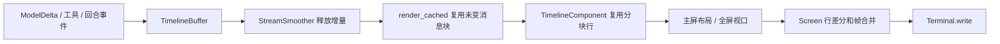

# 03 · 终端界面与流式渲染

> 核对日期：2026-10-03。范围：当前工作区源码（包含已有未提交改动）。本文描述已实现行为；性能保证与系统安全保证必须另有测试和测量依据。

## 1. 定位与边界

模型输出、工具进度与用户输入同时发生时，界面需要持续显示结果并接受中断。终端界面（terminal user interface, TUI）在文字终端里绘制输入框、工具卡片和状态栏。本模块只处理事件到显示状态、按键到控制请求、布局和终端输出；不执行工具、不解析厂商协议、不自行决定权限规则。

目前有两种入口：默认主屏 `InlineApp` 使用终端自身的滚动历史；`--fullscreen` 使用备用屏 `FullscreenApp`，由应用管理滚动、选择与复制。二者共享事件归约、卡片和组件。当前界面无 Textual 运行时依赖，但仍依赖 Rich 的文本样式与 Markdown 支撑，不应写成“没有任何依赖”。

## 2. 源码地图

| 路径 | 关键符号 / 内容 | 职责 |
|---|---|---|
| [render/app.py](../../src/logox/tui/render/app.py) | `InlineApp`, `TimelineComponent`, `StatusComponent`, `AppLayout` | 事件接入、输入任务、消息行缓存、界面宿主 |
| [render/fullscreen.py](../../src/logox/tui/render/fullscreen.py) | `FullscreenApp`, `FullscreenLayout` | 备用屏布局、滚动锚点、鼠标与选择 |
| [render/screen.py](../../src/logox/tui/render/screen.py) | `Screen`, `OverlayHandle` | 帧节流、行差分、浮层合成与硬件光标 |
| [render/terminal.py](../../src/logox/tui/render/terminal.py) | `Terminal`, `FakeTerminal`, `Win32Terminal`, `PosixTerminal` | 终端读写、模式切换、测试终端 |
| [render/component.py](../../src/logox/tui/render/component.py) | `Component`, `Container`, `fit_lines` | 组件契约与格宽保护 |
| [render/keys.py](../../src/logox/tui/render/keys.py) | `Key` 与输入解析 | 转义序列、粘贴与键盘输入 |
| [render/ansi.py](../../src/logox/tui/render/ansi.py) | ANSI 处理函数 | 样式序列、可见格宽、序列化 |
| [render/components/](../../src/logox/tui/render/components/) | editor / overlay / completion / text | 编辑器、审批和选择浮层、补全、文本盒 |
| [content/timeline.py](../../src/logox/tui/content/timeline.py) | `Block`, `TimelineBuffer`, `TimelineRenderCache`, `render_cached` | 事件到消息块、内容键缓存、卡片范围 |
| [content/smoother.py](../../src/logox/tui/content/smoother.py) | `StreamSmoother` | 正文和推理独立缓冲与步进 |
| [content/](../../src/logox/tui/content/) | cards / markdown / status / help / completion / overlay | 纯内容渲染与交互数据 |
| [render/commands.py](../../src/logox/tui/render/commands.py) | 命令执行器 | `/login`, `/model`, `/compact`, `/rewind` 等 |
| [commands.py](../../src/logox/tui/commands.py), [keymap.py](../../src/logox/tui/keymap.py) | 命令与按键声明 | 帮助、解析与键位约束 |
| [metrics.py](../../src/logox/tui/metrics.py), [format.py](../../src/logox/tui/format.py) | 归约与格式工具 | token、时间、费用、格宽与换行 |
| [theme.py](../../src/logox/tui/theme.py), [themes/](../../src/logox/tui/themes/), [buildinfo.py](../../src/logox/tui/buildinfo.py) | 主题与版本信息 | 三套内置配色、语义样式与启动信息 |

## 3. 渲染与交互机制



消息块缓存减少每次输入和吐字时的排版成本：所有未变块均可复用，包括完成的最后块。键包含实际显示字段、前序种类、宽度、主题字形及轨道开关；展开开关仅进入对应工具／Diff 或思考／入梦块的键，普通正文不因 Ctrl+T / Ctrl+O 失效；较早工具从运行改为完成、正文/推理原地改变时，重新排版对应块，不能仅按对象身份判断。未变前缀同时复用分块片段、行偏移与点击区间，UI 复用对应平坦行列表；Markdown 继续完整解析并复用未变结构与代码行；完整 Text 兼容访问才按需拼接。缓存仅持有当前块，清空后释放旧结果。块与行遍历、行范围映射及差分仍随历史增长，不保证整帧成本恒定。

网络分片先进入 `StreamSmoother`，ticker 按 `ui.stream_fps` 释放文本（当前夹在 5–60 FPS，默认 30）。小积压逐字释放，大积压每通道每帧最多 16 字符。两通道内部使用分段队列与头偏移，pending 计数直接读取，不在每步复制全部剩余积压。ticker 按绝对截止时间排下一帧，超时跳过漏帧，避免把本帧计算时间继续叠加到等待间隔。请求结束、回合结束或中断必须排空缓冲，避免文字留在下一轮。原来的“200ms 严格上限”没有机制保证：缓动是视觉策略，实际延迟受积压量、调度与终端写入影响。

已接受的 `UserPromptSubmit` 事件在上下文准备前兑现一帧，消息只插入一次；其余逐键 `Screen.request_render()` 合并密集请求，延迟帧有补画任务；行差分避免重写完全相同的行。满屏向上滚动时更多行会变化，终端输出成本可能明显增大。背压（backpressure）描述接收端处理速度跟不上发送端：ConPTY 写入等待可能让用户看到文字停顿后整段出现；缓动与节流减轻突发量，不能承诺彻底消除所有终端阻塞。

键位由 `keymap.py` 和帮助内容共同约束。`Esc` 先处理浮层或取消当前操作，忙时输入由界面队列管理。`Ctrl+O` 管工具与 Diff，`Ctrl+T` 管推理，`Ctrl+B` 管轨道；实际行为应以键位测试和 `/help` 为准。

全屏还负责底部输入停靠、消息视口、滚动条和滚动锚点。普通与浮层分支统一使用 `max(1, width - 1)` 的消息宽度，预留一列给滚动条；无滚动条时该列留空。浮层出现不再用两个宽度试排版。每块行数与缓存结果同步更新，命中时无需扫描完整文本计数；鼠标、选择与滚动恢复沿用同一宽度。历史阅读以消息块和块内行作锚点，底部偏移 0 才跟随新内容。默认主屏正常更新不清空回滚历史，屏外旧卡片保留当时状态、当前画面更新到最新状态（用户 A 裁定）。

## 4. 接口、异常与验证

组件真实协议为三个成员：

```python
# Component.render
def render(self, width: int) -> list[Text]: ...

# Component.handle_input
def handle_input(self, key: Key) -> bool: ...

# Component.invalidate
def invalidate(self) -> None: ...
```

`render(width)` 返回 Rich `Text` 行；宽度按终端显示格计算，中文字符可能占两格，不能只用字符串长度。`Block.kind` 区分 user / assistant / reasoning / tool / diff / notice 等。`RenderResult.segments` 提供 UI 的不可变分块 Text/行；兼容入口保留头部、完整块文本与动态尾部，`block_ranges` 用于点击与选择命中。

| 场景 | 正确性要求 | 测试 |
|---|---|---|
| 中文、粘贴、转义分片 | 不丢字、不重复、输入法光标位置可恢复 | `test_render_keys.py`, `test_render_components.py` |
| 连续两次切展开或轨道 | 画面确实变化；不能错误命中旧缓存 | `test_timeline_cache.py`, `test_track_toggle.py` |
| 正文 / 推理交错、结束或取消 | 排空两通道，尾部不残留 | `test_stream_smoother.py`, `test_tui_loop.py` |
| 缩放、全屏滚动、浮层 | 格宽、视口与鼠标范围保持一致 | `test_fullscreen_layout.py`, `test_fullscreen_mouse.py` |
| 审批过程中取消 | 等待结束、工具被拒绝或取消、输入可继续 | `test_permission_flow.py`, `test_permission_decider.py` |
| 程序退出或异常 | 恢复终端模式与光标 | `test_render_terminal.py`, `test_terminal_mode.py` |

```powershell
$env:PYTHONPATH = 'src'
.venv\Scripts\python.exe -m pytest -q tests/tui tests/e2e/test_tui_loop.py
```

模拟终端用例覆盖逻辑与输出序列，不等价于真实 Windows Terminal、ConPTY 或 POSIX 的视觉验收。真实终端还应人工核查长代码块、中文输入、缩放、工具卡片、全屏选择和退出恢复。本轮无真实终端性能指标时应明确标记未测。

## 5. 权衡与学习要点

主屏复用原生滚动与选择，复杂交互受终端行为制约；备用屏提供固定布局，滚动和复制由应用维护。它们是两种已存在的产品形态，本轮不重新选择界面框架。

**这是面试常考的：生产者与消费者（producer / consumer）和背压。** 模型分片是生产者，帧渲染与终端是消费者；面试官会追问怎样合并帧、怎样保证终态文字不丢、怎样测写出字节数。应该用“事件数量、帧数量、每帧耗时、字节吞吐、输入响应延迟”回答，不能把目标 FPS 当成实测 FPS。

当前通用验收见 [A 方案回归](../../tests/unit/test_audit_a_choices.py) 与对应模块测试；当前接手状态见 [架构入口](../ARCHITECTURE.md)。

### 5.1 已确认 A：缓存行数与固定宽度布局（历史阶段，D199 已扩展缓存）

TimelineRenderCache 新增已渲染前缀行数，在前缀重建时更新，清空时归零；缓存命中不再扫描前缀全文计数。已有块身份、宽度、轨道和展开失效条件保留。全屏浮层和普通分支采用同一消息宽度，浮层出现时不先用另一宽度试渲染再重画。

验收覆盖缓存更新/清空、空前缀、中文/换行、展开/收起、缩放、浮层、选择与鼠标范围；不引入视口虚拟化。


### 5.2 状态字形管线接通（2026-09-29，D200）

**问题**：主题文件里的 `[glyphs]` 段是**可写的、也是被文档承诺的**（`docs/UI-SPEC.md` 的字形表、`docs/THEME-GUIDE.md` 的模板都列了 `running` / `success` / `error` 等九项），内置三个主题也都写着 `running = "⏺"`。但这条链在**三处**同时断开，任何一处单独修都看不到效果：

| # | 断点 | 位置 | 症状 |
|---|---|---|---|
| ① | 卡片上下文没带字形 | `render/app.py` 的 `TimelineComponent.render` 建 `CardContext(palette=…, width=…)` 时**没传 `glyphs`** | 卡片永远走 `cards.py` 里的字面量 fallback |
| ② | 状态栏没有字形来源 | `StatusComponent.render` 建 `StatusContext` 时没传 `tool_glyph` | 状态栏永远用 dataclass 默认值 |
| ③ | 覆盖函数无人调用 | `tui/theme.py::glyph_set()`（本意是给 `ui.icon_set` 做 ASCII/Nerd 降级）**全仓零调用者** | `ui.icon_set = "ascii"` 写了也没用 |

**修法**（单一事实来源）：`InlineApp.__init__` 与 `apply_theme()` 各算一次
`glyph_set(theme, icon_set=config.ui.icon_set)`，注入 `timeline.glyphs` 与 `status.glyphs`；
两个组件在 `render()` 里把字形传进各自的 context。换主题与重读主题文件都走同一条路，
因此 `/theme`、`/reload`（D197）与启动三条路径行为一致。

**默认字形变更**：`running` 由 `⏺`（U+23FA）改为 **`✻`（U+273B）**。

- **为什么改**：用户反馈 ⏺ "太丑"。实测其显示宽度为 1（`rich.cells.cell_len` 与项目口径 `visible_width` 一致），**所以不是排版错误**；判断是 U+23FA 属 **emoji-capable** 字符，终端可能把它交给 emoji 字体渲染，画出的圆点与周围字形不搭。⚠️ 这一点**无法在离线环境验证**，是观感归因，不是已测事实。
- **为什么选 ✻**：它不是 emoji-capable；形状像"正在运算"的记号，与 `✓` / `✗` / `⊘` / `◼` 都不同形，不引入歧义。
- **被否的候选与代价**：`●`（U+25CF，与 ⏺ 同语义但风险最小 —— 区别不明显，可能"换了还是不满意"）；`◐`（有进度感，但与 `◼` 同为圆形系，需靠颜色区分）；`⟳`（语义最直白，但**会重复** —— running 时后缀本来就是 `⟳`，会显示成 `⟳ shell ⟳`）；`▶`（U+25B6 的 `Emoji_Presentation=Yes`，正是要避开的坑）。
- **不能占用的字形**：`○`（"未实现"与 MCP 已禁用）、`◆`（assistant 消息）、`❯`（user 消息与浮层指针）。

**验收条件**：

状态栏宿主 `StatusComponent.render` 必须从已定义的 `tool_glyph` 属性取得字形，再传给 `StatusContext`；该属性负责主题覆盖和默认 `✻`，不能在调用处引用未定义的回退名。除属性和纯内容测试外，需直接给宿主配置运行工具指标并调用 `render`，验证最终状态行包含自定义字形，防止“属性与内容函数各自正确、接线处却启动失败”。本次延迟复测发现未定义 `RUNNING_DEFAULT`，按此已有契约作最小恢复，不改变流式或滚动策略。

| # | 场景 | 检查点 |
|---|---|---|
| 1 | 默认主题 | 卡片 running 行以 `✻` 开头，**不含** `⏺` |
| 2 | 主题写 `glyphs.running = "X"` | 渲染出的就是 `X`（证明 ① 已通） |
| 3 | 状态栏生成中 | `X esc to interrupt`（证明 ② 已通） |
| 4 | `ui.icon_set = "ascii"` | 全部字形降级为 ASCII（证明 ③ 已通） |
| 5 | `apply_theme` 换主题 | 字形跟着换，且**旧缓存里的 `⏺` 不再出现在新帧**（缓存必须作废） |
| 6 | 内置三主题一致性 | `logox-dark` / `logox-light` / `logox-contrast` 的 `running` 都是新值（否则换主题会"图标变回去"） |

**这是面试常考的：配置必须端到端可达（end-to-end configurability）。** "配置项存在"与"配置项生效"是两件事；本项目已经反复出现同一形状的缺陷（机制在、读取方不存在）。判据是**从磁盘上的配置值追到屏幕上的像素**，两端各看一眼都发现不了。

### 5.3 流畅性诊断边界（2026-09-29，修复前观测）

本节保留修复前证据；当前实现为 §3 / §5.4，grep 的 GIL 路径由模块 05 §5.2 取代。

输入、帧回调和流式 ticker 共用主事件循环；`Screen.render_now` 同步完成排版、格宽检查、样式序列化及终端写出。上一节的行数缓存与固定宽度修复没有解决这些总成本。最后一条长回答即便内容未变仍会重排，造成输入也要重复付出长回答成本；全屏先渲染全部时间线再切视口。新增消息块时当前前缀缓存重建也会产生单帧停顿。

用户补充发送延迟主要发生在已有历史，模型工作期间打字更慢。真实 Editor → KernelLoop → 事件 → Screen 的离线链路中，800 对合成 UI 历史使首帧完成需主屏约 1.31 秒、全屏约 1.09 秒，而提交事件不到 1ms 已到达。每个场景一次观测，使用假终端/脚本模型、最小内核历史；排除真实终端与大上下文构建成本，不将 800 对消息当作固定卡顿阈值。`KernelLoop._body` 在构建上下文之前发布用户事件，但“请求重画”不等于“帧已完成”；后续同步计算也可能推迟显示。

缓存还有正确性边界：较早运行工具位于前缀时，完成事件原地改变 Block，对象身份没有变化，旧工具画面仍可能被复用。新增工具使前缀全量重建，旧卡片状态才显示出来。主屏 Screen 若发现变化行已在逻辑视口外，会走 `_full_render(clear=True)`；当前 `CLEAR_ALL` 含 `ESC[3J`，会请求清空保存的回滚历史。这条输出链路已捕获，但假终端不能证明 Windows Terminal 实际停在会话第一条。

全屏普通新工具事件则已复现阅读内容漂移：`scroll_offset` 记录距底部的行数，总行数增加时固定偏移使视口顶行随之改变。既有内容锚点（content anchor，记录哪个消息块的哪一行）目前用于展开切换等路径，没有覆盖普通新工具与增量。用户报告两种模式均跳到整个会话第一条；此次全屏只复现顶行从 24 到 27，未复现第 0 行，不能认定两种模式完全同因。

`StreamSmoother._compute_step` 按积压字符数释放：120 字的首帧放出 40 字，600 字首帧放出 200 字；它没有用实际帧间时间约束释放节奏，结束时还会直接排空。因此“流式”不等于逐字显示，200ms 追平不能作为保证。Windows 本轮离线真实 ticker 的空短输出步进中位间隔约 46ms，长回答约 93ms，配置 30 FPS 不能作为实际 FPS。

只读扫描移到线程释放了文件 IO 的等待，但同进程 Python 正则可持有全局解释器锁（GIL），仍能暂停主线程。已用真实 `GrepTool.run` 与有界复杂正则复现心跳约 361ms 间隔；不据此猜测用户实际正则。

真实 Windows Terminal 的空白输入卡顿尚未归因：FakeTerminal 中空输入一帧约 0.25ms，它没有真实尺寸查询或 `stdout.flush()`。必须记录输入到达/派发、帧排版、终端尺寸查询/写出、网络增量与显示步进的时间分布，再判断运行中是哪一段堵塞。诊断材料留本机 `docs/audits/2026-09-29-tui/`，包含耗时与长度，不记录输入/回答正文；工具线程的 CPU 隔离和渲染改造应先确定兼容边界再实施。

修复需同时验证缓存内容不过期、消息无遗漏/重复以及阅读位置稳定。局部方向是完成块复用、新块增量追加、已有块变化可靠失效；全屏在历史阅读时保持内容锚点，底部才跟随；主屏分开画面更新与回滚历史清理，并明确视口外旧卡片更新的呈现方式。仅取消缓存范围检查会漏块，仅删除 `ESC[3J` 后仍重放全部消息会产生重复历史，二者都不是完整修复。以上为待设计/实现边界，当前尚未落地。

### 5.4 流畅性修复设计与验收（2026-09-29，已实现）

目标：新消息和输入不重复计算已显示的历史；旧卡片状态及时更新；全屏历史阅读保持同一内容；主屏正常更新不清空回滚历史。沿用两种入口、Python/Rich、现有事件与按键，不新增持久格式。

**输入与缓存接口**：`render_cached` 接受当前 Block 序列和完整渲染参数，按块保存不可变的渲染结果。键包含实际显示字段、前序块种类（决定角色头与空行）、宽度、展开/轨道、配色和字形；完成的最后块也复用。原地状态/正文/参数/输出/统计/Diff 变化必须失效对应块，不把对象身份当作内容版本。缓存只保留当前可见块，清空/折叠/换主题和缩放后不会复用过期结果。

**输出与行复用**：保留完整 Text 的兼容访问，UI 使用分块结果，不先拼接整段会话再切行。缓存已切好的行；内容变化后仅重新切该块，样式和正文都相同的行继续复用旧对象，供 Screen 复用 ANSI。切行使用 Rich 保留样式的分割，避免每次为全部字符展开样式。活跃动子单独渲染，末尾空行处理须与绕开缓存的全量结果一致。

正在增长的 Markdown 仍重新解析结构，按当前段落/列表/表格/代码块内容缓存排版，代码块进一步复用未变的代码行；只有当前结构的缓存存活。追加表格行可能改变列宽，整表必须重排；未闭合围栏和段落转表格仍由完整解析决定，不凭空冻结语义。ticker 按绝对截止时间排下一帧，超时跳过漏掉的帧而不连续追画；正文和推理各步进一次。单帧释放最多 16 个字符，保留小积压逐字和终态立即排空；换取更小跳块的代价是大突发显示追平稍慢，不再声称 200ms 上限。终态排空仍可能一次显示余字。

**提交回显**：`UserPromptSubmit` 已由内核在上下文准备前发布，UI 接到它后兑现当前一帧，取消同一内容的待画帧；只使用事件里的用户消息，不额外提前插入重复回显。普通逐键请求仍合帧，不能恢复“每键同步画一帧”。回显失败、排队、取消仍沿用原回合语义。

**滚动裁定**：用户选择主屏 A——保留终端历史与阅读位置，滚出物理屏的旧卡片保留当时状态，当前画面反映最新状态。Screen 处理视口外变化时以仍在屏内的稳定行重定位逻辑行号，只更新当前屏和新增内容；无法重定位或尺寸变化时只重画可见尾部，不清空保存的历史、不重放完整会话。全屏每帧渲染前从上一帧的块范围与几何捕获内容锚点；新工具、增量、卡片高度、输入框/浮层/尺寸变化后恢复。原来在底部继续跟随，用户主动滚动/提交/展开键的语义保留。锚点内容删除时收敛到剩余范围，不使用错误锚点跳到开头。

**异常与验收**：`tests/tui/test_tui_responsiveness.py` 验证新增块只渲染新增块、完成尾部重复帧不重排、较早工具/推理改变后与全量样式一致、正文/推理双通道每帧各步进一次；真实提交回显早于模拟慢上下文；主屏不发 `ESC[3J` 且不重放首条；全屏历史锚点在新增工具/增量/浮层/缩放时稳定，底部继续跟随。已有缓存测试里“最后块永不缓存”和“追加必须全量”属于已替换的旧成本约束，不作为产品功能保留。性能用同一离线脚本前后测量，普通测试只断言工作量和正确性；真实 Windows Terminal 体验仍需现场验收。


**实现验收**：全项目 1893 passed / 3170 subtests passed；新增流畅性与 ripgrep 联合边界 51 项通过，相关源码静态检查通过。同一 100×30 离线假终端场景，800 对历史 Enter 首帧约 20/10ms；3.24 万字完整尾回答敲字约 1.0/1.5ms，流式追加约 3.7/4.6ms（主屏/全屏）。全屏新增工具后顶行 24→24，默认主屏旧卡片完成与新工具更新均不发 ESC[3J、不重放完整历史。固定性能证据和局限见 [续修报告](../TUI-LATENCY-2026-09-29.md#8-续修结果与验收边界)。这些结果不包含真实终端写出/尺寸查询、模型网络或大上下文构建，也未现场复现任意跳第 0 行；不据此保证真实终端完全无卡顿。

### 5.5 Anamnesis 单运行卡片

两模式共用 `AnamesisCard`：同 run_id 暂停与续做更新原卡片；阶段展示问题、依据、判断原因、取舍、结论和档案差异，完整长说明通过 `/anamnesis report` 阅读。点击／Ctrl+T 展开，计时头部复用分析正文排版；不占前台 token／工具统计。输入回调只发送活动通知，关闭同步禁止入梦新启动，再等待后台收尾。业务边界见 [09 入梦](09_anamnesis.md)。

### 5.6 主屏重绘污染 Windows Terminal 历史（2026-09-30，已实现）

用户确认截图位于默认主屏的终端历史。D199 移除重绘时的 `ESC[3J` 后仍使用 `ESC[2J ESC[H`；Windows Terminal 的 ED(2) 并非简单原地擦除，而会把旧屏内容推入回滚历史（含输入框、状态栏和入梦卡片）。卡片展开／收起与终端缩放触发当前屏重绘，因此历史里出现整页旧界面和重复正文；这是此前优化引入的兼容回归，不能用最新物理屏正确来证明历史正确。依据：Microsoft Terminal `AdaptDispatch::EraseInDisplay` 与 `_EraseAll`，https://github.com/microsoft/terminal/blob/main/src/terminal/adapter/adaptDispatch.cpp 。

**修复接口与边界**：在 ANSI 层定义统一的当前屏擦除序列 `ESC[H ESC[0J`（先归位，再擦到屏底），供 Screen 的可见尾部重画与三个 Terminal.clear 实现使用。保留缓存、行差分、屏内行对齐与自然追加，不清回滚区，不重放整个会话。启动时已约定的 CLEAR_ALL 和全屏进入备用屏的序列维持原语义；不借修复改变用户主屏 A 的产品取舍。已滚出物理屏的旧卡片仍是当时快照，已有被污染的历史不能安全选择性修复，应重启并恢复会话。

**验证设计**：模拟器显式增加 ED(2) 推入历史的可选模式；先用真实 InlineApp 的思考／工具卡片及输入框验证折叠会把旧状态栏错误写入历史，形成红检，再修复。检查连续展开收起、宽／高缩放后的当前屏内容、硬件光标、历史长度与原历史内容，普通输入／追加仍走差分；单独核对模拟器 ED(2) 与 Home+ED(0) 的差异，防止测试模型再次掩盖缺陷。模拟器不覆盖 ConPTY 管道与终端完整重排，真实 Windows Terminal 仍需现场验收。

**实现验收**：新增 11 项，旧清屏常量仅在隔离测试进程复原时 10 failed / 1 passed；修复后含既有 Screen／Terminal／保真度／流畅性共 125 passed，相关源码与测试静态检查通过。短尾卡片重新展开会自然滚入新卡片内容，允许正常滚动，但新增历史中不能出现旧输入框／状态栏；长尾重排及缩放重绘不能增加整页历史快照。全量 1960 passed / 3201 subtests passed（52.85s），另有 3 项入梦 LocalTransportTests 失败：现有静态窗口实现要求配置窗口，旧传输测试未配置；旧渲染序列复测同样 3 failed / 1 passed。此次未更改入梦窗口逻辑或这三项测试。当前窗口已有污染请重启并 resume；/reload 不重载 Python。

### 5.7 入梦运行动画与结束提示（2026-09-30）

入梦头部沿用时间线已有 SPINNER_FRAMES，在共同 ticker 中以 10Hz 推进；不用独立后台线程或新增计时任务。折叠／展开都能看到字符动画；动画只是任务存活提示，不伪称持续收到模型内容。完成、失败、暂停及原窗口中断显示静态符号，停止动画和计时。当前会话收到真实整体完成／失败／暂停时添加一条普通通知及原因，重复事件／历史恢复不刷通知；正常批次交接不视为暂停结束，以 §5.10 的 continuing 状态显示。恢复为旧中断状态的卡片不会继续转动。

动画只改变头部 revision，思考及静态阶段正文仍分别复用缓存，不在每个动画帧重新换行。仍遵循主屏屏外快照保护，完整最新状态见当前卡片／结束通知及报告，不能原地更新已滚出物理屏的旧终端历史。接口、无响应期限与档案保护见 [09 入梦](09_anamnesis.md)。新增 9 项验证包括同秒动画、无分片刷新、缓存复用、终态冻结、两模式结束通知与去重；全量 2000 passed / 3213 subtests passed（69.53s），实际原生 Windows Terminal 仍需重启后验收。

### 5.8 入梦与思考共用 Ctrl+T，草稿不暂停（2026-09-30）

真实按键排查发现两模式 Ctrl+T 更新 expand_reasoning，但入梦分支读 expand_tools，所以已落盘的思考仍无法展开。现在入梦整卡与普通思考共用 Ctrl+T；Ctrl+O 只控制工具／diff，点击仍可展开单卡。渲染和点击均读取 expand_reasoning，沿用已有缓存参数；全局思考开关清理 reasoning／anamnesis 的点击覆盖，工具开关不清理入梦。新卡片跟随当前开关，恢复默认折叠但保留原思考。

编辑输入只通知活动时间，真正提交普通消息后先暂停当前入梦，再启动前台；/anamnesis stop 是明确暂停入口，只读命令不暂停。不因按键或未发送草稿递增资料世代，也不专门以 Esc／Ctrl+C 暂停入梦；普通退出与前台中断行为保留。两模式真实 _dispatch、编辑器 Enter、slash、点击、预览恢复、缓存失效及草稿期间完成提案由 tests/anamnesis/test_expansion.py 覆盖；结果见最新 [入梦验收](../ANAMNESIS-VALIDATION.md)。主屏屏外快照限制继续生效。

### 5.9 入梦部分采纳结果（2026-09-30）

沿用同 run_id 的完整卡片、Ctrl+T 和恢复流程。合格条目显示已保存；被拒绝或证据时效不足的条目显示“候选（未入档）”及具体原因，不能把候选展示成已更新档案。部分采纳整体完成使用 completed，真实中断使用 paused，正常分批交接使用 continuing（见 §5.10）；reason 显示保存／候选数量；全部候选表示资料已整理，不显示为模型故障。只读建议仍待验证，不能据报告误称做过测试。两种 TUI 的恢复显示由 test_partial.py 覆盖，完整核验与游标边界见 [09 入梦](09_anamnesis.md)。

### 5.10 入梦批次交接与无进展暂停（2026-10-01）

正常完整批次保存后仍有待审资料，服务发 checkpoint／continuing，在原 run_id 卡片显示“批次已保存／等待续做”、静态 ↻ 及剩余数量，不生成全局暂停通知。交接期间停止动画，下一批 started 清理旧原因并恢复呼吸；只有真实暂停、失败和整体完成提示结束。非活动历史的 continuing 恢复为 paused，可继续而不假称已经完成。Ctrl+T、固定启动会话归属、屏外旧终端快照保持。

不完整提案的暂停明确显示“资料游标未推进、已保留分析、停止自动重试”及手动 nap／sleep 的入口；持久化防重复和新资料判断归服务，界面不凭模型的“完成”文字推断完成。两种真实 App 的事件、同卡片、静态交接、恢复和最终单次通知由 [test_continuation.py](../../tests/anamnesis/test_continuation.py) 验证；结果见 [验收记录](../ANAMNESIS-VALIDATION.md)。

### 5.11 清理与增量复用（2026-10-03，已实现）

输入或流式帧仍核对全部消息内容键；未变段及行区间不重复生成，UI 仅拼装变化后缀。Ctrl+T / Ctrl+O 及单卡点击依赖相应展开键失效，避免清空整个时间线；主题、宽度和清空保留显式失效。入梦卡片键同时持有对象及 revision，替换为同 revision 新卡片也刷新。Screen 仅复用同宽度、同不可变 Text 的格宽检查结果；全屏仅缓存当前视口行的滚动条组合，主题和字符／样式变化失效。中文、输入法光标、选择和阅读锚点仍依原规则处理。

补全接受后退出旧历史选择；忙状态从用户轮开始保持到整轮终态，ModelRequestFinished 只排空流式缓冲。删除旧 TimelineBuffer 增量字段、未用指标和未加载 app.tcss；公开 palette_css_variables 保留兼容。新回归覆盖缓存／无缓存对拍、对象替换、中文格宽、IME、展开只重排相应卡片、整轮忙状态和缓冲排空，见 tests/tui/test_cleanup_performance.py。

全量 2068 passed / 3215 subtests passed。3200 对历史输入帧中位主屏 55.785→18.166ms、全屏 43.668→6.812ms；800 对历史展开／折叠约 159—220→5—6ms。FakeTerminal 100×30，同机合成数据，不含真实终端或模型。测量方法、可复测脚本、缓存代价和剩余同步路径见 [清理报告](../CLEANUP-REPORT-2026-10-03.md)。
