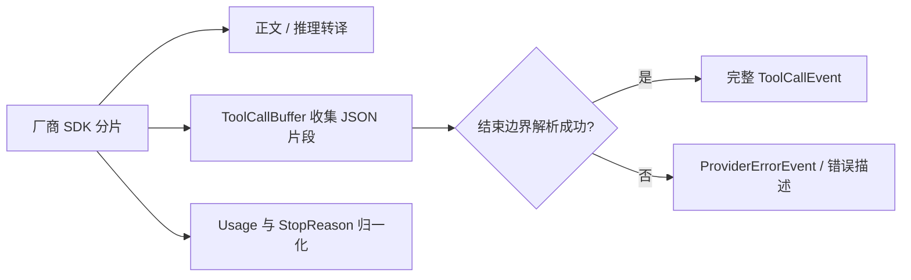

# 04 · 模型提供商、流式协议与凭据

> 核对日期：2026-09-30。范围：当前工作区源码（包含已有未提交改动）。本文描述已实现行为；性能保证与系统安全保证必须另有测试和测量依据。

## 1. 定位与边界

厂商对正文、推理、工具参数、用量和结束原因的表示不同。适配层（adapter layer）把这些差异放在边缘：内核只消费统一事件，不需要按厂商编写分支。没有这一层，新增端点或处理非完整 JSON 都会进入核心循环。

本模块负责厂商注册、凭据解析、兼容接口与 Anthropic 转译、工具参数组装、模型发现、Ollama 窗口查询和静态成本估算。登录弹窗与状态文件操作由 TUI / Runtime 协调；工具权限由 [06](06_permissions.md) 决定。

## 2. 源码地图

| 文件 | 实际符号 | 职责 |
|---|---|---|
| [base.py](../../src/logox/providers/base.py) | `Provider`, `ChatRequest`, `ToolCallBuffer`, `ModelInfo`, `ThinkingConfig` | 中立请求、流式事件和片段组装 |
| [openai_compat.py](../../src/logox/providers/openai_compat.py) | `OpenAICompatProvider` | OpenAI 兼容端点的请求与流转换 |
| [anthropic.py](../../src/logox/providers/anthropic.py) | `AnthropicProvider` | Anthropic 原生块、用量与推理格式 |
| [registry.py](../../src/logox/providers/registry.py) | `ProviderSpec`, `ProviderRegistry`, `MissingKeyProvider`, `resolve_api_key`, `is_keyless` | 预设、覆盖、凭据、模型窗口解析与构造 |
| [discovery.py](../../src/logox/providers/discovery.py) | `discover_models`, `DiscoveryResult`, `merge_models`, `as_model_infos` | 端点模型列表、错误报告与合并 |
| [pricing.py](../../src/logox/providers/pricing.py) | `estimate_cost_usd` | 已知模型费率的本地估算 |

第三方 SDK 在实际调用函数内部延迟导入。惰性导入（lazy import）解决只查询版本也加载网络 SDK 的启动浪费；`test_imports.py` 检查轻量路径。这不代表真实首次请求没有 SDK 初始化成本。

## 3. 请求、流式组装与切换

`Provider.stream(ChatRequest)` 返回异步事件迭代器。适配器将厂商分片转成 `DeltaEvent / ToolCallEvent / UsageEvent / StopEvent / ProviderErrorEvent`，内核再转成领域总线事件。

OpenAI 兼容分片中正文取 `delta.content`；推理取非空字符串 `delta.reasoning_content`，空值或非法类型时后备到 `delta.reasoning`（Ollama）。两个思考字段同片返回时优先前者，只发一份 `DeltaEvent(kind="reasoning")`，避免重复文本；不支持的值不制造思考。`ChatRequest.max_tokens=None` 时请求体不传该字段；入梦整理／核验采用这一行为，前台请求已有的限额策略不在本轮变更范围。协议依据见 [Ollama 官方实现](https://github.com/ollama/ollama/blob/main/openai/openai.go)。

工具参数可能按几个字符一段下发。`ToolCallBuffer.merge()` 收集片段；`finalize()` 在流结束边界解析 JSON。无参数合法，非对象 JSON、语法错误或缺少工具名返回错误描述，不把半截参数送进执行。JSON 对象合法只证明结构可以解析；工具必填字段和多余字段仍由调度器与 `ToolArgs` 校验，不能说适配器保证语义正确。



凭据以 `resolve_api_key(spec, environ)` 为入口。`/login` 读取 Runtime 的 `has_key`：已存在密钥且无 `--reset` 时复用，缺密钥或显式重设时弹出输入；本地免密端点无需真实 Key。`has_key` 表示存在可解析值，不表示服务端验证有效。缺密钥可用 `MissingKeyProvider` 启动，让用户通过登录恢复，而非启动后无法进入界面。

普通端点发现列表与预设经稳定去重合并；免密本地端点已有发现缓存时使用该缓存，不追加云端预设。`/model` 列表使用本地已知信息；刷新或登录可能请求网络。`Runtime.apply_model()` 同步更新计量与状态，切小窗口压缩由 [02](02_context.md) 和 Runtime 承担。

模型上下文窗口不再采用时机脆弱的运行时探针（已剔除脆弱的 `/api/ps` 与 `/api/show` 异步 HTTP 查询），一律使用纯同步确定性的静态配置。用户可在 `config.toml` 中配置 Provider 级兜底 `context_window` 与针对具体模型 ID 的精细 `model_windows` 映射字典。查询时按：精确模型 ID $\rightarrow$ `:latest` 规范化 Tag 匹配 $\rightarrow$ 提供商兜底窗口 进行 $O(1)$ 本地内存检索，零网络往返、零切模型卡顿。

## 4. 接口、错误与测试

源码定义的核心入口：

```python
# Provider.list_models
def list_models(self) -> list[ModelInfo]: ...

# Provider.stream
def stream(self, request: ChatRequest) -> AsyncIterator[ProviderEvent]: ...

# ToolCallBuffer.merge
def merge(self, *, call_id: str | None=None, name: str | None=None, fragment: str | None=None) -> None: ...

# ToolCallBuffer.finalize
def finalize(self) -> ToolCallEvent | dict[str, str]: ...
```

`ChatRequest` 包含 model / system / messages / tools / temperature / max_tokens / thinking 等字段。`DeltaEvent` 使用 `kind` 与 `text`，`ToolCallEvent` 使用 `call_id / name / arguments / index`，`StopEvent` 使用 `stop_reason`。不要把厂商事件字段写成总线 `ModelDelta.delta` 或旧接口 `chat()`。

| 故障 | 行为 | 测试 |
|---|---|---|
| 鉴权、连接、限流、服务端失败 | 统一错误分类；重试边界交给内核 | `test_openai_compat.py`, `test_anthropic.py` |
| 思考字段差异、双字段及非法值 | 即时归一化、后备、去重，不丢合法思考 | `test_openai_compat.py` 新增 3 项，入梦传输验证见 `test_runtime.py` |
| 工具参数断片或截断 | 不执行不完整调用，提供错误信息 | `test_provider_base.py`, `test_adapter_hygiene.py` |
| 无密钥 / 免密端点 / 复用与重设 | 构造和登录行为保持可解释 | `test_registry.py`, `test_render_commands.py` |
| 模型列表失败 | 返回报告并保留可用清单 | `test_provider_discovery.py`, `test_local_model_discovery.py` |
| 本地窗口静态配置解析 | 验证精确名、Tag 规范化与兜底分层 | `test_static_model_windows.py` |
| 未知价格 | 估算返回未知，不伪装免费 | `test_pricing.py` |

```powershell
$env:PYTHONPATH = 'src'
.venv\Scripts\python.exe -m pytest -q tests/contract tests/unit/test_provider_discovery.py tests/unit/test_static_model_windows.py
```

上述多数是离线流回放或本地假端点测试；不证明每个当前线上模型兼容。价格表是源码内静态估算，实际账单、模型可用性与厂商最新约束需要发布时核验。

## 5. 本轮优化设计与权衡

本轮将 `ToolCallBuffer` 的逐片段字符串追加改为列表收集，在解析时统一拼接，避免大工具参数反复复制已有全文。保留 `arguments` 的字符串读写接口、工具名和 ID 替换规则、错误截取与最终事件形状。回归覆盖大量小片段、空参数、非法 JSON、重复 finalize 以及赋值后继续 merge。

**这是面试常考的：接口契约（protocol / interface）与契约测试（contract test）。** 不同实现提供相同方法与事件形状，调用方才能替换实现；测试给适配器喂已知分片并检查结果，比直接调用真实模型更稳定。代价是离线样本不能覆盖厂商未来的协议变化，需另外维护小规模在线验证集。

局部基准显示分片列表换来了更低追加耗时，但 10,000 段输入的临时内存峰值由约 242 KB 增为 327 KB；这是保存片段引用的代价。频繁读取 `arguments` 会再次拼接，当前适配器主要在结束边界使用它。

当前通用验收见 [A 方案回归](../../tests/unit/test_audit_a_choices.py) 与对应模块测试；当前接手状态见 [架构入口](../ARCHITECTURE.md)。

### 5.1 确定性静态模型上下文窗口与剔除运行时探针（D194）

由于本地大模型切换时，绝大多数目标模型尚未预热加载进显存，导致对 `/api/ps` 的动态运行时探测（Runtime Probe）命中率极低且时机极其脆弱；若回退至 `/api/show` 每次切模型又会引入数百毫秒的 HTTP 延迟与不可控的网络波动。
因此，彻底物理移除 `ollama_probe.py`，改为纯静态分层声明：
1. `[providers.<name>]` 的 `context_window` 作为默认兜底；
2. `[providers.<name>.model_windows]` 映射表支持针对单模型声明精准窗口（如 `qwen3.8:27b = 98304`，`minimind-3 = 4096`）；
3. 查表采用精确匹配优先、`:latest` 规范化 Tag 容错、未命中回退 Provider 默认值；
4. 全流程 $O(1)$ 纯内存同步，零网络阻塞。

验收：`tests/unit/test_static_model_windows.py` 全覆盖精确匹配、tag 容错、回退及 Pydantic 非正数参数拦截。

### 5.2 Anamnesis 独立本地传输

入梦复用统一请求／流事件，但 `anamnesis/local.py` 单独限定本机端点、实际窗口、无代理／无重定向传输，不跟随前台 `/model`，不调用云端。Ollama 以运行实例 context_length 或明确 num_ctx 为据；LM Studio 必须返回可确认的实际窗口，未知时拒绝。独立工具循环归 [09 入梦](09_anamnesis.md)，不是在 Provider 中增加业务调度。离线适配器 SSE 用例不等于真实模型质量验收。
