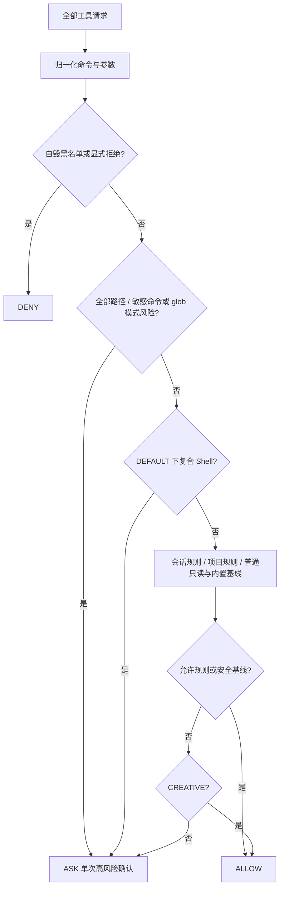

# 06 · 权限决策、路径审计与审批

> 核对日期：2026-09-29。范围：当前工作区源码（含已有未提交改动）。状态：已有实现与已知缺口分别列出；策略设计不得等同于已覆盖的运行路径。

## 1. 定位与安全边界

Agent 的文件操作和 Shell 命令可能超出用户意图。权限系统在执行前判断允许、拒绝或询问，让用户能看清授权范围。人在回路（human in the loop, HITL）指遇到需要人裁决的动作时等待用户选择，解决的是模型不能替用户确认风险的问题。

本模块实现策略审计与学习规则；调度入口由 [01](01_kernel.md) 控制，弹窗与等待桥接由 [03](03_tui.md) / [08](08_app_and_collaboration.md) 实现。`PathSandbox` 是应用级路径审计，不是操作系统级进程沙箱（sandbox）：已获准的 Shell 进程仍拥有用户账户的操作系统权限。

**Scheduler 的全部注册工具都进入权限决策，readonly 只影响调度。普通工作区只读自动允许；敏感或越界目标需要确认。`requires_permission=False` 不再构成跳过审计的入口。**

## 2. 源码地图与契约归属

| 文件 | 真实符号 | 职责 |
|---|---|---|
| [engine.py](../../src/logox/permissions/engine.py) | `PermissionEngine` | 五层判定、规则学习、撤销、状态快照 |
| [sandbox.py](../../src/logox/permissions/sandbox.py) | `PathSandbox` | 路径解析、工作区边界与敏感标记 |
| [normalizer.py](../../src/logox/permissions/normalizer.py) | `normalize_shell_command` | 命令前缀、词法切分与复合操作符 |
| [models.py](../../src/logox/permissions/models.py) | `Decision`, `PermissionMode`, `RiskLevel`, `PermissionRule`, `PermissionEvaluation` | 策略数据与枚举 |
| [decider.py](../../src/logox/permissions/decider.py) | `HierarchicalPermissionDecider`, `format_permission_detail` | 层级决策与参数说明实现 |
| [app.py](../../src/logox/app.py) | `UiPermissionDecider` | 当前装配路径的决策与交互桥接 |
| [permission_types.py](../../src/logox/permission_types.py) | `PermissionAsk`, `PermissionChoice` 等 | 无界面依赖的询问数据 |
| [kernel/scheduler.py](../../src/logox/kernel/scheduler.py) | `PermissionDecider` 协议、调度侧 `Decision` | 内核授权注入点 |

策略侧与调度侧都定义 Decision，桥接时必须转换到调度器预期枚举；不能只凭字符串相同推断枚举身份相同。

## 3. 实际决策流程



`DEFAULT` 对没有匹配规则的请求询问；保存的允许规则或内置基线可以静默放行，并非“每次写都问”。`CREATIVE` 对常规未匹配动作自动允许，仍保留命中黑名单的拒绝与被识别高风险的人工询问。复合命令在 DEFAULT 下会询问，在 CREATIVE 下不统一强制询问。

路径审计相对工作区解析目标，通过 `resolve()` 处理 `..` 与现有符号链接。敏感检测关注 `.git`、以 `.env` 开头的路径片段及 `.logox/config.toml`、`permissions.toml`；高风险结果为 ASK，允许用户明确授权，不是绝对 DENY。

`audit_tool_args()` 检查所有 `path / file_path / target_file / file / dir / cwd` 字段，任一风险都会影响结果；正常 cwd 不能遮住敏感 Shell 文本。显式敏感 glob 模式也需确认。普通递归搜索跳过敏感子路径，且解析后的文件不得逃出本次搜索根目录；经审批的显式敏感根目录或模式可搜索指定范围。任意脚本的内部行为也无法靠命令文本完整识别；例如一个名称看似只读的测试命令仍能运行用户代码。

规则顺序是拒绝优先、会话允许、项目允许、内置基线。显式拒绝优先于高风险确认，高风险与复合命令检查发生在允许规则之前。“始终允许”保存的是具体范围规则，不能写成无条件忽略一切风险。配置由状态仓保存；跨项目隔离取决于 Runtime 选择正确的项目状态目录。

## 4. 接口、失败与验证

真实入口如下：

```python
# PermissionEngine.evaluate
def evaluate(self, tool_name: str, args: dict[str, Any] | None=None, *, readonly: bool=False) -> PermissionEvaluation: ...

# PermissionEngine.learn_rule
def learn_rule(self, rule: PermissionRule) -> None: ...

# PermissionEngine.revoke_rule
def revoke_rule(self, rule: PermissionRule) -> bool: ...

# PermissionEngine.get_rules_snapshot
def get_rules_snapshot(self) -> dict[str, Any]: ...
```

`PermissionEvaluation` 返回 decision / reason / risk_level / matched_rule / suggested_rule。`PermissionRule` 描述工具名、匹配模式、决策与作用域。无界面或询问失败时不允许执行，调度器把 ASK 转成拒绝结果并向模型说明。

| 场景 | 当前预期 | 测试 |
|---|---|---|
| 自毁命令 | 被已有模式识别则直接 DENY | `test_permissions.py` |
| 越界路径、敏感文件、符号链接 | 审计产生高风险 ASK | `test_permissions.py` |
| 复合命令 / 引号内普通文本 | 词法识别后按运行模式处理 | `test_permissions.py`, `test_permission_mode.py` |
| 保存 / 撤销允许规则 | 生效范围与状态持久化一致 | `test_permissions_command.py`, `test_permission_mode.py` |
| 弹窗取消、无界面、异常 | 工具不得默认执行 | `test_permission_decider.py`, `test_permission_flow.py` |

`test_audit_a_choices.py` 增加真实 Scheduler → 权限引擎 → 文件工具的贯通用例，覆盖普通读取、敏感读取拒绝、递归搜索过滤、敏感 glob、带正常 cwd 的敏感 Shell，以及显式拒绝优先。

```powershell
$env:PYTHONPATH = 'src'
.venv\Scripts\python.exe -m pytest -q tests/unit/test_permissions.py tests/unit/test_permission_mode.py tests/unit/test_permissions_command.py tests/tui/test_permission_decider.py tests/tui/test_permission_flow.py
```

## 5. 权衡、限制与下一步

已按用户 A 方案将审计与询问分开：所有工具做基础审计，工作区普通只读静默放行，敏感或越界再确认。未采用“每次只读都询问”，因为正常阅读会被频繁打断。CREATIVE 对普通未匹配操作的行为保持既有契约。

**这是面试常考的：检查时与使用时的竞争（time of check to time of use, TOCTOU）。** 路径刚审计完、真正打开前，符号链接或文件仍可能被另一进程替换；面试官会问 resolve 为何不能构成操作系统隔离。应说明本项目提供应用策略与人工审批，尚无容器/受限令牌等系统隔离。

当前通用验收见 [A 方案回归](../../tests/unit/test_audit_a_choices.py) 与对应模块测试；当前接手状态见 [架构入口](../ARCHITECTURE.md)。

### 5.1 已确认 A：所有工具做审计，普通只读静默放行（已实现）

Scheduler 不跳过权限决策。PermissionEngine.evaluate 增加只读提示参数，用于普通工具默认放行；该提示仅在路径风险与显式拒绝检查之后生效，不能让 deny 失效。read/grep/glob 的已知名称兼容直接引擎调用。

PathSandbox.audit_tool_args 检查所有存在的路径字段，并单独检查 Shell command；普通 cwd 不能遮盖敏感 command。grep/glob 扫描可能遇到敏感子路径，应根据搜索范围/显式模式识别风险，普通工作区扫描默认不泄露敏感文件，显式敏感范围可通过审批访问。具体过滤与审批范围同时验证，不把应用审计宣称为 OS 沙箱。

测试必须经过真实 Scheduler：普通 read 不问、敏感 read/grep/glob 询问或拒绝、deny 优先、多个路径、正常 cwd+敏感 command、越界与符号链接。
