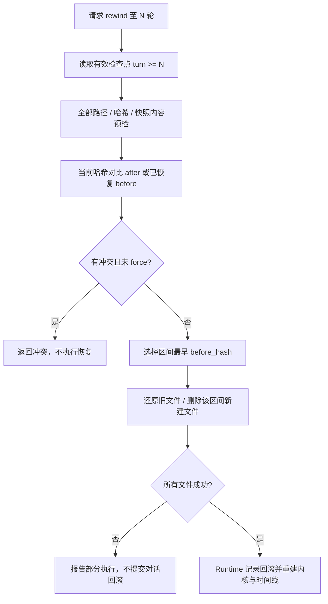

# 07 · 会话持久化、快照与回滚

> 核对日期：2026-09-30。范围：当前工作区源码（含已有未提交改动）。状态：已有实现与已知缺口分别列出；策略设计不得等同于已覆盖的运行路径。

## 1. 定位与边界

会话记录让用户关闭程序后继续任务；文件快照让错误修改有恢复依据。只恢复文件而不处理对话历史，会让模型继续相信已经被撤销的改动；直接覆盖文件又可能破坏用户在编辑器里的新修改。本模块负责日志、会话选择、历史回放、检查点与文件回滚。

恢复（resume）重建历史；回滚（rewind）撤销目标轮次及之后的修改。文件级原子替换（atomic replace）解决单个文件写到一半被看到的问题；多文件恢复、日志与内存更新并没有整体事务保证。本模块不提供任意 Shell 或外部服务副作用的一键撤销。

## 2. 源码地图与存储布局

| 文件 | 实际符号 | 职责 |
|---|---|---|
| [manager.py](../../src/logox/store/manager.py) | `SessionManager`, `SessionInfo` | 工作区分桶、创建、列表、最近会话、软删除 |
| [slug.py](../../src/logox/store/slug.py) | `slugify_cwd`, `unslug_cwd_hint` | 路径名及短哈希分桶 |
| [persistence.py](../../src/logox/store/persistence.py) | `SessionPersistenceSubscriber` | 模型步骤、工具结果、摘要与检查点记录 |
| [replay.py](../../src/logox/store/replay.py) | `load_session_records`, `filter_rewound_records`, `reconstruct_messages`, `replay_into_timeline`, `replay_session` | 有效记录读取与确定性回放 |
| [checkpoint.py](../../src/logox/store/checkpoint.py) | `CheckpointTracker`, `FileSnapshot`, `TurnCheckpoint`, `ConflictInfo`, `RewindResult` | 轮次检查点与结果模型 |
| [blob.py](../../src/logox/store/blob.py) | `BlobStore` | SHA-256 内容寻址存储与单文件恢复 |
| [rewind.py](../../src/logox/store/rewind.py) | `check_conflicts`, `execute_rewind` | 外部修改检查与区间恢复 |
| [context/storage.py](../../src/logox/context/storage.py) | `SessionTranscriptWriter` | 会话 JSONL、工具输出文件与行号 |

默认数据来自 `LogoxPaths` 的用户目录（通常 `~/.logox`）：

```text
sessions/<workspace-slug>/<session-id>.jsonl    对话步骤与会话元数据
sessions/<workspace-slug>/tools/<session-hash>/tool_<id>.log  会话隔离的工具输出
blobs/<hash前2位>/<其余哈希>                  内容寻址文件快照
logs/...                                     独立诊断事件日志
```

工具输出 Blob 与内容寻址快照是两套用途不同的存储。前者按调用 ID 命名，后者按文件内容哈希去重；不能混为“所有日志都按内容去重”。工具输出使用会话文件名哈希划分命名空间，避免不同会话的相同调用 ID 覆盖。

## 3. 持久化与恢复机制

`SessionPersistenceSubscriber` 接收增量时在内存积累，到 `ModelRequestFinished` 才写该请求的正文、推理和调用；不是每个 token 都实时落盘。异常关闭可能丢掉尚未结束的模型请求。`SessionTranscriptWriter` 以 JSONL 追加并 `flush()`，当前没有 `fsync()` 的断电持久性保证，追加成功后才提交行号与轮次区间，失败 warning 并返回 None。失败后的再次追加先重新核对实际文件行数；已有损坏尾行没有换行时补分隔，使后续 JSON 不接到坏行里。读侧仍会忽略无效记录，这不是自动修复损坏内容。

持久化订阅者对每条工具结果强制另存文件（直接调用 writer 时仍支持阈值），当前 JSONL 仍保留 content，外置文件并不自动消除主日志的全文重复。读侧忽略无效 JSON 行；重建工具调用与结果配对，并将回合摘要来源、真实记录行号写回消息 meta。回滚标记过滤掉已经撤销的历史分支。启动恢复和热切换均将过滤后的记录交给上下文构建器恢复 `context_state`；时间线继续回放全部有效原始对话。

检查点由 Scheduler 围绕支持的 `write / edit` 操作保存前后内容哈希。内容寻址存储（content-addressed storage, CAS）按 SHA-256 命名，同样内容不重复写；避免每轮复制整个工程。任意 Shell 修改、远程 MCP 修改或手工编辑不自动拥有这些快照。



`to_turn=N` 表示撤销 N 轮及之后，不是“保留到 N 轮结束”。外部漂移（external drift）是当前文件与 Agent 最后记录的版本不同；默认阻止覆盖，`force=True` 会覆盖用户修改，属于需要明确理解的已有操作。

## 4. 接口、失败与验证

源码接口：

```python
# SessionManager.list_sessions
def list_sessions(self, cwd: Path | str) -> list[SessionInfo]: ...

# SessionManager.find_most_recent
def find_most_recent(self, cwd: Path | str) -> SessionInfo | None: ...

# SessionManager.scan_session_metadata
def scan_session_metadata(self, file_path: Path, cwd: str='') -> SessionInfo | None: ...

# execute_rewind
def execute_rewind(records: list[dict[str, Any]], to_turn: int, cwd: Path, blob_store: BlobStore, *, force: bool=False) -> RewindResult: ...
```

`SessionInfo` 包含 session_id / file_path / cwd / created_at / updated_at / turn_count / title_summary / total_tokens。`FileSnapshot` 使用 path / before_hash / after_hash；`RewindResult` 有 success / to_turn / restored_files / deleted_files / conflicts / message。

| 场景 | 当前行为或限制 | 测试 |
|---|---|---|
| 无会话、空会话、坏 JSON 行 | 列表/回放容错，不把坏行当有效消息 | `test_store.py` |
| 摘要、推理、工具展示恢复 | 消息与时间线恢复应一致 | `test_resume_fidelity.py`, `test_store.py` |
| 压缩状态跨进程、热切换与回滚 | 绑定有效分支，恢复摘要与工具归档，按有效视图计量 | `test_context_state_resume.py` |
| 多次回滚与继续新轮次 | 过滤已经撤销的记录，避免轮次错配 | `test_rewind.py`, `test_turn_summary_position.py` |
| 外部文件被编辑或删除 | 默认返回冲突 | `test_rewind.py` |
| 快照不存在 / 恢复失败 | 预检缺失快照；失败返回 success=False，不推进历史 | `test_audit_regressions.py` |
| 磁盘满 | 警告并继续，不能宣称所有文本已保存 | 本轮环境失败与故障注入 |

```powershell
$env:PYTHONPATH = 'src'
.venv\Scripts\python.exe -m pytest -q tests/unit/test_store.py tests/unit/test_rewind.py tests/unit/test_resume_fidelity.py tests/unit/test_transcript_paths.py
```

生产使用应保留会话与快照备份，磁盘空间与写入失败需要可见诊断。把快照缺失、恢复中途失败和损坏尾行分开验证，不能只测正常恢复哈希一致。

## 5. 本轮优化设计与权衡

`find_most_recent()` 原来调用 `list_sessions()`，为恢复一份最新会话解析了全部历史日志。本轮只按文件修改时间稳定排序候选，解析最新可读文件；若被删除或读取失败，继续下一份。仍保持列表方法的全量元数据统计、相同时间的稳定顺序与无会话返回 None。不引入需要失效管理的持久索引缓存。

**这是面试常考的：原子性（atomicity）与事务（transaction）。** 单文件 replace 让读者看到旧或新版本；多个文件加日志和内存要一起成功，才算整体事务。当前 rewind 是逐文件恢复，遇到中途失败可能出现部分成功，不能用“时空穿梭”文案替代这个边界。已完成路径、哈希与快照内容预检，并识别已恢复版本以支持重试；完整事务日志和自动补偿未实现。

当前通用验收见 [A 方案回归](../../tests/unit/test_audit_a_choices.py) 与对应模块测试；当前接手状态见 [架构入口](../ARCHITECTURE.md)。

### 5.1 本轮回滚结果修复设计

旧代码在快照缺失或删除失败后仍返回 success=True，Runtime 据此撤销对话历史，导致磁盘与历史不一致。本轮在写文件前预检需要的快照是否存在；缺失时返回失败并保留文件。执行中失败捕获并返回 success=False，结果继续包含已经成功恢复/删除的路径，message 明确可能部分执行。Runtime 的现有 success 检查会阻止提交回滚记录和截断历史。

此修复只使结果诚实并减少可提前发现的失败，不承诺多个文件同时恢复成功。已追加快照完整性与路径校验；检查后并发文件变化和失败后的整体补偿仍不保证。验收覆盖缺失快照、恢复返回 False、写入抛 OSError、删除失败、正常区间回滚。

### 5.2 已确认 A：完整预检、诚实失败与兼容日志（已实现）

回滚修改前解析所有路径，限制工作区内、拒绝无目标及非法哈希，验证快照存在和内容哈希；一项不合格则完全不执行。执行中仍可能部分成功，返回成功路径和失败信息；重试已恢复的文件时需识别目标 before 版本，避免把已成功恢复当作用户冲突。保留现有 RewindResult 与 JSONL 格式，不引入事务日志。

写日志成功后才提交行号与 turn_lines，失败返回 None；持久化调用方不把 None 写成 transcript_line。工具输出路径采用每会话命名空间，新日志记录准确指针，读侧兼容旧 tools/tool_id.log。主日志全文重复属于格式迁移问题，本次 A 保持旧 JSONL 内容兼容，不实施 B 的新持久队列。

验收路径穿越/绝对越界/符号链接、非法或损坏快照、先成功后失败与重试、失败写入不推进行号、相同 call_id 跨会话不覆盖、旧会话回放。

### 5.3 入梦证据与档案存储

入梦复用会话分桶和有效回滚视图，物理行号／内容摘要值／片段偏移由自身资料收集器登记，不把 JSONL 列表下标当物理行号。档案、准备记录、反向版本、处理游标、代码依据索引和晨报放在独立受限存储；不改原 JSONL 格式、源码快照或 `/undo` 语义。用户／项目档案分开提交，部分成功如实报告。具体恢复与写入边界见 [09 入梦](09_anamnesis.md)。

### 5.4 上下文状态记录（2026-09-30）

`compaction` 为统计审计记录，不能代表可恢复上下文。新增 `context_state` 为同文件、版本 1 的压缩状态记录；角色 system，独立 state 字段，界面不显示为聊天消息，完整原始历史不改。恢复必须先应用 rewind，再校验绑定历史内容与数量；不得只按 tokens_after 恢复。详细接口、失败与测试见 [02 §5.3](02_context.md#53-压缩状态跨进程恢复修复2026-09-30)。

状态：已实现，新增 18 项跨恢复用例，全量 1949 项／3212 子用例通过。记录的 state 结构如下：

| 字段 | 格式与约束 |
|---|---|
| version | 整数 1；不支持版本告警并尝试更早状态 |
| history_count / covered | 来源单元数量／覆盖边界；单个工具结果为一单元，不能切开原始工具批次 |
| history_digest | 原始角色、正文与工具内容的 SHA-256；排除推理及回放元数据，绑定快照之前的有效分支 |
| prefix | 通过 Message 校验的折叠前缀，包含逐轮摘要／归档索引或全局备忘录 |
| tools | 尾部来源单元下标及已归档工具块；调用 ID 必须匹配，归档必须存在 |
| epochs / working_set | 折叠区间账本与已读取文件节选；恢复后下一 epoch ID 接续 |

状态由上下文构建器在有效变化后写入，不依赖 debug dump 或退出钩子；统计 compaction 事件继续独立保留。普通 build 不重复写状态，写入失败下一次 build 重试；不覆盖／删除旧日志。状态列出来源单元而非内存对象 ID，恢复后重新绑定对象引用。启动 resume、热切换及回滚共用上下文恢复方法，原始消息重建和时间线展示仍保持原有格式。
