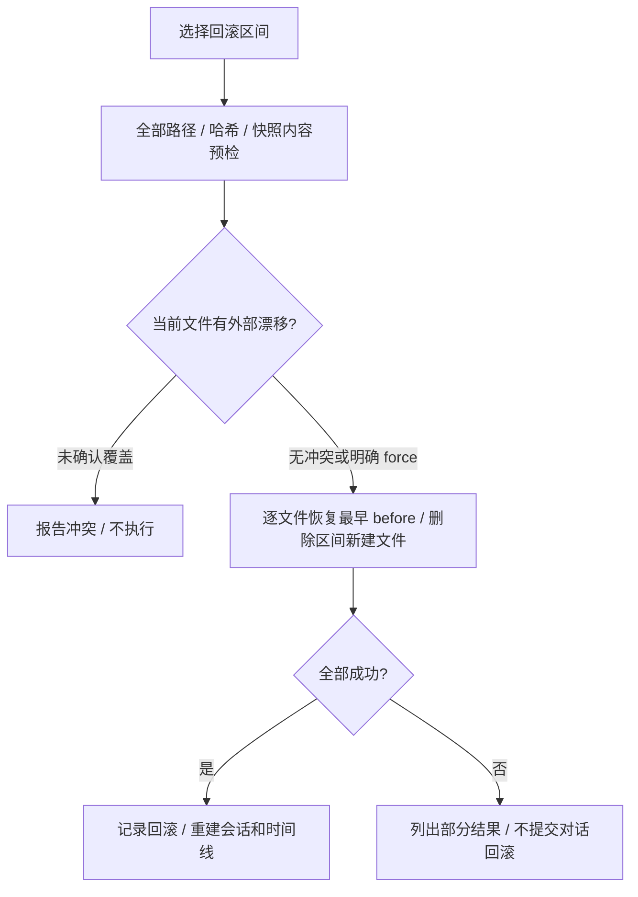

# 会话存储、快照与恢复

核对日期：2026-10-09。对话、压缩状态、工具原文和文件快照有不同用途。

## 职责与布局

本模块保存会话、列出历史、回放有效分支、管理文件检查点与回滚。resume 重建对话；rewind 撤销目标轮次及之后的受支持文件修改，并在成功后更新历史。它不撤销任意 Shell、MCP 或外部服务的副作用。

默认用户目录由 LogoxPaths 给出：

```text
~/.logox/
  sessions/<workspace-slug>/<session-id>.jsonl
  sessions/<workspace-slug>/tools/<session-hash>/tool_<id>.log
  blobs/<hash前2位>/<其余哈希>
  logs/
  anamnesis/
```

工具日志按会话命名空间避免相同调用 ID 覆盖；文件快照用 SHA-256 内容寻址（CAS）去重。诊断事件日志和入梦过程不是对话消息正文。

## 会话记录与时间

持久化订阅者在内存积累流式正文/推理，到 ModelRequestFinished 写 model_output，保存工具调用、用量、耗时及统一/原始停止原因。ToolCallFinished 写工具结果及展示提示。新 turn_finished 用 turn_summary 保存摘要；读取兼容旧 content 回退。

主要事件记录用 `timestamp` 保存 Unix 秒，可有小数；模型和工具结果表示对应完成事件的时间，不是开始时间。内部记录未指定时间时取创建时刻，显式 null 表示未知。新 session_init 保留 created_at 并保存同值 timestamp。

读旧日志优先保留 timestamp，其次兼容 ts，否则内存补 null；不改原文件、mtime、行号或内容摘要值。duration_ms 是耗时，不能代替发生时刻，不能从文件名推测逐条时间。

JSONL 追加后 flush，成功才提交物理行号和轮次范围；失败 warning 返回 None。再次写入核对行数，损坏尾行无换行时补分隔，读侧忽略非法行。当前没有每条 fsync 的断电持久保证；请求结束前的增量仍在内存，异常关闭可能丢失。

每个工具结果另存原文文件，主 JSONL 仍保存全文；外置不等于已消除重复。读取 JSONL 按真实换行处理，不能用 Unicode splitlines 拆开合法字符串内的分隔字符。

## 回放与上下文恢复

load_session_records → 过滤回滚分支 → reconstruct_messages → replay_into_timeline。工具调用和结果双向配对：结果缺调用时补调用，调用缺结果时按所属批次补失败结果。已完成结果保留；未开始、已中断或未保存结果的调用不会重新执行，也不补成成功。恢复只改内存视图，不改原始 JSONL；新增合成消息不冒充真实记录行号。摘要来源及真实记录行号写回 meta，工具 display 恢复 Diff 与错误详情。

压缩统计 compaction 与可恢复 context_state 分开。恢复状态必须匹配有效原始分支及归档文件；启动 resume、热切换和 rewind 共用 [上下文模块](02_context.md) 的校验。时间线仍显示完整有效原始对话，模型请求使用恢复后的折叠视图。

入梦会话只记录无模型角色的 anamnesis_ref，独立过程和报告从 Anamnesis 存储加载；不把后台思考污染前台模型消息。会话归属见 [入梦模块](09_anamnesis.md)。

## 文件回滚

Scheduler 围绕支持的 write/edit 保存 before_hash 和 after_hash。to_turn=N 表示撤销 N 轮及之后，不是保留到该轮结束。



预检拒绝越界、非法哈希及缺失/损坏快照。执行中仍可能部分成功；重试识别已恢复 before 版本，避免误判为外部改动。单文件临时替换原子，多文件、日志与内存没有整体事务和自动补偿保证。force 会覆盖外部手改，界面先显示冲突选择。

操作说明见 [权限与恢复](../user/safety-and-recovery.md)。

## 接口与验证入口

| 源码 | 职责 |
|---|---|
| [manager.py](../../src/logox/store/manager.py)、[slug.py](../../src/logox/store/slug.py) | 工作区分桶、会话元数据、最近会话、软删除 |
| [persistence.py](../../src/logox/store/persistence.py) | 事件落盘 |
| [replay.py](../../src/logox/store/replay.py) | 旧格式兼容、有效分支、消息与界面回放 |
| [context/storage.py](../../src/logox/context/storage.py) | 追加、行号、工具原文 |
| [blob.py](../../src/logox/store/blob.py)、[checkpoint.py](../../src/logox/store/checkpoint.py) | 内容快照、检查点与结果模型 |
| [rewind.py](../../src/logox/store/rewind.py) | 冲突、预检、恢复和诚实失败 |

验证新旧日志、损坏尾行、相同调用 ID 隔离、摘要/Diff 恢复、压缩→退出→resume、外部漂移、预检不写入和部分恢复失败。入口：[存储](../../tests/unit/test_store.py)、[回滚](../../tests/unit/test_rewind.py)、[回放一致性](../../tests/unit/test_resume_fidelity.py)、[中断后配对恢复](../../tests/unit/test_tool_pairing_recovery.py)、[时间戳](../../tests/unit/test_record_timestamps.py)、[压缩状态](../../tests/unit/test_context_state_resume.py)。磁盘失败需要诊断，不把“会话继续运行”写成“数据已经保存”。
