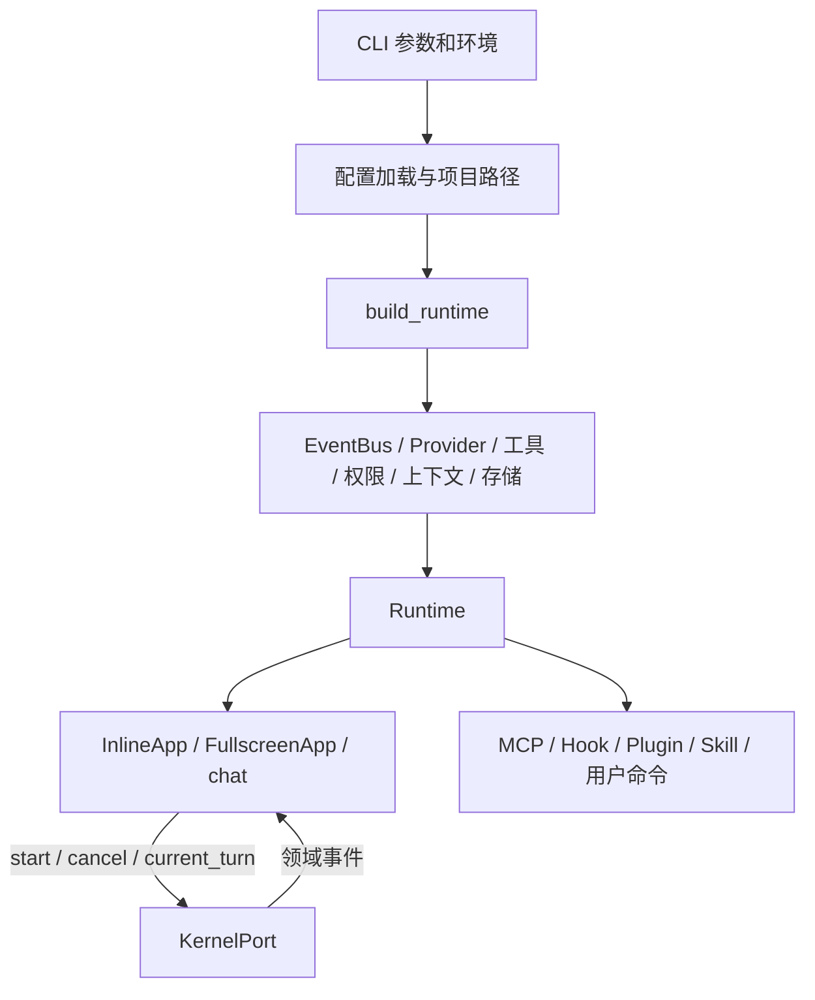

# 08 · 应用装配、配置与扩展协作

> 核对日期：2026-10-03。范围：当前工作区源码（含已有未提交改动）。状态：已有实现与已知缺口分别列出；策略设计不得等同于已覆盖的运行路径。

## 1. 定位与边界

各模块需要连接起来，但内核不应知道怎样创建厂商 SDK、怎样找配置和怎样弹窗。装配根（composition root）在一个顶层入口创建对象、传入需要的依赖，并管理关闭流程；否则每个模块都自行组装，测试和切换会变得难以控制。

本模块描述 CLI 到 Runtime 的启动链、六级配置、模型切换、权限桥接、日志、MCP、插件、命令与技能。核心循环属于 [01](01_kernel.md)，界面组件属于 [03](03_tui.md)，规则本身属于 [06](06_permissions.md)。

## 2. 源码地图与扩展边界

| 路径 | 实际符号 / 内容 | 职责 |
|---|---|---|
| [cli.py](../../src/logox/cli.py), [__main__.py](../../src/logox/__main__.py) | `main` 与 Python 模块入口 | 参数、版本、配置诊断、文本/界面模式 |
| [app.py](../../src/logox/app.py) | `Runtime`, `StartupError`, `build_runtime`, `UiPermissionDecider` | 跨模块装配、切模/压缩/会话/权限桥接 |
| [paths.py](../../src/logox/paths.py) | `LogoxPaths`, `ProjectPaths`, 项目发现 | 用户与项目文件位置 |
| [config/](../../src/logox/config/) | loader / schema / state / writer / envfile / theme / defaults | 配置合并、来源、状态、TOML 和凭据文件 |
| [telemetry.py](../../src/logox/telemetry.py) | `EventLog`, `redact_text` | 诊断事件日志、脱敏和批量写入 |
| [mcp/manager.py](../../src/logox/mcp/manager.py) | `McpManager` | 服务描述、客户端索引与统一关闭 |
| [mcp/client.py](../../src/logox/mcp/client.py) | `McpClient` | 惰性连接、工具列表、调用与状态事件 |
| [mcp/adapter.py](../../src/logox/mcp/adapter.py) | `McpMetaTool`, `McpMetaArgs`, `McpProxyTool`, `condense_mcp_tool` | MCP 与本地 Tool 的桥接 |
| [mcp/models.py](../../src/logox/mcp/models.py) | `McpConnectionState`, `McpServerStatus` | 服务状态快照 |
| [plugins.py](../../src/logox/plugins.py) | `PluginManager`, `PluginContext` | Python 插件发现、注册工具/命令/订阅 |
| [hooks.py](../../src/logox/hooks.py) | `HookRunner`, `HookExecutionResult` | 观察型 Shell 钩子、超时与事件挂接 |
| [commands/](../../src/logox/commands/) | `CommandManager`, 命令模型 | 文件式用户斜杠命令 |
| [skills/](../../src/logox/skills/) | `SkillManager`, `SkillMeta` | 技能扫描、元数据索引与按需读正文 |
| [devsetup.py](../../src/logox/devsetup.py) | 开发设置帮助 | CLI 开发辅助流程 |
| [errors.py](../../src/logox/errors.py), [difftext.py](../../src/logox/difftext.py) | 公共错误与 Diff 数据 | 跨模块中立数据支撑 |

Python 插件和 Shell 钩子可运行本机代码，不是已隔离的不可信扩展。安装与启用扩展应建立信任来源与范围，不能把普通工具审批视作插件本身的代码执行隔离。

## 3. 装配、配置与协作流程



依赖注入（dependency injection）解决模块需要能力但不应自己挑选实现的问题：`build_runtime()` 将提供商、构建器和决策器传给内核；测试可传假实现。`KernelPort` 的真实最小成员是 `start / cancel / current_turn`，不是文档旧版的 `is_busy`。

配置按以下优先级从低到高合并：模型字段默认值 → 用户 config → 从远到近的项目 config → 上次使用 state 覆盖 → `LOGOX__...` 环境变量 → CLI 覆盖。嵌套表深度合并，数组整体替换。`defaults.toml` 是默认配置的说明样本，运行时基线来自 schema 模型，不能写成 loader 每次读取这个 TOML。

`ConfigBundle` 返回 config / sources / origin / issues，常规模式对有问题字段回退并报告；strict 模式存在任何 issue（含 warning）即抛错误。`.env` 凭据加载与 TOML 配置加载是不同入口；Runtime 的构造不应偷偷修改全局环境。状态仓负责偏好与项目权限，实际项目来源应从 `--check-config` 的来源记录核查。

权限询问通过 `PermissionAsk` 与 Future 暂停工具协程，用户选择后继续。Future（待完成结果）让该协程等待期间其他任务仍能处理输入；不是把整个事件循环停住。取消与关闭时必须结束等待并清理浮层。

模型切换由 `apply_model()` 同步更新内核、计量和状态；手动/及早/自动压缩共用构建器。极小窗口先只留历史逐轮摘要，仍达到高水位时由 Runtime 提供本地全量汇总回调。当前本机 Ollama / LM Studio 可复用；否则需明确配置 Ollama 模型。没有本地模型、输入超其窗口或摘要失败时保留摘要并暂停，不自动调用云端或机械截断。单轮摘要补写仍使用当前提供商，细节见 [02](02_context.md)。

MCP（Model Context Protocol）是外部工具服务协议。`McpManager` 启动只建立客户端描述，首次 list/call 再连接。当前客户端实际走 stdio 子进程，配置允许 http 以给存量配置明确诊断，但连接前会拒绝未实现传输，不会误拉 stdio 子进程。注册给模型的默认入口是一个 `mcp` 元工具，先 `action='list'` 返回目录，再 `action='call'` 代理执行；目录压缩只保留简要参数类型和说明，会丢掉复杂 Schema 约束，不代表完整参数校验。

技能首次仅注入名称、描述与路径，详细正文按需读；用户命令扫描文件并进行参数/提示展开。诊断 `EventLog` 走非阻塞队列并批量写盘，可能丢弃积压事件；对话持久化的另一条链见 [07](07_store.md)。

## 4. 真实接口、失败与验证

```python
# build_runtime
def build_runtime(bundle: Any, cwd: Path, paths: LogoxPaths, *, session_id: str | None=None, allow_unsafe_tools: bool | None=None, resume_file: Path | str | None=None) -> Runtime | StartupError: ...

# Runtime.apply_model
def apply_model(self, model: str) -> int | None: ...

# Runtime.eager_compact_if_needed
async def eager_compact_if_needed(self) -> Any | None: ...

# Runtime.create_memo_summarizer
def create_memo_summarizer(self) -> Any: ...

# McpMetaTool.run
async def run(self, args: ToolArgs | dict[str, Any], ctx: ToolContext) -> ToolResult: ...
```

`StartupError` 是预期启动失败结果。缺密钥可用占位提供商启动；未知提供商、无可用模型或主题错误等通过诊断路径报告。Runtime 的跨模块操作不是稳定外部 SDK，新增协作能力应先更新所属模块文档。

| 场景 | 检查点 | 测试 |
|---|---|---|
| 六层覆盖与非法配置 | 精确字段来源、数组替换、strict 行为 | `test_config.py`, `test_cli.py` |
| 工作区 / 用户配置隔离 | 临时用例不读取开发机真实配置 | `test_config.py`, 本轮隔离 runner |
| 启动失败与版本轻量路径 | 可行动的错误信息、不拉重 SDK | `test_app_startup.py`, `test_imports.py` |
| 模型切换 / 自动阶段 3 | 注入真实可调用回调，适配新模型状态 | `test_model_switch_and_compaction_hook.py`, `test_compaction_stage3.py` |
| MCP 首次连接、并发连接、超时 | 惰性初始化与状态、关闭资源 | `test_mcp_lifecycle.py`, `test_mcp_adapter.py` |
| MCP 经 Scheduler 调用 | 参数模型与适配器一致，结果真实返回 | `test_audit_regressions.py` |
| 插件/钩子/技能/命令 | 顺序、异常、覆盖、按需载入 | `test_plugins.py`, `test_hooks.py`, `test_skills.py`, `test_commands.py` |

```powershell
$env:PYTHONPATH = 'src'
.venv\Scripts\python.exe -m pytest -q tests/tui/test_app_startup.py tests/unit/test_config.py tests/unit/test_imports.py tests/unit/test_mcp_adapter.py tests/unit/test_mcp_lifecycle.py tests/unit/test_hooks.py tests/unit/test_plugins.py tests/unit/test_skills.py tests/unit/test_commands.py
```

## 5. 本轮修复设计与后续决策

1. `build_runtime()` 原来直接 `return Runtime(...)`，之后的摘要回调赋值永远不执行且引用未定义 `runtime`。本轮先构造并绑定 Runtime，再注册 `runtime.create_memo_summarizer()`，最后返回。用真实 build_runtime 的用例确认自动内核请求可到达回调。
2. `Scheduler` 校验后传入 `McpMetaArgs`，元工具原来的 `.get()` 字典用法会失败。本轮先把已校验参数对象转成 dict，保留现有直接传 dict 的兼容测试；增加经过 Scheduler 的 list 与 call 用例。此修复不改变权限标记、调用范围或传输选择。
3. 大工具输出归档失败时保留原文的修复归 [02](02_context.md)；最近会话扫描优化归 [07](07_store.md)。

**这是面试常考的：测试边界与贯通验证（integration testing）。** 直接调用元工具的字典测试全通过，仍可能漏掉真实调度器传入对象时的故障。面试官会追问如何发现“模块单独能用，连接后不能用”；本轮以真实参数校验和调用结果验证连接处。

已按 A 完成权限入口、超预算处理、连接取消与发布文件可纳入性；极小窗口摘要按最新用户裁定改为本地。http 实现、回滚整体事务、动态工具 Schema 计量和真实模型兼容性仍属后续工作。

当前通用验收见 [A 方案回归](../../tests/unit/test_audit_a_choices.py) 与对应模块测试；当前接手状态见 [架构入口](../ARCHITECTURE.md)。

MCP 紧凑目录本轮额外修复 type 为列表时的 TypeError：逐项映射类型并用 ` | ` 合并，非法列表元素略过，空结果以 any 表示。目录仍是提示性签名，不能代替远端完整 Schema 校验；测试同时走真实 Scheduler 的 list 入口。

### 5.1 已确认 A：传输拒绝、取消清理与可发布材料（已实现）

未支持的 http MCP 在连接前返回明确错误，不尝试 stdio；保留配置字段以给旧配置明确诊断。连接启动取消时关闭已打开的 AsyncExitStack，清空会话并返回停止状态，再传播 CancelledError；关闭接口幂等。

发布 A 仅调整忽略规则：根 tools 辅助目录大部分仍忽略，仅主题生成脚本和固定官方色板作为测试依赖允许纳入；src/logox/tools 新文件可见；八份模块文档、架构入口和离线测试可纳入 Git，个人复盘、原审计数据、凭据与会话继续排除。本轮不进行提交或远端发布。验收 git check-ignore 与文件清单、构建包六工具、http 不启动进程、握手中取消及重复关闭。

### 5.2 `/reload`：资源热重载（本轮新增，方案 = 界面侧 + 提示词侧）

**为什么做**：改 `AGENTS.md`、技能包、模板命令、主题文件之后，都必须重启进程才生效。参考实现 Pi 的 `/reload`（本机 npm 包 `dist/core/agent-session.js:2603-2626`）只做四件事：作废旧扩展上下文、重读 settings、重建供应商注册、重扫资源文件；`CHANGELOG.md:3622` 把资源清单写得很直白——**AGENTS.md / 提示词模板 / skills / themes / 扩展**。**它一行自己的代码都不重新 import。**

**边界（这一条比我做了什么更重要）**：

| 做 | 不做 |
|---|---|
| 项目记忆（`LOGOX.md` / `AGENTS.md`）重扫 | ❌ **不重载 Python 代码**——改 `.py` 仍要重启；`/status` 的「代码」行继续承担过期告警（D137） |
| 技能包重扫、模板命令重扫 | ❌ 不重连 MCP 长连接、不重建插件注册表（`PluginManager` 没有卸载路径，重载会重复注册） |
| 当前主题文件重读 + 重绘 | ❌ 不替换 `config` 的构造期字段（窗口 / 水位线 / reserve / 压缩参数已烤进 builder 与 compactor） |
| `config.toml` 重读并**校验**（只报告，不半替换） | ❌ 不排队、不中断回合：正在生成时**拒绝执行** |
| 报告是否触碰了缓存前缀 | ❌ 不压缩、不动历史、不动检查点 |

**代价必须说出来**：记忆与技能索引**是系统提示的一部分**（`builder._assemble_system_prompt`），所以重载它们会让前缀指纹变化 ⇒ 下一次请求的 KV 前缀按全价重算一次。账本**不会算错**——`tokens.py:295` 发现 `anchor.prefix_digest` 不匹配会自动让锚点失效。所以 `/reload` 的职责是**告知**，不是"顺手重扫一遍了事"。

**接口**：

```python
# Runtime（装配根）：唯一同时认识 builder / skill / command / config 的地方
def reload_resources(self) -> ResourceReloadReport: ...

@dataclass(frozen=True)
class ReloadItem:
    name: str; detail: str = ""; error: str = ""

@dataclass(frozen=True)
class ResourceReloadReport:
    items: list[ReloadItem]          # 每项：成功给 detail，失败给 error
    prefix_changed: bool             # 系统提示是否变了（决定是否提示"前缀重算"）
    system_tokens_before: int
    system_tokens_after: int
    pending_restart: list[str]       # 读了、但需重启才生效的字段名

# 构建器：只读快照，供装配根比较前缀（新增公开方法，不再让装配根去碰私有名）
def system_prompt_snapshot(self) -> str: ...

# CommandHost（界面）：`/reload` 需要知道"现在能不能执行"
@property
def busy(self) -> bool: ...
```

**失败边界**（口径与 `/login`、`/theme` 一致：**降级成一行提示，会话继续**）：

1. **每项独立 try/except**——技能包扫失败不该让记忆也不刷。
2. `context_builder is None`（未接上下文）→ 跳过记忆项并**说明原因**，不是静默跳过。
3. **`config.toml` 只校验不替换**：有任何 issue 就报告文件/字段/原因；**运行中的 `config` 对象原封不动**。半替换会造成"两份事实"，正是本项目反复出现的缺陷类型。
4. 主题文件损坏 → **保留当前主题**并说明（`apply_theme` 本来就是这个语义）。
5. 整轮任务尚未结束（包括工具、重试或摘要补写）→ **拒绝执行**（`host.busy`），不做排队。一次 ModelRequestFinished 不解除该守卫。

**验收条件**（写测试时逐条对着看）：

| # | 场景 | 检查点 |
|---|---|---|
| 1 | 改 `AGENTS.md` 后 `/reload` | `builder.memory` 内容变化，提示里出现新的来源与 token 量 |
| 2 | **未改任何文件**时 `/reload` | `prefix_changed=False`，**不出现**"前缀重算"提示（否则每次都说要花钱，等于噪音） |
| 3 | 改同名主题文件后 `/reload` | `app.theme.palette.input_border` 变成新值（这是"切走再切回"之外唯一路径） |
| 4 | 生成中执行 `/reload` | 一行"正在回答"提示，且 `reload_resources` **未被调用** |
| 5 | 某一项扫描抛异常 | 其他项照常成功，提示里出现该项失败原因，命令不崩 |
| 6 | `config.toml` 写错 | 提示里出现文件与字段，且 `runtime.config` **未被替换** |
| 7 | 命令清单 | `/reload` 出现在 `AVAILABLE_COMMANDS`（补全与 `/help` 自动跟随），且**不在** `PLANNED_COMMANDS` |

**这是面试常考的：热重载的边界（hot reload boundaries）。** "我加了 `/reload`"是半句；对方在等的是后半句——**什么东西故意不重载，为什么**。本题的答案是"代码不重载 + 配置只校验不替换"，两条都是为了让"运行中的对象图"不出现半新半旧的状态。

### 5.3 测试环境隔离设计与实现

公开测试入口 `tests/conftest.py` 将仓库内测试 cwd 的祖先项目搜索限制在测试仓库边界，不读取仓库外真实用户配置；单测临时文件放在 `.test-tmp`。这仅修改测试进程中的函数和环境，产品仍按原规则发现祖先项目。测试执行期间移除进程中的真实 API Key，防止离线夹具意外使用凭据；测试自行注入的假环境值仍可验证配置覆盖。使用 pytest 的 dev 依赖可重现整套验收。回合内复检用例关闭真实项目记忆，用明确容量与长工具结果验证：多次模型请求都复检、至少实际压缩一次、每次请求低于预算、工具结果仍可回读。

### 5.4 Anamnesis 装配与关闭

`Runtime.anamnesis` 持有独立 `AnamesisService`；配置严格校验并与默认 TOML 对齐。本地运行器在入梦时创建，构造 Runtime 不发起请求，只有 TUI.run 启动调度；--chat 不启动入梦。TUI 将用户活动和整轮结束传给服务，关闭会取消并等待收尾，重复跨事件循环关闭安全。命令清单包含 `/anamnesis`，补全与帮助随之更新；运行策略和版本恢复见 [09 入梦](09_anamnesis.md)，不堆入 Runtime。

### 5.5 整轮忙状态与清理边界（2026-10-03，已实现）

InlineApp 的 busy 不再随单次 ModelRequestFinished 变假，而等成功／失败／取消的整轮结束路径解除；FullscreenApp 继承同一处理。因此模型结束到工具开始的间隙仍由既有 reload／模型／会话守卫保护。新增两种模式与终态测试，避免中途资源变更。公开配置、插件／钩子动态入口、SDK 依赖和 MCP 协议均保留，未根据单次静态引用数删除扩展能力。根级 tools 允许纳入新的离线 benchmark_tui.py，生成 ANAMNESIS.md 忽略规则仅防止发布个人资料，不删除内容。详情见 [清理报告](../CLEANUP-REPORT-2026-10-03.md)。
