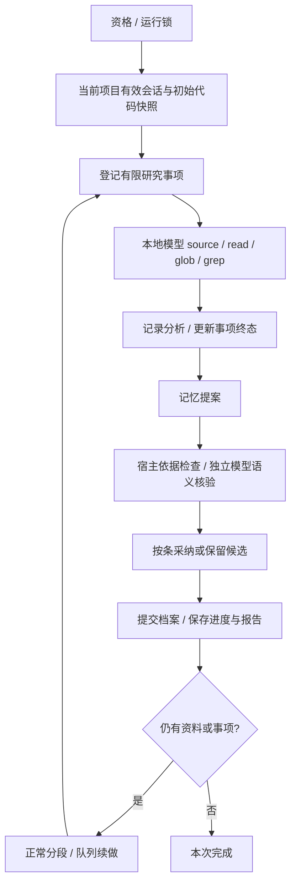

# Anamnesis 入梦与背景记忆

核对日期：2026-10-09。当前为统一入梦，独立本地模型执行只读研究；没有小憩/长眠运行分支。

## 职责与边界

入梦在 TUI 打开、项目空闲时回顾对话、按问题阅读代码、生成记忆提案并核验。用户档案记录有依据的稳定事实和偏好，项目档案记录当前状态、约束和可行下一步；条目替换/删除优先于无界追加。

模型不获得 write/edit、Shell、测试、实验副本、MCP、插件或钩子入口。宿主仅管理用户 `~/.logox/ANAMNESIS.md`、当前项目 `ANAMNESIS.md` 和 `~/.logox/anamnesis/` 的过程记录。应用限制不等于操作系统沙箱。

代码类名前缀为 `Anamesis`，功能、目录、命令和文档为 `Anamnesis / anamnesis / ANAMNESIS.md`。配置与操作见 [入梦指南](../user/anamnesis.md)。

## 调度与多窗口

自动资格按规范工作目录分组：项目全部存活窗口最后用户活动与前台任务结束取较晚时间，均超过 idle_seconds，且没有模型、工具或审批在运行。单次 ModelRequestFinished 不代表整轮结束。

各项目按最后提交用户指令从最近到最早排队；同项目仅最近会话承载。禁用或未配置窗口仍参与项目资格，最近窗口不可运行时不偷偷转到旧会话。单用户文件锁保证同时只有一个任务；批次交接轮转其它合格项目，不抢占已运行任务。窗口每 2 秒登记，超过 20 秒心跳或进程退出不候选，跨进程状态存在传播间隔。

用户提交普通消息或 /anamnesis stop 暂停当前窗口；草稿、粘贴、删除、滚动和展开只刷新下次空闲资格，不停止已运行模型、不使提案失效。其它窗口提交不跨窗口唤醒当前任务。手动启动跳过空闲等待，仍检查同项目前台忙状态和用户运行锁。

关闭 TUI 禁止新启动并等待收尾，--chat 不启动调度。没有新资料、代码变化或可恢复事项时不重复整理；因重复研究被保护暂停的相同依据不自动重试。

## 资料与研究过程

只扫描当前项目会话桶；明确属于其它 cwd 的记录排除，旧记录缺 cwd 时只在本桶归属。用户画像需当前项目中明确的用户原话；不为一次入梦扫描所有关闭项目。

来源登记物理日志行号、内容摘要值、片段偏移和 timestamp。时间未知为 null，不从文件名/mtime补造；回滚使旧来源失效。文件来源按当前项目、链接、敏感路径、大小和 LEGACY 排除检查；grep/glob 是检索线索，入档事实仍需真实 source/read 依据。

初始代码快照为路径、mtime 和 size，完成只记录该快照；运行中新变化留下一次。元数据用于变化提示，不是代码结论证据，同尺寸且保留时间的修改可能漏检。未变日志复用扫描缓存，变动日志仍重新扫描，尚无字节级增量扫描。

宿主登记回顾/代码问题，模型用 plan_research 明确有限事项；开始后仅追加具有父事项和必要性理由的前置依赖。读取和分析绑定当前 item_id。update_research 校验预期版本、来源和分析；resolved 需要有依据结论，waiting_evidence 需要明确缺证，不代表问题解决。无关发现留作建议，不自动无限扩题。

阶段分析说明问题、依据、理由、替代方案、结论与不确定性；分析 ID 不可覆盖，修订用新 ID 指向旧分析。实际有效来源覆盖计为进展，重叠读取、换编号或声称完成不计进展。

同事项相同参数/结果无进展累计达到 repeat_trigger_count（默认 3）时发出可见自检提示；最多 self_check_max_attempts（默认 2）次后保护暂停。阻断绑定来源与代码指纹，跨窗口/重开仍生效；手动启动或真实新依据可重新尝试，草稿不解锁。精确重复检测不保证捕获所有换词的低效研究。

## 提案、核验与活档案

propose_memory 必须显式 complete，表示本批资料审阅，不是整个运行完成。空提案不能结束未完成事项。变更以稳定 entry_id 指定作用域、动作、旧值、来源和对应 analysis_record_id；可引用已登记分析，不要求复制整份记录。

程序先检查身份、来源/分析包含关系、作用域、时间和当前来源有效性，再向同一本地模型发送独立语义核验请求。核验不执行工具，返回采纳条目 ID 和拒绝理由；独立请求不是独立模型，也不是人工审批。

用户事实需明确用户原话；项目事实须当前项目来源，只有 assistant 转述不足以证明完成。项目当前状态依据需不早于最新有效非 assistant 时间界线，或使用本次可核验文件；新叙述不能把旧测试/git证据变新。稳定用户偏好不自动按项目时间衰减；没有固定衰减公式。

完整批次按条采纳：合格条目入档，拒绝和 candidate 留在报告/过程，不进入前台背景。有效审阅完成后推进资料游标，表示已审而非全已采纳；全候选也可正常结束。生成不完整、核验协议错误、来源变化或取消不伪装提交成功。

每份档案独立锁定 → 核对版本和来源 → 保存旧版/prepared → 再检查唤醒与外部修改 → 同目录临时写、同步、替换 → 保存机器元数据/committed → 推进作用域进度。用户和项目不是整体事务，部分成功如实报告。

默认用户/项目正文预算为 800/1600 估算 tokens。手工改过 MD、机器版本不匹配或链接目标时停止自动覆盖，保留提案。ArchiveStore.revert 有反向版本 API，但没有 slash 撤销或手工接管界面；/undo 不撤销记忆。

## 持久化、展示与模型限制

版本 2 检查点保存事项、覆盖、分析、重复状态、提案和事件序号。重要事件先追加并 flush，再原子保存检查点，最后通知界面。恢复从有效事件尾部补齐；旧状态按原文备份另开新版运行，不猜测转换为已完成事项。已提交档案只有提交日志和受管理版本一致才跳过重复写入，正文相同不足以证明成功。

一次 run_id 一张卡片，固定绑定启动会话，后续最近会话变化不搬家。JSONL 的 anamnesis_ref 恢复位置，再异步加载预览；缺引用但有明确归属的记录附到末尾，无归属旧记录只进项目历史。新到事件按序合并，避免重复或串会话。

运行头部动画表示任务仍活动；完成、失败、暂停和中断停止动画。正常分段显示批次已保存/等待续做，不反复刷暂停。计时包含同运行暂停时间，不能当纯模型耗时。Ctrl+T 与普通思考共用，Ctrl+O 仅工具/diff；重开默认折叠。

模型返回的 reasoning 增量实时预览并保存，结构化阶段完整后展示；未返回思考不编造。预览节选事项、分析、操作与尾部思考，完整 report/trace 外置。主屏屏外卡片仍是终端旧快照，不承诺原地更新。

本地端点仅 Ollama/LM Studio，接受 localhost、127.0.0.1、::1，禁止代理、重定向和云端兜底。窗口查同一提供商 model_windows/context_window，至少 4096；不动态探测服务，用户须配置实际容量。

请求省略 max_tokens，不设整次时长、总轮数或固定生成字符限额；仍检查输入预算、预留生成空间、档案大小和连续无数据期限。默认 180 秒没有模型数据才停止，正文、思考和原始参数分片延长期限；HTTP 传输另有等待保护。服务端输出限制仍可能截断，截断保留过程并拒绝提交。

## 源码与验证入口

| 源码 | 职责 |
|---|---|
| [service.py](../../src/logox/anamnesis/service.py)、[coordinator.py](../../src/logox/anamnesis/coordinator.py) | 生命周期、资格、队列、运行锁与恢复 |
| [sources.py](../../src/logox/anamnesis/sources.py)、[research.py](../../src/logox/anamnesis/research.py) | 资料身份、有效覆盖、事项和重复保护 |
| [runner.py](../../src/logox/anamnesis/runner.py)、[local.py](../../src/logox/anamnesis/local.py) | 只读模型循环、输入预算和独立核验 |
| [models.py](../../src/logox/anamnesis/models.py) | 来源、提案、分析、研究和事件数据 |
| [archives.py](../../src/logox/anamnesis/archives.py)、[io.py](../../src/logox/anamnesis/io.py) | 版本、档案提交、文件锁、准备恢复和反向变更 |
| [reports.py](../../src/logox/anamnesis/reports.py) | 结论、变更结果、候选和覆盖缺口 |
| [context/anamnesis.py](../../src/logox/context/anamnesis.py) | 前台加载，默认窗口 5%，整份选择和跳过原因 |
| [tui/content/anamnesis.py](../../src/logox/tui/content/anamnesis.py) | 卡片预览、节选和排版缓存 |

自动记忆开关 memory_enabled 独立于调度 enabled；context.project_memory_enabled 只额外关闭项目档案，保留用户档案。发现当前目录直接 ANAMNESIS.md 优先，兼容 .logox 路径，祖先止于 Git 根；请求中按 cwd、用户、近到远祖先整份选择。

验证入口：[基础边界](../../tests/anamnesis/test_foundations.py)、[真实只读工具](../../tests/anamnesis/test_runtime.py)、[研究状态](../../tests/anamnesis/test_research.py)、[统一生命周期](../../tests/anamnesis/test_unified.py)、[历史恢复](../../tests/anamnesis/test_history.py)、[部分采纳](../../tests/anamnesis/test_partial.py)、[暂停续做](../../tests/anamnesis/test_continuation.py)、[流与超时](../../tests/anamnesis/test_activity.py)、[模型选择](../../tests/anamnesis/test_model_selection.py)。

真实记忆误记率、召回、token/工具收益尚无本轮对照评测。自主源码实验、档案手工接管、自动候选重试、静态窗口一致性检测、全源码覆盖证明及长期记录清理尚未实现。研究建议不等于已经测试通过的优化；待验证事项见 [当前状态](../development/STATUS.md)。
